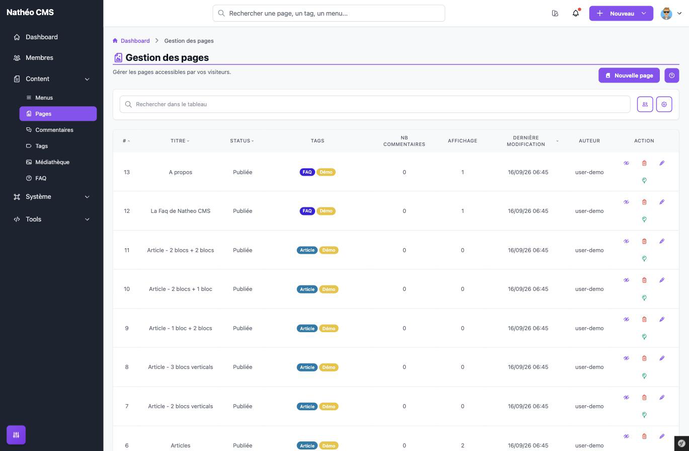

Les pages sont le contenu principal de votre site : c'est ici que vous créez
et gérez tout ce que vos visiteurs peuvent lire — articles, projets, blog,
FAQ mise en page, etc. Chaque page se compose d'un ou plusieurs blocs de
contenu, d'un référencement (SEO), de tags et d'une association à des menus.

Cette page est accessible aux contributeurs, administrateurs et
super-administrateurs, à l'URL `/admin/{locale}/page/`.

Le tableau liste toutes les pages du site, avec pour chacune : son numéro,
son titre, son statut, ses tags, son nombre de commentaires, son nombre
d'affichages, sa date de dernière modification et son auteur. Une petite
icône 📌 à côté du numéro identifie la page définie comme **landing page**
(page d'accueil par défaut du site). Vous pouvez trier chaque colonne en cliquant sur son
en-tête, et rechercher une page par titre ou par tag associé. Le filtre
**Moi / Tous** restreint la liste aux pages dont vous êtes l'auteur.

Pour chaque page, plusieurs actions sont disponibles directement depuis la
ligne :

- ✏️ **Modifier** — ouvre la page dans l'éditeur (voir
  [Créer et éditer une page](ajouter_editer.md))
- 👁️ **Activer / Désactiver** — une page désactivée devient inaccessible sur
  le site, sans être supprimée
- 🗑️ **Supprimer** — retire définitivement la page ainsi que son historique
  de modifications ; n'apparaît que si la suppression définitive est
  autorisée dans les [options système](../../Systeme/options.md)
- 📌 **Définir comme landing page** — n'apparaît que si la page n'est pas déjà
  la landing page ; bascule automatiquement l'ancienne landing page en page
  normale (une seule page peut avoir ce statut à la fois)

Et en haut de page, le bouton **Nouvelle page** ouvre l'éditeur de création.

## Voir aussi
- [Créer et éditer une page](ajouter_editer.md)
- [Le contenu de la page](contenu.md)
- [SEO, tags et menus](seo_tags_menus.md)
- [Historique et aperçu](historique_apercu.md)
- [Référence technique](technique.md)
