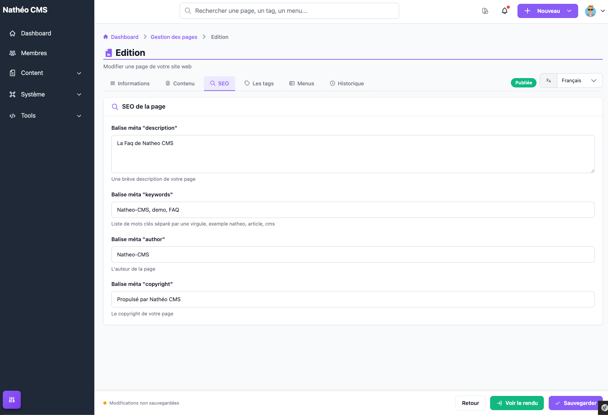
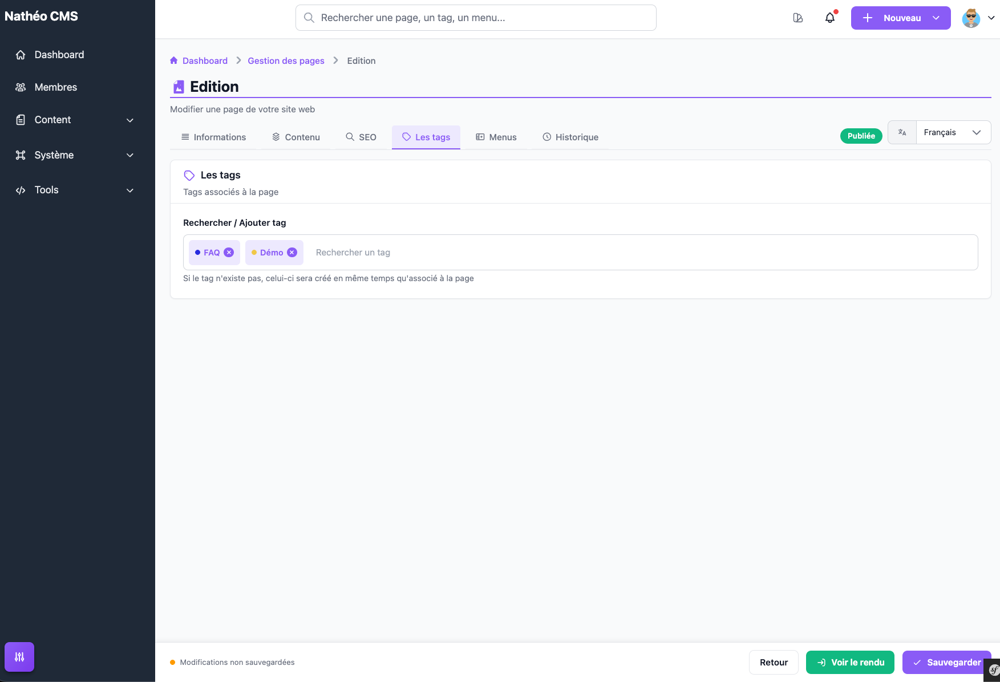
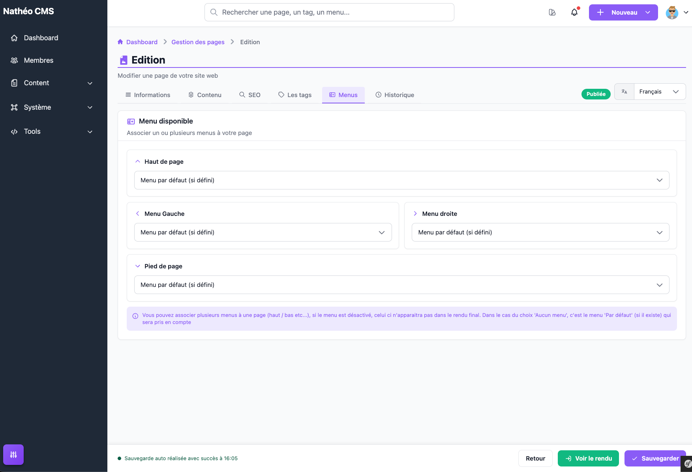

Trois onglets de l'éditeur (voir [Créer et éditer une page](ajouter_editer.md))
complètent les informations et le contenu de la page : **SEO**, **Les tags**
et **Menus**.

## Onglet SEO

Ces 4 champs, tous obligatoires et propres à chaque langue, alimentent les
balises meta de la page sur le site public :

| Champ | Balise meta |
|---|---|
| Balise méta "description" | `description` |
| Balise méta "keywords" | `keywords` |
| Balise méta "author" | `author` |
| Balise méta "copyright" | `copyright` |

À la création d'une page, les champs *author* et *copyright* sont
pré-remplis automatiquement : *author* avec votre nom (selon votre
préférence d'affichage des données personnelles, voir
[Mon profil](../../MonCompte/profil.md)), *copyright* avec le nom du site
suivi de l'année en cours. Ces valeurs restent bien sûr modifiables.

## Onglet Les tags

Fonctionne exactement comme l'auto-complétion des [tags](../Tags/listing.md) :
tapez pour rechercher un tag existant dans les suggestions, ou validez un nom
qui n'existe pas encore pour le créer et l'associer directement à la page. Un
clic sur le ✕ d'un tag l'enlève de la page (sans le supprimer du site).

## Onglet Menus

Permet d'associer un ou plusieurs [menus](../Menus/listing.md) à la page,
un par position : **Haut de page**, **Menu Gauche**, **Menu droite** et
**Pied de page**. Un menu désactivé apparaît dans la liste avec la mention
*(Désactivé)* mais reste sélectionnable (il n'apparaîtra simplement pas dans
le rendu final tant qu'il reste désactivé).

Le choix **Menu par défaut (si défini)** ne sélectionne aucun menu explicite
pour cette page : c'est alors le menu marqué *par défaut* pour la position
concernée (s'il en existe un) qui s'affiche sur le site public. Pour les
positions **Menu Gauche** et **Menu droite** spécifiquement, associer un
menu explicite sur l'un des deux côtés désactive le menu par défaut de
l'**autre** côté (comportement propre à ces deux positions, détaillé dans la
[référence technique des menus](../Menus/technique.md)).

## Voir aussi
- [Créer et éditer une page](ajouter_editer.md)
- [Le contenu de la page](contenu.md)
- [Tags](../Tags/listing.md)
- [Menus](../Menus/listing.md)
- [Référence technique](technique.md)
