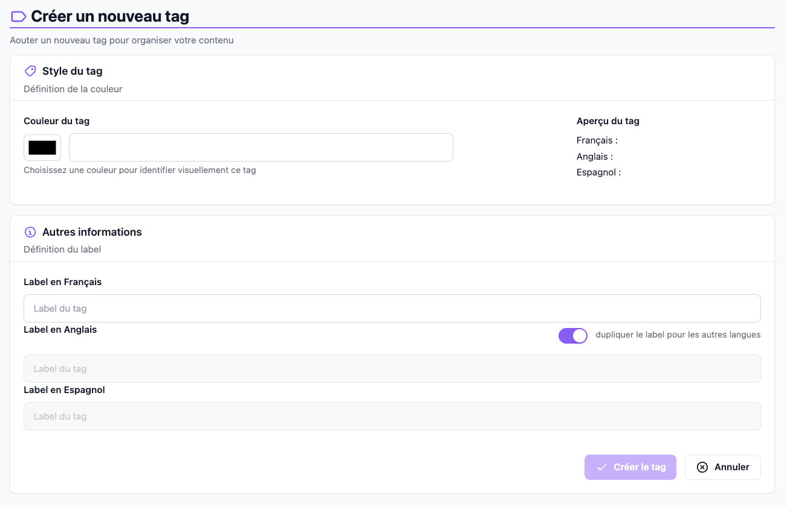
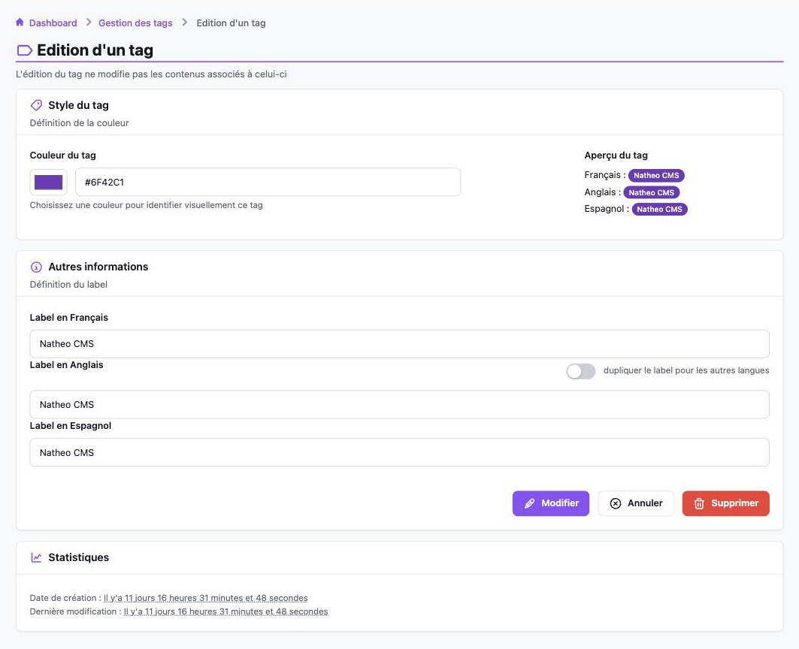

Ce formulaire permet de créer un nouveau tag ou de modifier un tag existant,
depuis le [listing des tags](listing.md).

Il est accessible aux contributeurs, administrateurs et super-administrateurs,
aux URLs `/admin/{locale}/tag/add/` (création) et `/admin/{locale}/tag/update/{id}` (édition).

Un tag se compose de deux choses toutes simples :

- **Une couleur**, à choisir librement (au format `#rrggbb`) — un lien vous
  propose des exemples si vous manquez d'inspiration
- **Un libellé**, à saisir dans chacune des langues du site. Pour aller plus
  vite, une case à cocher permet de dupliquer automatiquement le libellé
  saisi vers les autres langues

Au fur et à mesure de la saisie, un aperçu vous montre à quoi ressemblera le
tag une fois publié.

En édition, un petit bloc en bas de page rappelle depuis quand le tag existe
et quand il a été modifié pour la dernière fois.

Une fois satisfait, il ne reste plus qu'à valider avec le bouton **Créer le
tag** (ou **Modifier**), ou à cliquer sur **Annuler** pour revenir au listing
sans rien changer. En édition, un bouton **Supprimer** est également
disponible — une confirmation vous sera demandée avant toute suppression.

> 💡 Modifier ou supprimer un tag n'a aucun impact sur les contenus (pages)
> qui lui sont associés : seul le tag lui-même est concerné.

## Voir aussi
- [Listing des tags](listing.md)
- [Référence technique](technique.md) *(tables, services, routes)*
