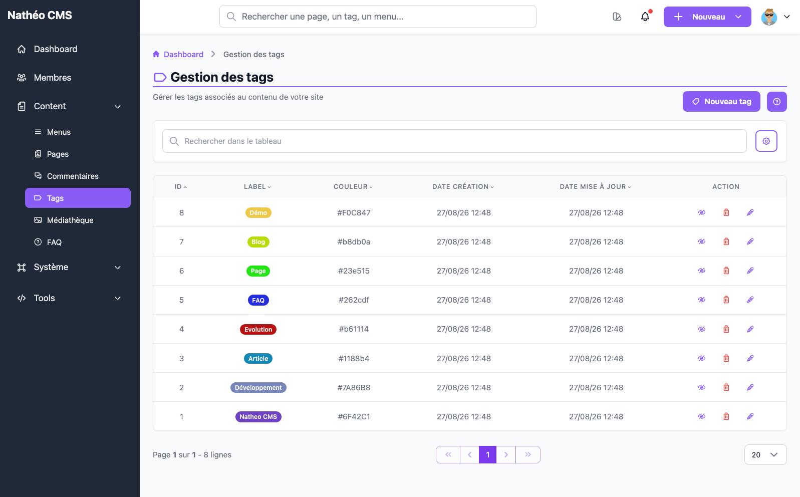

Les tags vous permettent de classer et de regrouper les pages de votre site.
Une fois créés, ils peuvent aussi servir de filtre pour vos visiteurs.

Cette page est accessible aux contributeurs, administrateurs et super-administrateurs.

Le tableau liste tous les tags existants, avec leur couleur et leurs dates de
création et de mise à jour. Vous pouvez trier chaque colonne en cliquant sur
son en-tête, et retrouver rapidement un tag grâce à la barre de recherche.

Pour chaque tag, trois actions sont disponibles directement depuis la ligne :

- ✏️ **Modifier** — ouvre le tag pour changer sa couleur ou son libellé
- 👁️ **Activer / Désactiver** — un tag désactivé disparaît du site, mais rien
  n'est supprimé : vous pouvez le réactiver à tout moment
- 🗑️ **Supprimer** — retire définitivement le tag ; les contenus qui lui
  étaient associés restent, eux, bien intacts

Et en haut de page, le bouton **Nouveau tag** ouvre le formulaire de création.

## Voir aussi
- [Créer ou modifier un tag](ajouter_editer.md)
- [Référence technique](technique.md) *(tables, services, routes)*
