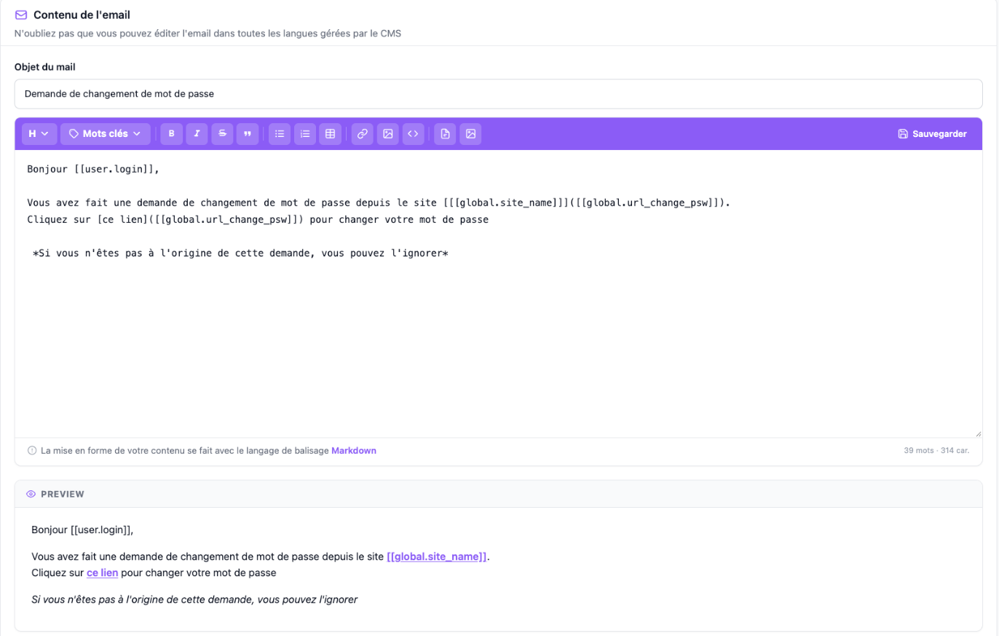
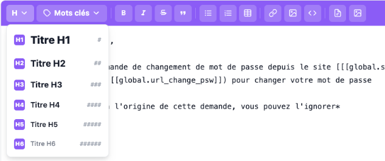
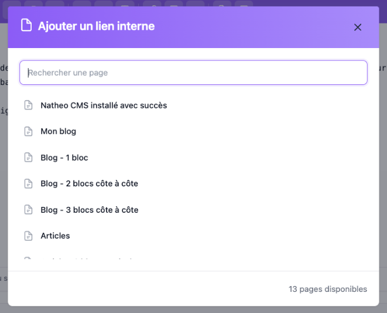
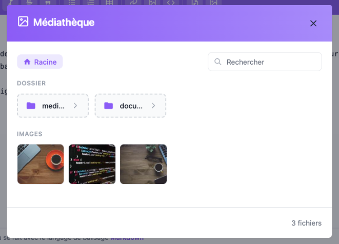

L'**éditeur Markdown** est la zone de saisie utilisée partout où un texte long doit être mis en forme dans
l'administration : blocs de texte des pages, réponses de la FAQ, modération des commentaires et contenu des emails.
Le texte est rédigé en [Markdown](https://www.markdownguide.org), un langage de balisage léger (`**gras**`,
`# Titre`, `- liste`...) : la barre d'outils se contente d'insérer ces balises pour vous.

Cette page décrit l'éditeur du point de vue de l'utilisateur. Pour l'intégrer dans un écran ou l'étendre, voir la
[documentation technique du composant](../../Architecture/composants/editeur_markdown.md).

## Accès

L'éditeur n'a pas d'écran propre : il apparaît dans les écrans qui l'utilisent et suit leurs droits d'accès. Les
données dont il a besoin (liste des pages, médiathèque) sont réservées aux **contributeurs** et au-dessus
(`ROLE_CONTRIBUTEUR`).

## Où le trouve-t-on ?

Toutes les fonctionnalités ne sont pas activées partout :

| Écran | Mots-clés | Lien interne et Médiathèque | Aperçu | Bouton Sauvegarder | Champ obligatoire |
|---|:---:|:---:|:---:|:---:|:---:|
| [Bloc de texte d'une page](../Contenu/Pages/contenu.md) | — | — | — | — | — |
| [Réponse d'une question de FAQ](../Contenu/Faq/ajouter_editer.md) | — | ✅ | — | ✅ | ✅ |
| [Modération d'un commentaire](../Contenu/Commentaires/moderation.md) | — | — | — | ✅ | — |
| [Contenu d'un email](../Systeme/mail.md) | ✅ | ✅ | ✅ | ✅ | ✅ |

## Présentation

L'éditeur se compose de quatre parties :

| Partie | Rôle |
|---|---|
| **Barre d'outils** (violette) | Boutons d'insertion de balises Markdown, regroupés par famille, puis le bouton **Sauvegarder** tout à droite (selon l'écran). Le survol d'un bouton affiche son nom et, le cas échéant, son raccourci clavier |
| **Zone de saisie** | Le texte en Markdown. Sa hauteur minimale dépend de l'écran, elle peut être agrandie avec la poignée en bas à droite |
| **Pied de l'éditeur** | Rappel que le contenu s'écrit en Markdown (lien vers le guide [markdownguide.org](https://www.markdownguide.org)) et compteur de **mots** et de **caractères**. Si le champ est obligatoire et vide (ou ne contient que des espaces), l'éditeur passe en rouge et le pied affiche « Le champ ne peut pas être vide » |
| **Aperçu** (*Preview*) | Rendu du texte mis à jour à chaque frappe. Affiché seulement sur l'écran des emails |

## La barre d'outils

Chaque bouton agit à l'endroit du curseur. Si du texte est **sélectionné**, il est entouré par la balise ; sinon un
texte d'exemple (dans la langue de l'administration) est inséré et sélectionné, prêt à être remplacé.

| Bouton | Insère | Raccourci |
|---|---|---|
| **H** — Titres (menu) | Un titre de niveau 1 à 6 : `# ` à `###### ` en début de ligne | — |
| **Mots clés** (menu) | Un mot-clé remplacé automatiquement à l'envoi, ex. `[[user.login]]`. Uniquement sur les emails : voir [Gestion des emails](../Systeme/mail.md) | — |
| **B** — Gras | `**texte en gras**` | `Ctrl`/`Cmd` + `B` |
| ***I*** — Italique | `*texte en italique*` | `Ctrl`/`Cmd` + `I` |
| ~~S~~ — Barré | `~~texte barré~~` | — |
| ❝ — Citation | `> ` en début de ligne | — |
| Liste à puces | `- ` en début de ligne | — |
| Liste numérotée | `1. `, `2. `, `3. `... en début de ligne | — |
| Tableau | Un tableau de 3 colonnes (*Colonne 1* à *Colonne 3*) et 1 ligne de cellules | — |
| Lien | `[Texte du lien](url)` : remplacez ensuite `url` par l'adresse voulue | `Ctrl`/`Cmd` + `K` |
| Image | `` : remplacez ensuite `url` par l'adresse de l'image | — |
| `<>` — Code | `` `code` `` (code en ligne) | — |
| Lien interne | Ouvre la fenêtre [Lien interne](#lien-interne) | — |
| Médiathèque | Ouvre la fenêtre [Médiathèque](#médiathèque) | — |
| **Sauvegarder** | Voir [Le bouton Sauvegarder](#le-bouton-sauvegarder) | — |

Les menus *Titres* et *Mots clés* se ferment avec la touche `Échap` ou par un clic en dehors de la barre d'outils.

### Titres, citations et listes

Ces boutons agissent sur **chaque ligne** touchée par la sélection (ou sur la ligne du curseur s'il n'y a pas de
sélection) :

- **Ajout** : le préfixe est ajouté en début de chaque ligne. Pour la liste numérotée, les lignes sont numérotées
  `1.`, `2.`, `3.`... dans l'ordre.
- **Remplacement** : un préfixe de la même famille est remplacé plutôt que cumulé. Choisir *Titre H2* sur une ligne
  `# Titre` donne `## Titre` ; passer une liste à puces en liste numérotée (ou l'inverse) remplace les puces par des
  numéros.
- **Retrait** : si toutes les lignes portent déjà ce préfixe, un nouveau clic le **retire** (le bouton fonctionne
  comme un interrupteur).

### Tableaux et médias

Le tableau et les médias insérés depuis la [médiathèque](#médiathèque) sont placés sur leurs propres lignes, séparés
du texte qui les entoure par une **ligne vide**, pour que le Markdown les reconnaisse correctement.

### Clavier

- `Ctrl`/`Cmd` + `Z` annule aussi les insertions faites avec la barre d'outils, comme une frappe normale.
- La touche `Tab` insère deux espaces (utile pour imbriquer une liste) au lieu de passer au champ suivant. Pour
  **sortir de l'éditeur au clavier**, appuyez sur `Échap` puis `Tab`, ou utilisez `Maj` + `Tab` pour revenir au
  champ précédent.

### Lien interne

Ce bouton ouvre une fenêtre listant les pages du site **publiées et actives**, avec un champ de recherche sur le
titre et le nombre de pages disponibles en pied de fenêtre. La liste est rechargée à chaque ouverture : une page
publiée entre-temps y apparaît sans recharger l'écran. Si la liste ne peut pas être chargée, la fenêtre affiche
« Impossible de charger la liste des pages ».

Un clic sur une page insère un lien de la forme `[Titre de la page](P#42)`, où `42` est l'identifiant de la page. Si
du texte était sélectionné, il sert de libellé au lien à la place du titre.

`P#42` n'est pas une adresse : elle est remplacée par l'URL réelle de la page au moment de l'affichage sur le site,
dans la langue du visiteur. Le lien reste donc valide si l'URL de la page change par la suite. La même syntaxe peut
être saisie à la main dans un éditeur qui n'a pas le bouton (bloc de texte d'une page par exemple), à condition
d'être écrite comme la cible d'un lien : `[libellé](P#42)`. Un `P#42` écrit dans le texte courant n'est pas
converti.

### Médiathèque

Ce bouton ouvre une fenêtre de sélection dans la [médiathèque](../Contenu/Mediatheque/mediatheque.md) :

- les **dossiers** s'ouvrent d'un clic ; le fil de navigation en haut (*Racine* puis les dossiers parcourus) permet
  de remonter ;
- le champ **Rechercher** filtre les médias du dossier affiché sur leur titre ;
- les médias sont séparés en **Images** et **Fichiers**, avec leur nombre en pied de fenêtre.

Un clic sur un média l'insère dans le texte : `` pour une image (affichée
dans le texte), `[titre](/assets/natheotheque/document.pdf)` pour un autre fichier (lien de téléchargement). Le texte
entre crochets est le titre du média dans la médiathèque.

Quand plusieurs éditeurs sont présents sur un même écran (plusieurs questions d'une FAQ par exemple), les fenêtres
*Lien interne* et *Médiathèque* insèrent toujours dans l'éditeur depuis lequel elles ont été ouvertes.

## Le bouton Sauvegarder

Le bouton **Sauvegarder** de l'éditeur **n'enregistre rien en base de données** : il transmet seulement le texte à
l'écran qui contient l'éditeur. L'enregistrement réel se fait toujours avec le bouton de sauvegarde de cet écran
(*Sauvegarder* de la FAQ, du commentaire ou de l'email).

Selon l'écran, le texte est d'ailleurs déjà transmis sans ce bouton :

| Écran | Le texte est transmis à l'écran... |
|---|---|
| Bloc de texte d'une page, contenu d'un email | À chaque frappe : le bouton *Sauvegarder* de l'éditeur n'apporte rien de plus |
| Réponse de FAQ, modération d'un commentaire | Quand vous **quittez la zone de saisie** (clic ailleurs) après une modification, ou au clic sur *Sauvegarder* de l'éditeur |

## Aperçu et rendu sur le site

L'aperçu de l'éditeur (emails uniquement) reprend la typographie de l'administration, pas celle de votre thème :
il donne une idée de la structure du texte, pas du rendu final. Quelques différences sont à connaître :

| Situation | Aperçu de l'éditeur | Site | Emails |
|---|---|---|---|
| Simple retour à la ligne (sans ligne vide) | Retour à la ligne affiché | Les deux lignes sont **fusionnées** dans le même paragraphe | Idem site |
| Lien interne `[libellé](P#42)` | Libellé souligné en pointillés, non cliquable (`P#42` au survol) | Lien vers l'URL réelle de la page (blocs de texte des pages et réponses de FAQ) | **Non converti**, voir ci-dessous |
| HTML saisi directement dans le texte | Nettoyé | Nettoyé : balises et attributs dangereux (scripts, `onclick`...) retirés, le reste est conservé | Conservé tel quel |
| Attributs `{.classe}` ou `{#id}` après un élément | Affichés comme du texte | Appliqués à l'élément dans les blocs de texte des pages uniquement | Appliqués à l'élément |

Pour changer de paragraphe, laissez toujours une **ligne vide**. Gras, italique, barré, titres, listes, citations,
liens, images, code et tableaux sont rendus de la même façon partout.

## Voir aussi

- [Éditeur Markdown (technique)](../../Architecture/composants/editeur_markdown.md)
- [Contenu d'une page](../Contenu/Pages/contenu.md)
- [Ajouter / éditer une FAQ](../Contenu/Faq/ajouter_editer.md)
- [Modération des commentaires](../Contenu/Commentaires/moderation.md)
- [Gestion des emails](../Systeme/mail.md)
- [Médiathèque](../Contenu/Mediatheque/mediatheque.md)
