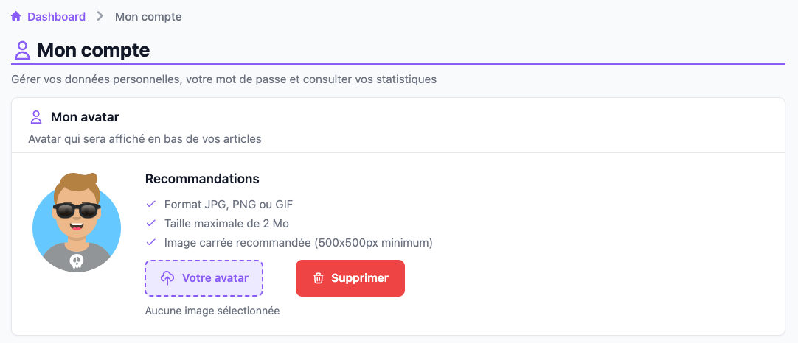
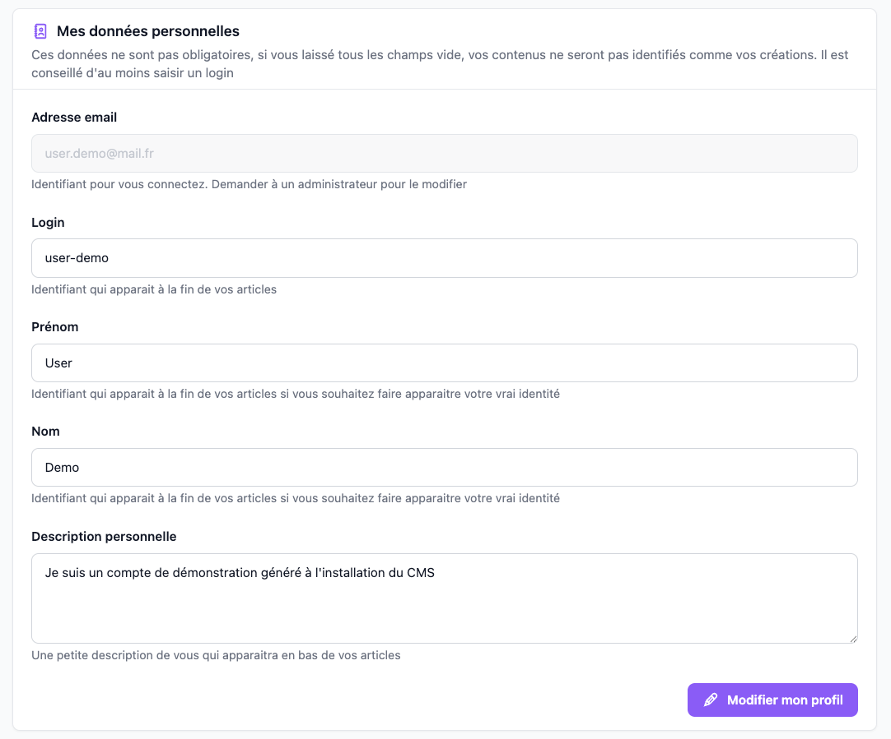
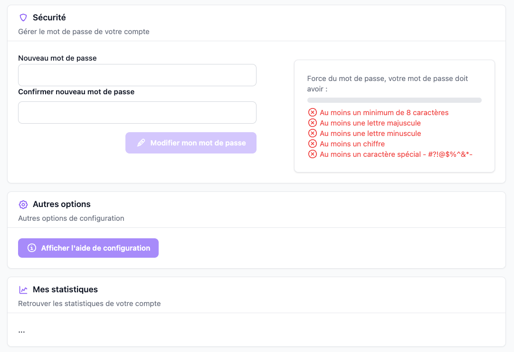
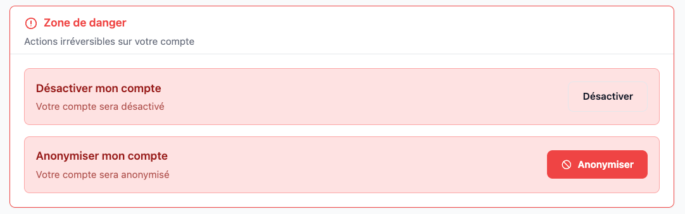

La page **Mon compte** regroupe tout ce qu'un utilisateur connecté peut modifier sur son propre profil : avatar,
données personnelles, mot de passe, et — selon son rôle — la désactivation/suppression de son compte ou une option
de configuration réservée aux super-administrateurs.

## Accès

Accessible à tout utilisateur connecté (rôle minimum `ROLE_USER`), via l'icône de profil dans l'en-tête de
l'administration, ou directement à l'URL `/admin/{locale}/user/my-account`.

## Mon avatar

Un avatar est affiché en bas des articles que vous rédigez. Le fichier est envoyé en même temps que le reste du
formulaire, lors du clic sur **Modifier mon profil** (voir plus bas) — le choisir ne l'envoie pas immédiatement.

| Contrainte | Valeur |
|---|---|
| Formats acceptés | JPG, JPEG, PNG, GIF |
| Taille maximale | **1 Mo** (limite réellement appliquée par le formulaire, malgré le texte affiché à l'écran qui indique 2 Mo) |
| Dimensions | Aucune vérification technique ; 500×500px minimum conseillé pour un rendu carré correct |

Si un avatar est déjà défini, un bouton **Supprimer** apparaît à côté du champ d'upload : il retire immédiatement le
fichier (sans passer par le bouton **Modifier mon profil**) et revient à l'avatar par défaut (vos initiales sur fond
coloré).

## Mes données personnelles

Aucun de ces champs n'est obligatoire. Si vous les laissez tous vides, vos contenus (articles, pages…) ne seront pas
signés avec votre identité — il est conseillé de renseigner au moins un login.

| Champ | Description | Obligatoire |
|---|---|---|
| Adresse email | Votre identifiant de connexion. Lecture seule sur cette page — seul un administrateur peut le modifier | — |
| Login | Identifiant affiché à la fin de vos articles | Non |
| Prénom | Affiché à la fin de vos articles si vous souhaitez faire apparaître votre vraie identité | Non |
| Nom | Idem | Non |
| Description personnelle | Courte présentation affichée à la fin de vos articles | Non |

Le bouton **Modifier mon profil**, en bas de la carte, envoie ces champs ainsi que l'avatar sélectionné le cas
échéant.

## Sécurité

Un formulaire dédié permet de changer son propre mot de passe, indépendamment du reste du profil (sauvegarde
immédiate en Ajax, sans recharger la page).

Le nouveau mot de passe doit respecter, en temps réel pendant la saisie :

| Règle | Détail |
|---|---|
| Longueur | Au moins 8 caractères (pas de maximum ici, contrairement au formulaire du compte fondateur à l'installation qui plafonne à 20) |
| Majuscule | Au moins une lettre majuscule |
| Minuscule | Au moins une lettre minuscule |
| Chiffre | Au moins un chiffre |
| Caractère spécial | Au moins un parmi `#?!@$%^&*-` |

Une barre de progression (rouge → orange → vert) et une liste à cocher indiquent en direct les règles déjà
respectées. Le bouton **Modifier mon mot de passe** reste désactivé tant que le mot de passe ne respecte pas
toutes les règles ou que les deux champs ne sont pas identiques.

## Zone de danger

*Visible uniquement si vous n'êtes **pas** `ROLE_SUPER_ADMIN`* (les fondateurs/super-administrateurs ne peuvent pas
s'auto-désactiver ni s'auto-supprimer) — elle prend alors la place de la carte **Autres options** ci-dessous, juste
après **Sécurité**.

| Action | Effet |
|---|---|
| **Désactiver mon compte** | Vous déconnecte et empêche toute nouvelle connexion, jusqu'à réactivation par un administrateur |
| **Anonymiser mon compte** *(ou* **Supprimer mon compte***, selon la configuration)* | Action irréversible détaillée ci-dessous |

Chaque bouton ouvre une modale de confirmation. Les deux actions envoient un email et une notification à tous les
super-administrateurs si ces fonctionnalités sont activées dans les [options système](../Systeme/options.md).

Le libellé et l'effet du deuxième bouton dépendent de deux options système
([voir la page dédiée](../Systeme/options.md)) :

| Suppression autorisée | Remplacement/anonymisation | Bouton affiché | Effet |
|---|---|---|---|
| Non | — | *(bouton masqué)* | Aucune action possible |
| Oui | Non | **Supprimer mon compte** | Le compte est réellement supprimé de la base, avatar compris |
| Oui | Oui *(réglage par défaut)* | **Anonymiser mon compte** | Le compte est anonymisé (conservé mais vidé de ses données identifiantes) plutôt que supprimé |

## Autres options

*Visible uniquement si vous êtes `ROLE_SUPER_ADMIN`* — à l'inverse de la zone de danger ci-dessus : sur un compte
super-administrateur, cette carte remplace la zone de danger juste après **Sécurité** (voir la capture dans la
section **Sécurité** plus haut).

Un unique bouton, **Afficher l'aide de configuration** / **Masquer l'aide de configuration**, contrôle si le bloc
d'aide de première connexion s'affiche sur le tableau de bord.

## Mes statistiques

Une carte **Mes statistiques** est présente sur la page mais son contenu n'est pas encore implémenté côté CMS (🚧) :
elle n'affiche aucune donnée pour le moment.

## Voir aussi
- [Notifications](Notifications/notifications.md)
- [Options système](../Systeme/options.md)
- [Gestion des utilisateurs](../Systeme/utilisateurs.md)
