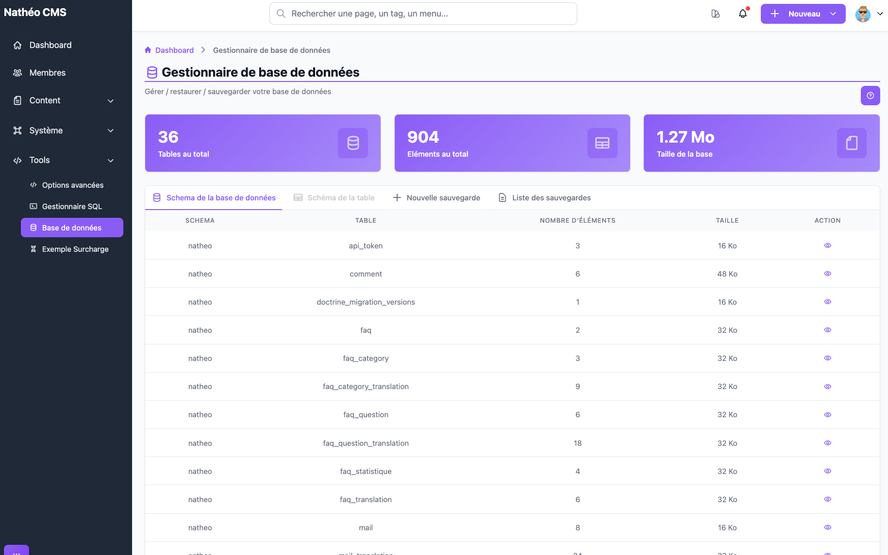
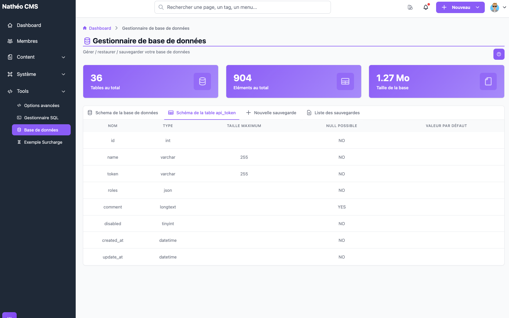
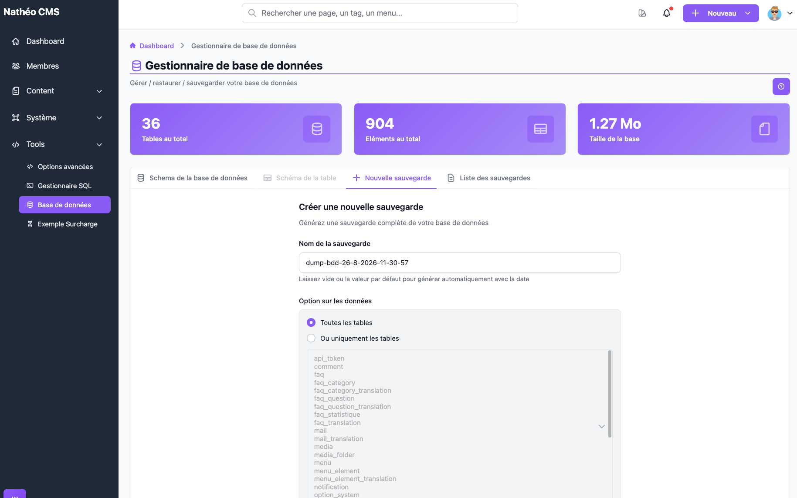
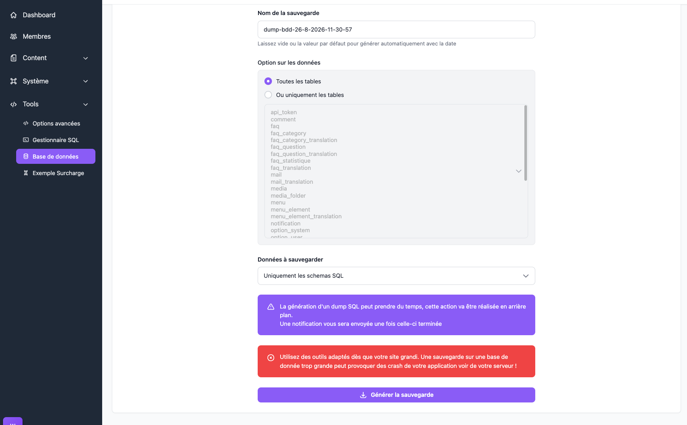

Le **Gestionnaire de base de données** permet d'explorer la structure de la base de données (tables et colonnes)
et de générer, télécharger ou supprimer des sauvegardes SQL complètes — sans avoir besoin d'un accès direct au
serveur de base de données.

## Accès

Réservé aux **super-administrateurs** (`ROLE_SUPER_ADMIN`), via *Outils > Base de données* ou directement à
l'URL `/admin/{locale}/database-manager/`.

## Schéma de la base de données

C'est l'onglet affiché par défaut à l'arrivée sur la page. Trois cartes de statistiques résument la base :
nombre total de tables, nombre total d'éléments (lignes, toutes tables confondues) et taille totale occupée.

Le tableau liste **toutes** les tables réellement présentes en base (lecture directe du schéma
`information_schema`, indépendante des entités Doctrine) : schéma, nom de table, nombre d'éléments et taille.

| Colonne | Détail |
|---|---|
| Nombre d'éléments | Compte des lignes de la table. Si le comptage échoue pour une table donnée, la cellule affiche « données indisponible » à la place d'un nombre |
| Taille | Taille sur disque de la table, déjà mise en forme (Ko/Mo/Go) |
| Action | 👁️ Charge le schéma détaillé de cette table dans l'onglet *Schéma de la table* (voir ci-dessous) |

Cliquer sur l'action 👁️ d'une ligne surligne la ligne correspondante et active l'onglet *Schéma de la table*
(grisé/inaccessible tant qu'aucune table n'a été choisie).

## Schéma de la table

Une fois une table choisie depuis l'onglet précédent, ce second onglet affiche le détail de ses colonnes : nom,
type SQL, taille maximum (extraite entre parenthèses du type — ex. `varchar(255)` → 255 ; vide pour un type
sans taille comme `int`), si la valeur `NULL` est autorisée, et la valeur par défaut éventuelle. Le nom de la
table consultée est rappelé dans le libellé de l'onglet.

## Créer une nouvelle sauvegarde

| Champ | Détail |
|---|---|
| Nom de la sauvegarde | Pré-rempli avec `dump-bdd-{jour}-{mois}-{année}-{heure}-{minute}-{seconde}` (composants zéro-paddés sur deux chiffres) ; personnalisable, mais uniquement lettres, chiffres, tirets et underscores (100 caractères maximum) |
| Tables | **Toutes les tables**, ou une sélection dans une liste multiple (Ctrl/Cmd + clic pour en choisir plusieurs) |

Si le nom saisi ne respecte pas ce format, ou correspond à une sauvegarde déjà existante, un message d'erreur
s'affiche immédiatement et la génération n'est pas lancée.

| Champ | Détail |
|---|---|
| Données à sauvegarder | **Uniquement les schémas SQL** (structure des tables, `CREATE TABLE`), **Uniquement les données** (`INSERT`), ou **Schéma SQL et données** (les deux) |

> 📝 La liste de sélection **« Ou uniquement les tables »** ne propose que les tables correspondant à une entité
> Doctrine du CMS (mêmes tables que celles utilisées par l'assistant du [Gestionnaire SQL](gestionnaire_sql.md)),
> triées par ordre alphabétique. Une table technique sans entité — par exemple `doctrine_migration_versions`,
> pourtant bien visible dans l'onglet *Schéma de la base de données* — **ne peut donc pas être choisie
> individuellement** ; elle n'est incluse que si vous sélectionnez **Toutes les tables**.

Un bandeau d'information rappelle que la génération peut prendre du temps et se déroule en arrière-plan : une
[notification](../MonCompte/Notifications/notifications.md) vous est envoyée une fois la sauvegarde terminée,
avec un lien de téléchargement direct. Un second bandeau, d'avertissement, recommande d'utiliser des outils
dédiés dès que la base grandit, une sauvegarde sur une base trop volumineuse pouvant faire planter l'application
ou le serveur.

Le bouton **Générer la sauvegarde** déclenche la génération et affiche un message de confirmation ; la liste des
sauvegardes (onglet suivant) se recharge automatiquement une fois l'appel terminé (pas besoin d'attendre la fin
réelle de la génération, qui se fait en tâche de fond).

### Ce qui se passe techniquement

1. La demande est traitée de façon **asynchrone** via le bus de messages Symfony (message `DumpSql`, géré par
   `DumpSqlHandler`) — la page ne bloque donc pas pendant la génération.
2. Le fichier est écrit dans un dossier de stockage dédié, **hors du dossier public** de l'application (jamais
   accessible par une URL directe), sous le nom `{nom}.sql`. Selon l'option de données choisie, il contient les
   requêtes `CREATE TABLE` (schéma), puis toujours un marqueur `/* DATA GENERATION */`, puis les requêtes
   `INSERT` (données) si demandées — le marqueur est présent même en mode « schéma seul », où aucun `INSERT` ne
   suit. Les valeurs sont correctement échappées à l'insertion (apostrophes comprises) et une valeur `NULL` en
   base est bien réécrite comme le mot-clé SQL `NULL`.
3. Les tables sont réordonnées pour respecter leurs dépendances de clés étrangères (une table référencée est
   insérée avant celle qui la référence) et les données sont écrites par lots de 500 lignes, pour ne pas charger
   une table volumineuse entièrement en mémoire.
4. Une fois le fichier généré avec succès, une notification de catégorie **SQL** (même catégorie que le
   [Gestionnaire SQL](gestionnaire_sql.md)) est envoyée à l'utilisateur ayant lancé la sauvegarde, avec un lien de
   téléchargement direct. **En cas d'échec** (erreur SQL en cours de génération, etc.), le fichier partiel est
   supprimé et une notification d'échec dédiée est envoyée à la place, invitant à consulter les journaux
   applicatifs pour le détail de l'erreur.

## Liste des sauvegardes

Recense les fichiers `.sql` du dossier de stockage des sauvegardes, triés du plus récent au plus ancien (date de
dernière modification), avec nom, date, taille et extension. Pour chaque sauvegarde :

| Action | Effet |
|---|---|
| **Télécharger** | Passe par une route d'administration dédiée : le fichier est servi en pièce jointe, jamais par un lien vers un fichier public — protégée par la même authentification (`ROLE_SUPER_ADMIN`) que le reste de la page |
| 🗑️ **Supprimer** | Demande confirmation dans une modale, puis supprime définitivement le fichier du disque |

Le bouton **Rafraîchir** recharge la liste sans quitter l'onglet.

## Voir aussi
- [Gestionnaire SQL](gestionnaire_sql.md) *(même catégorie de notification, même source de tables pour l'assistant)*
- [Notifications](../MonCompte/Notifications/notifications.md) *(notification envoyée à la fin d'une génération de sauvegarde)*
- [Options avancées](options_avancees.md) *(autre outil sensible réservé aux super-administrateurs)*
