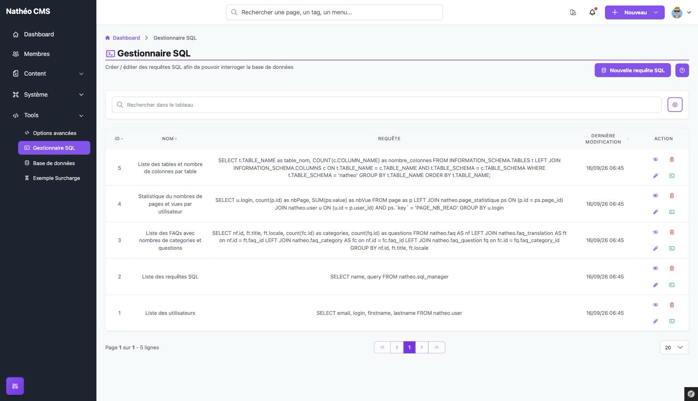
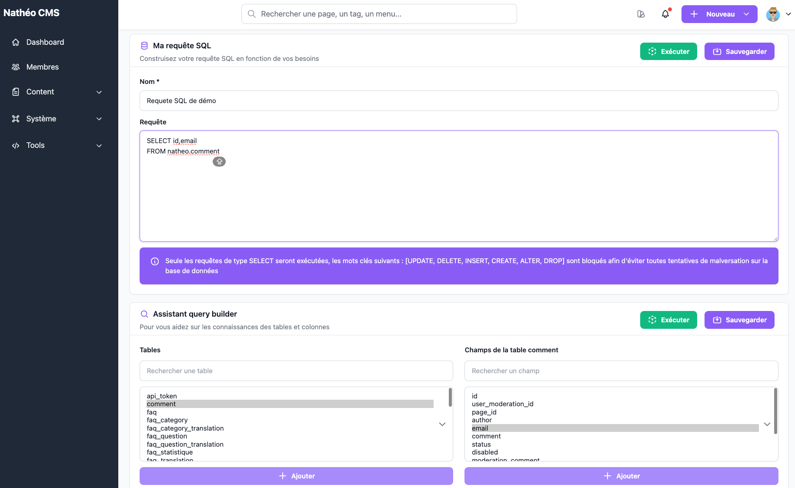
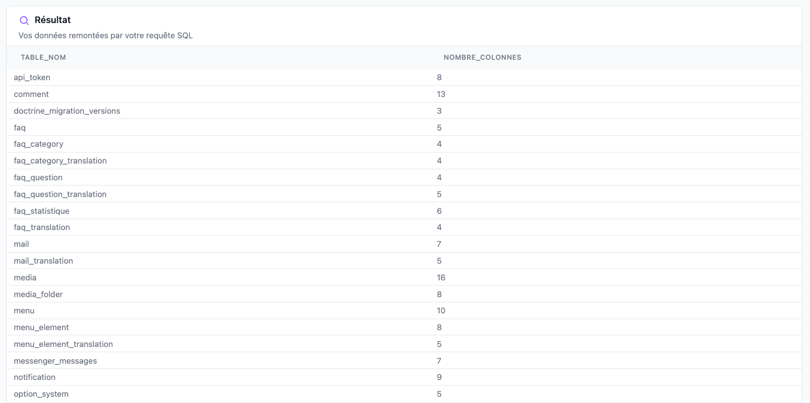

Le **Gestionnaire SQL** permet d'écrire, sauvegarder et exécuter des requêtes SQL en lecture seule pour
interroger directement la base de données du CMS — pratique pour des extractions ponctuelles (statistiques,
vérifications) sans avoir besoin d'un accès direct à la base.

## Accès

Réservé aux **super-administrateurs** (`ROLE_SUPER_ADMIN`), via *Outils > Gestionnaire SQL* ou directement à
l'URL `/admin/{locale}/sql-manager/`.

## Liste des requêtes SQL

Le tableau liste toutes les requêtes SQL enregistrées par **tous** les super-administrateurs (pas seulement les
vôtres), avec leur identifiant, leur nom, leur contenu et leur date de dernière modification. Vous pouvez trier
chaque colonne et retrouver rapidement une requête grâce à la barre de recherche (qui filtre sur le nom **ou** le
contenu de la requête).

Pour chaque requête, les actions disponibles dépendent de son état :

| Requête active | Requête désactivée |
|---|---|
| 👁️ **Désactiver** *(confirmation demandée)*, ✏️ **Modifier**, ▶️ **Exécuter**, et 🗑️ **Supprimer** si les options système autorisent la suppression de données | 👁️ **Activer** *(sans confirmation)* uniquement |

> ⚠️ Une requête désactivée ne peut donc **pas être supprimée directement** : il faut d'abord la réactiver.
> Elle ne peut pas non plus être ouverte en modification ou en exécution en accédant directement à son URL —
> le serveur redirige vers le listing si on essaie.

Le bouton **Nouvelle requête SQL** en haut de page ouvre le formulaire de création.

## Créer / éditer une requête

Le même écran sert à la création, à la modification et à l'exécution d'une requête existante (voir plus bas) :
seul le contenu affiché change légèrement selon le contexte.

| Champ | Obligatoire | Description |
|---|---|---|
| Nom | Oui | Nom libre de la requête, affiché dans le listing |
| Requête | Oui | Le SQL à exécuter — **uniquement des requêtes `SELECT`** (voir *Sécurité* ci-dessous) |

Un bandeau d'aide rappelle en permanence cette contrainte de lecture seule.

### Assistant "Query builder"

Pour vous aider si vous ne connaissez pas par cœur le nom des tables et des colonnes, un assistant est proposé
sous le champ Requête :

1. Recherchez et sélectionnez une ou plusieurs tables dans la colonne de gauche (liste construite à partir des
   entités Doctrine du CMS, donc chaque "table" correspond à une entité) — sélectionner une table affiche
   automatiquement ses colonnes dans la colonne de droite.
2. Le bouton **Ajouter** sous la liste des tables insère le(s) nom(s) de table sélectionné(s), préfixés du nom
   du schéma (ex. `natheo.user`), à l'endroit du curseur dans le champ Requête.
3. Sélectionnez ensuite une ou plusieurs colonnes de la table affichée à droite, puis cliquez sur son bouton
   **Ajouter** pour les insérer de la même façon.

Si du texte était sélectionné dans le champ Requête au moment de cliquer sur un bouton **Ajouter**, le texte
inséré s'insère juste avant la sélection (qui reste, elle, inchangée), plutôt qu'au niveau exact du curseur.

Les boutons **Exécuter** et **Sauvegarder** sont dupliqués en haut de la carte "Ma requête SQL" et de la carte
"Assistant query builder" : ce sont exactement les mêmes actions des deux côtés, par simple confort d'usage
quelle que soit la partie de l'écran sur laquelle vous travaillez.

À la première sauvegarde d'une **nouvelle** requête (écran de création, pas encore d'identifiant), l'écran
redirige automatiquement vers son URL d'édition (`.../update/{id}`) une fois la sauvegarde effectuée.

## Exécuter une requête et lire le résultat

Cliquer sur **Exécuter** (ou sur l'action ▶️ d'une ligne du listing, qui ouvre l'écran d'édition en lançant
l'exécution automatiquement) affiche le résultat de la requête dans un tableau en bas de page, avec une colonne
par champ remonté. Si la requête ne renvoie aucune ligne, ou si elle échoue, un message l'indique à la place du
tableau — le message d'erreur SQL brut est affiché tel quel en cas d'échec (erreur de syntaxe, table/colonne
inexistante, etc.).

## Sécurité : lecture seule uniquement

Que ce soit à la sauvegarde ou à l'exécution, le serveur vérifie systématiquement (la vérification n'est faite
qu'**côté serveur**, rien n'empêche de taper autre chose côté client avant de cliquer) que la requête ne contient
aucun des mots-clés suivants, insensibles à la casse : `UPDATE`, `DELETE`, `INSERT`, `CREATE`, `ALTER`, `DROP`,
`TRUNCATE`. Si l'un d'eux est détecté, la requête est refusée avec un message d'erreur.

> 📝 Le bandeau d'aide affiché à l'écran n'énumère que six de ces mots-clés bloqués (`UPDATE, DELETE, INSERT,
> CREATE, ALTER, DROP`) : `TRUNCATE` est bien bloqué aussi par le code, mais absent du texte affiché à
> l'utilisateur.

## Sauvegarder la requête SQL générée par un tableau

Depuis n'importe quel [tableau Grid](../../Architecture/composants/grid.md#affichage-de-la-requête-sql) du CMS
qui expose son SQL généré (menu "..." > "Afficher le SQL"), un bouton permet de sauvegarder directement cette
requête dans le Gestionnaire SQL. Elle apparaît alors dans le listing sous le nom générique
**« -- Requête générique -- »**, prête à être renommée et réutilisée.

## Voir aussi
- [Tableau GRID](../../Architecture/composants/grid.md) *(fonctionnalité "Afficher le SQL")*
