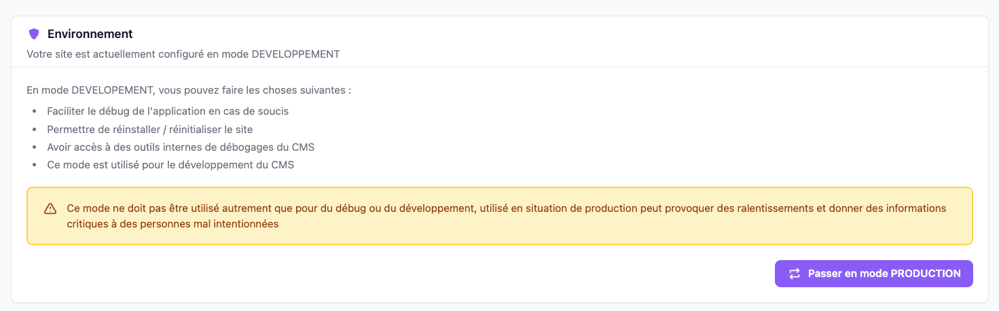
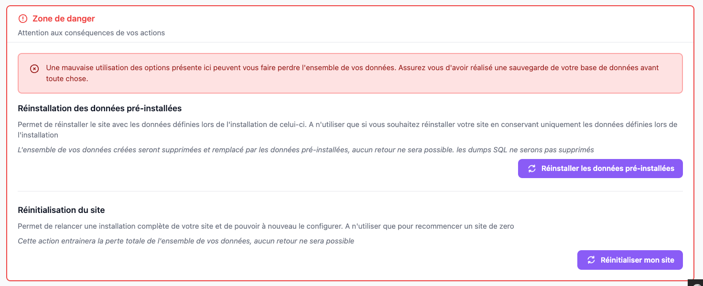
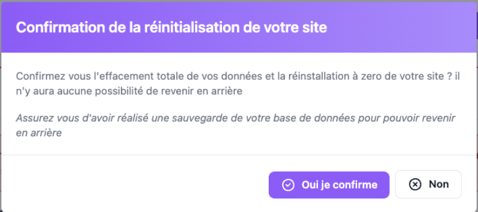

La page **Options avancées** regroupe deux familles d'actions sensibles : le changement d'environnement de
l'application (DEV/PROD) et — uniquement en environnement de développement — des actions destructives de
réinitialisation du site.

## Accès

Réservée aux **super-administrateurs** (`ROLE_SUPER_ADMIN`), via *Outils > Options avancées* ou directement à
l'URL `/admin/{locale}/advanced-options/`.

## Environnement

Affiche le mode courant de l'application (`kernel.environment`, lu depuis la variable `APP_ENV` du fichier `.env`
ou `.env.local` si celui-ci existe) et permet de basculer vers l'autre mode.

| Mode | Effets |
|---|---|
| **DEVELOPPEMENT** | Débogage facilité, réinstallation/réinitialisation du site possible (voir *Zone de danger* ci-dessous), accès aux outils internes de débogage du CMS. À ne jamais utiliser en production : ralentissements, informations critiques exposées |
| **PRODUCTION** | Cache précis des vues et requêtes SQL, erreurs génériques uniquement, logs réduits au strict minimum pour la fluidité. Aucun outil de débogage accessible à part les logs fichiers |

Le bouton **Passer en mode DEVELOPPEMENT** / **Passer en mode PRODUCTION** (le libellé s'inverse selon le mode
courant) ouvre une modale de confirmation avant d'agir.

### Ce qui se passe techniquement

1. Le fichier `.env` (ou `.env.local`) est réécrit : la ligne `APP_ENV=` est basculée entre `dev` et `prod`
   (`EnvFile::switchAppEnv()`).
2. Le cache applicatif Symfony est rechargé (équivalent de la commande `cache:clear`).
3. La page se recharge automatiquement une fois l'appel terminé.

Aucune vérification de rôle supplémentaire n'est faite à cette étape au-delà de `ROLE_SUPER_ADMIN` déjà exigé pour
toute la page.

## Zone de danger

*Visible uniquement en mode DEVELOPPEMENT* — masquée en production, y compris pour un super-administrateur.

Les deux actions ci-dessous ouvrent une modale de confirmation avant d'agir :

| Action | Effet |
|---|---|
| **Réinstaller les données pré-installées** | Route `reset-data` (POST) : `dropDatabase()` → `createDatabase()` → `createSchema()` → `loadFixtures()` — la base est recréée avec les données définies lors de l'installation |
| **Réinitialiser mon site** | Route `reset-database` (POST) : `dropDatabase()` seul, puis redirection vers `/`, qui renvoie vers l'écran d'installation puisque la base n'existe plus |

Chaque bouton envoie son propre jeton CSRF, distinct l'un de l'autre (`csrf_token('reset_data')` / `csrf_token('reset_database')`, générés séparément côté Twig et revérifiés côté serveur chacun contre son propre id : `isCsrfTokenValid('reset_data', ...)` pour la route `reset-data`, `isCsrfTokenValid('reset_database', ...)` pour `reset-database`).

### Garde-fous existants

- Les routes `reset-data` et `reset-database` répondent `403` si l'application n'est pas en mode `dev`
  (`$kernel->isDebug()`), même si l'URL est appelée directement.
- Toute la page est protégée par `ROLE_SUPER_ADMIN`.

## Voir aussi
- [Pré-requis](../../Demarrage/pre_requis.md)
- [Installation (environnement de développement)](../../Demarrage/installation_dev.md)
- [Installation (environnement de production)](../../Demarrage/installation_prod.md)
