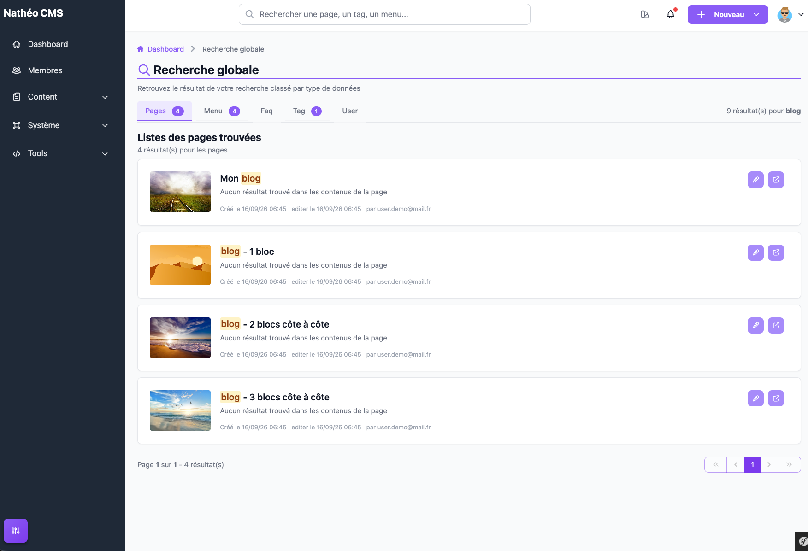
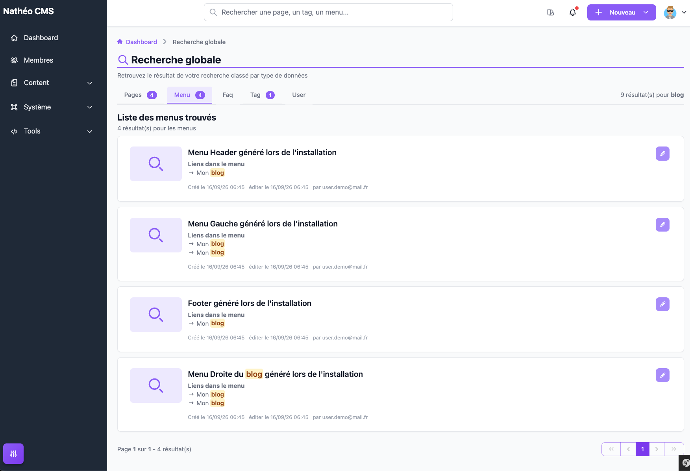
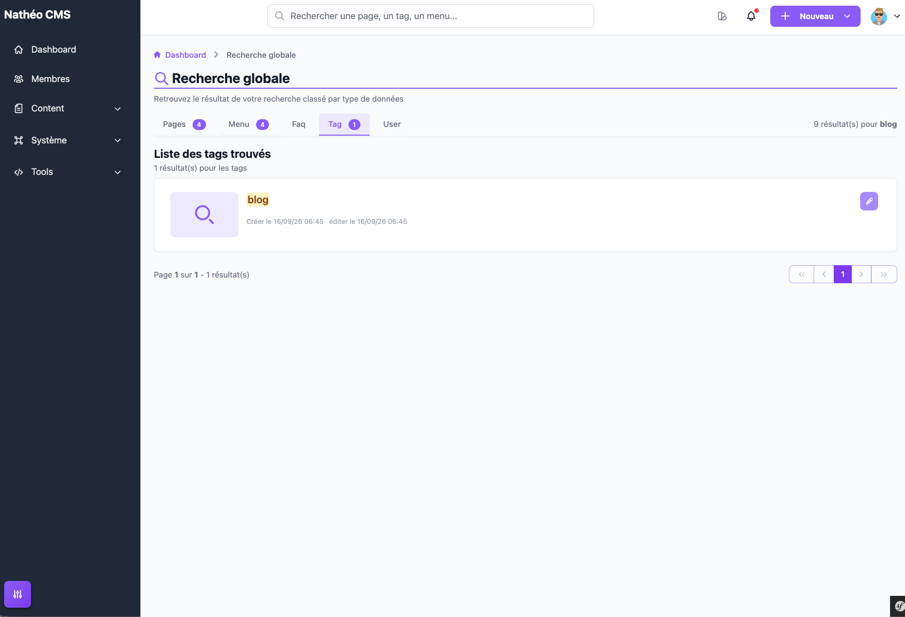

La recherche globale permet de retrouver, depuis un seul champ, du contenu
réparti sur cinq types de données du CMS : les **pages**, les **menus**, les
**FAQ**, les **tags** et les **utilisateurs**.

## Accès

Le champ de recherche est affiché en permanence au centre de l'en-tête de
l'administration, pour tout utilisateur ayant au moins le rôle
**Contributeur** (le champ n'apparaît pas pour un simple rôle Utilisateur,
même si la page de résultats reste techniquement accessible à tout compte
connecté si l'URL est atteinte directement).

## Lancer une recherche

Saisissez votre critère dans le champ puis validez avec **Entrée** (le champ
ne propose pas de bouton de validation dédié). Vous êtes redirigé vers la page
**Recherche globale**, qui affiche vos résultats classés par type de données.

> 💡 Le texte d'aide affiché dans le champ (« Rechercher une page, un tag, un
> menu... ») ne mentionne que trois des cinq types réellement interrogés — les
> FAQ et les utilisateurs sont eux aussi cherchés, simplement absents du
> texte.

## La page de résultats

En haut de page, un compteur annonce le nombre total de résultats toutes
catégories confondues, suivi du terme recherché. Les résultats sont répartis
dans **cinq onglets** (Pages, Menu, Faq, Tag, User), chacun affichant en badge
le nombre de résultats trouvés pour ce type ; les onglets sans résultat
n'affichent pas de badge.

Chaque onglet se charge indépendamment des autres dès l'arrivée sur la page
(cinq appels distincts en arrière-plan) : un indicateur de chargement animé
s'affiche sur l'onglet le temps de la requête, et son contenu apparaît dès
qu'elle aboutit — vous pouvez consulter un onglet déjà chargé pendant que les
autres continuent de charger.

### Ce que chaque onglet recherche

| Onglet | Champs interrogés (langue courante, sauf mention contraire) |
|---|---|
| **Pages** | Titre de la page, texte des blocs de contenu **de type Texte uniquement** (un bloc FAQ ou Liste de pages n'est pas parcouru), identifiant de connexion de l'auteur (toutes langues) |
| **Menu** | Nom du menu (non traduit), texte des liens du menu, identifiant de connexion de l'auteur (toutes langues) |
| **Faq** | Titre de la FAQ, titre de chaque catégorie, titre et réponse de chaque question, identifiant de connexion de l'auteur (toutes langues) |
| **Tag** | Libellé du tag |
| **User** | Identifiant de connexion, e-mail, prénom, nom (aucune notion de langue) |

### Une fiche de résultat

Selon l'onglet, chaque résultat est présenté sous forme de carte avec :

- une **vignette** (image d'en-tête pour une page, avatar pour un
  utilisateur) ou, à défaut, une **icône de recherche générique** (menus,
  tags, FAQ) ;
- le **titre** (titre de page, nom de menu, titre de FAQ, libellé de tag ou
  identité de l'utilisateur), avec la portion correspondant à votre recherche
  **surlignée en jaune** ;
- pour les pages, menus et FAQ : un ou plusieurs **extraits de contenu** où le
  terme a été trouvé (texte de la page, lien de menu, titre de catégorie/
  question ou réponse), chacun précédé d'une flèche — les tags et les
  utilisateurs n'ont pas cette zone, seul le titre/libellé est cherché ;
- les dates de **création** et de dernière **édition** ;
- pour les pages, menus et FAQ : l'**auteur**, lui aussi surligné si votre
  recherche correspond à son identifiant de connexion ;
- un ou deux boutons d'action à droite : **éditer** (ouvre la fiche
  d'édition dans un nouvel onglet, disponible partout) et **aperçu** (ouvre la
  page publique correspondante, uniquement pour l'onglet Pages).

### Pagination

Chaque onglet possède sa propre pagination, indépendante des autres, calculée
sur le nombre d'éléments par page défini par l'option utilisateur
`OU_NB_ELEMENT` — la même que celle utilisée par les
[listings du CMS basés sur le composant Grid](../../Architecture/composants/grid.md).
Changer de page sur un onglet ne recharge que cet onglet.

## Voir aussi
- [Référence technique](technique.md)
- [Tableau GRID](../../Architecture/composants/grid.md)
