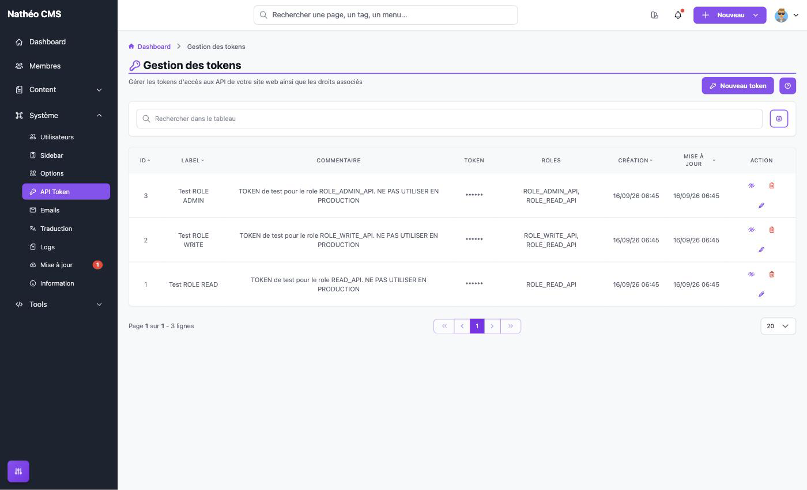

La page **Gestion des tokens** permet de créer et d'administrer les jetons (tokens) qui donnent accès aux
[API](../../../API/index.md) du CMS. Toute application qui interroge l'API (par exemple le front de votre site)
doit présenter un jeton valide : sans jeton, aucune donnée n'est servie.

## Accès

Réservée aux **super-administrateurs** (`ROLE_SUPER_ADMIN`), via *Système > API Token* ou directement à l'URL
`/admin/{locale}/api-token/`.

## Utilisation d'un jeton

Un jeton s'envoie dans l'en-tête HTTP `Authorization` de chaque appel à l'API :

```shell
curl --location 'https://mon-site.fr/api/v1/authentication/' \
--header 'Authorization: Bearer [mon-token]'
```

L'appel est accepté si **toutes** les conditions suivantes sont remplies :

| Condition | Sinon |
|---|---|
| L'option système **Ouvrir l'API ?** est activée ([options système](../options.md#api)) | `403` « Ressource non accessible - API fermée » |
| L'IP de l'appelant est autorisée (`app.ip_api_authorize` dans `config/services.yaml`, si `app.ip_api_active_filter` vaut `true` — par défaut seules `127.0.0.1` et `::1` le sont) | `401` « Token Invalide » |
| Le jeton existe, n'est **pas désactivé** et n'a **pas dépassé sa date d'expiration** | `401` « Token Invalide » |
| Le rôle du jeton permet d'accéder à la route appelée (voir ci-dessous) | `403` |

Un jeton désactivé, expiré, supprimé ou régénéré est refusé **immédiatement**, dès l'appel suivant.

L'en-tête doit commencer exactement par `Bearer ` (avec la majuscule et l'espace) : toute autre forme n'est pas
reconnue comme une tentative d'authentification par jeton.

> ⚠️ Une IP non autorisée reçoit le même message « Token Invalide » qu'un mauvais jeton. Si un jeton correct est
> refusé, vérifiez d'abord la liste des IP autorisées.

## Les rôles d'un jeton

Chaque jeton porte un rôle, indépendant des [rôles des comptes utilisateurs](../roles.md). Chaque rôle hérite du
précédent :

| Rôle affiché | Code | Hérite de |
|---|---|---|
| **Lecture** | `ROLE_READ_API` | — |
| **Lecture + Écriture** | `ROLE_WRITE_API` | Lecture |
| **Admin** | `ROLE_ADMIN_API` | Lecture + Écriture |

| Ce que le jeton permet | Rôle minimum |
|---|---|
| Lire pages, menus, commentaires, options, sitemap ; connecter un utilisateur | **Lecture** |
| Ajouter un commentaire, modérer un commentaire | **Lecture + Écriture** |

> 📝 Le rôle **Admin** n'apporte aujourd'hui rien de plus que *Lecture + Écriture* ; il est prévu pour de futures
> API. Donnez à chaque jeton le rôle qui correspond à son usage réel : un front qui ne fait qu'afficher le site
> n'a besoin que de *Lecture*, un front qui permet de déposer des commentaires a besoin de *Lecture + Écriture*.
> Le détail par endpoint est dans la [présentation de l'API](../../../API/index.md#rôles-des-jetons).

Les droits liés à un **utilisateur** connecté via l'API (voir les pages en brouillon, modérer un commentaire...)
dépendent du rôle de ce compte, pas de celui du jeton : voir [Les rôles côté site et
API](../roles.md#les-rôles-côté-site-et-api).

## Liste des jetons



Le bouton **Nouveau token** ouvre la [création d'un jeton](nouveau_jeton.md). Le bouton **?** affiche une aide
rappelant le rôle de chaque icône d'action.

Le tableau (composant [Grid](../../../Architecture/composants/grid.md)) affiche :

| Colonne | Contenu |
|---|---|
| **ID** | Identifiant du jeton |
| **Label** | Nom du jeton |
| **Commentaire** | Commentaire libre saisi à la création |
| **Token** | Toujours masqué (`******`) : la valeur n'est affichée qu'une seule fois, à sa [création](nouveau_jeton.md#créer-un-jeton) ou à sa [régénération](nouveau_jeton.md#régénérer-un-jeton) |
| **Roles** | Codes des rôles du jeton, rôle hérité inclus (ex. `ROLE_WRITE_API, ROLE_READ_API`) |
| **Expiration** | Date d'expiration (`JJ/MM/AA`), « Aucune » si le jeton n'expire pas, ou « Expiré le *date* » une fois la date passée |
| **Dernière utilisation** | Date du dernier appel à l'API accepté avec ce jeton (`JJ/MM/AA HH:MM`), ou « Jamais » |
| **Création** / **Mise à jour** | Dates au format `JJ/MM/AA HH:MM` |

La recherche porte uniquement sur le **nom** du jeton. Le tri est possible sur l'ID, le nom et les deux dates. Un
jeton désactivé **ou expiré** apparaît grisé.

La colonne **Dernière utilisation** permet de repérer les jetons qui ne servent plus (à supprimer) ou au contraire
un jeton utilisé alors qu'il ne devrait plus l'être (fuite possible). Elle est mise à jour au plus une fois par
minute pour un même jeton.

### Actions

| Icône | Action |
|---|---|
| 👁️‍🗨️ œil barré | **Désactiver** le jeton, après confirmation : toute application qui l'utilise est refusée immédiatement. Le jeton est conservé et peut être réactivé |
| 👁️ œil | **Réactiver** un jeton désactivé (sans confirmation) |
| 🗑️ corbeille | **Supprimer** le jeton, après confirmation. La suppression est **définitive**. Masquée si l'option [Autoriser la suppression des données](../options.md) est désactivée |
| ✏️ crayon | Ouvrir l'[édition du jeton](nouveau_jeton.md#modifier-un-jeton) |

Pour couper temporairement un accès (fuite suspectée, maintenance d'un front...), préférez la **désactivation** :
elle est réversible et conserve le jeton tel quel.

## Jetons de démonstration

Si le mode debug (`NATHEO_DEBUG=true`, voir [configuration](../../../Demarrage/configuration_installation.md)) est
actif lors de l'installation, trois jetons de test sont créés : **Test ROLE READ**, **Test ROLE WRITE** et
**Test ROLE ADMIN**, un par rôle.

> ⚠️ **Leurs valeurs sont identiques sur toutes les installations** et publiques (elles sont écrites dans le code
> source du CMS). N'importe qui peut donc les utiliser. **Supprimez-les** (ou à défaut désactivez-les) avant toute
> mise en ligne, et créez vos propres jetons.

Le tableau de bord le rappelle dans son bloc d'aide à la première connexion : il signale chaque jeton de test
encore présent (« Le token *nom* est présent, supprimer le ! »), ou l'absence de tout jeton (« Aucun token n'est
configuré »), avec un lien **Gérer les tokens** vers cette page. Le contrôle porte sur la **valeur** des jetons de
test : renommer un jeton de test ne le fait pas disparaître de l'avertissement, le
[régénérer](nouveau_jeton.md#régénérer-un-jeton) si.

## Points d'attention

- **Valeur jamais stockée en clair** : seule une empreinte (hash SHA-256) du jeton est enregistrée en base (table
  `api_token`). Le jeton n'est affiché qu'**une seule fois**, à sa création ou à sa régénération : s'il est perdu,
  il ne peut pas être retrouvé, ni par un super-administrateur ni via la base de données. Il faut alors le
  [régénérer](nouveau_jeton.md#régénérer-un-jeton) et mettre à jour les applications qui l'utilisent.
- **Expiration optionnelle** : sans date d'expiration, un jeton reste valide tant qu'il n'est pas désactivé,
  régénéré ou supprimé. Avec une date, il est refusé à partir du lendemain de cette date (il reste valide jusqu'à
  23:59:59 le jour indiqué).
- Deux jetons ne peuvent pas avoir la même valeur (contrainte d'unicité en base).

## Notes techniques

- Authentification : pare-feu `api` de `config/packages/security.yaml` (`^/api`, sans session), avec
  `App\Security\ApiAuthenticator` (en-tête `Authorization` commençant par `Bearer `, contrôle de `OS_OPEN_SITE`) et
  `App\Security\Provider\ApiProvider`, qui délègue à `ApiService::getUserByApiToken()` : filtre IP, recherche d'un
  jeton non désactivé dont le hash correspond, refus s'il est expiré (`ApiToken::isExpired()`), puis mise à jour de
  `last_used_at` (au plus une écriture par minute, `LAST_USED_REFRESH_INTERVAL`). Le jeton est converti en un
  `User` anonyme portant ses rôles.
- Hash : `App\Utils\System\ApiToken\TokenHasher::hash()` (SHA-256, colonne `token` de 64 caractères, unique).
  Les jetons étant aléatoires et longs, un hash rapide et déterministe suffit et permet la recherche directe en
  base. La migration `Version20261003081354` a hashé les jetons existants (ils restent donc valides) et ajouté les
  colonnes `expires_at` et `last_used_at` ; un retour arrière de cette migration ne restaure pas les valeurs en
  clair, les jetons devront alors être recréés.
- Hiérarchie des rôles (`role_hierarchy`) : `ROLE_ADMIN_API` → `ROLE_WRITE_API` → `ROLE_READ_API` → `ROLE_USER`.
  `ApiToken::getRoles()` ajoute toujours `ROLE_READ_API`.
- Les actions de la liste (`PUT ajax/update-disabled/{id}`, `DELETE ajax/delete/{id}`) sont protégées par un jeton
  CSRF envoyé dans l'en-tête `X-CSRF-TOKEN` (ids `api_token_update_disabled` et `api_token_delete`, constantes
  `ApiTokenService::CSRF_TOKEN_*`) ; en cas de jeton CSRF invalide, la réponse est un `403` « Jeton de sécurité
  invalide, veuillez recharger la page ». La route de suppression ne revérifie pas l'option *Autoriser la
  suppression des données*.
- Jetons de test : `ApiTokenFixture` (chargée seulement si `app.debug_mode`), données dans
  `src/DataFixtures/data/system/api_token_fixtures_data.yaml`, valeurs dans `ApiTokenConst::API_TOKEN_READ` /
  `_WRITE` / `_ADMIN` (hashées à l'insertion), contrôlées par `DashboardService` qui compare leurs hash.
- Code concerné : `ApiTokenController`, `ApiTokenService`, entité `ApiToken` et `ApiTokenRepository`,
  `ApiTokenConst`, `TokenHasher`, `ApiTokenTranslate`, templates `templates/admin/system/api_token/`, composant Vue
  `assets/vue/controllers/Admin/System/ApiToken.vue` (types dans `assets/ts/ApiToken/ApiToken.type.ts`), textes dans `translations/api_token+intl-icu.*.yaml`.

## Voir aussi
- [Créer et éditer un jeton](nouveau_jeton.md)
- [API](../../../API/index.md) et [Authentification](../../../API/References/authentication.md)
- [Rôles](../roles.md)
- [Options système](../options.md)
