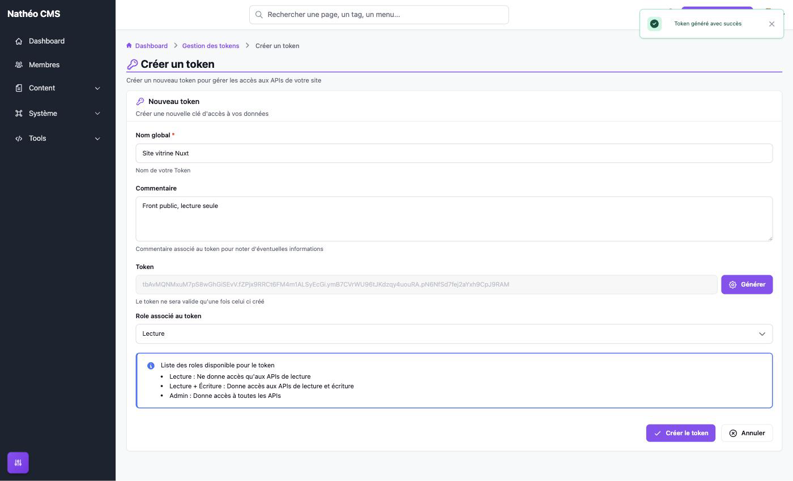
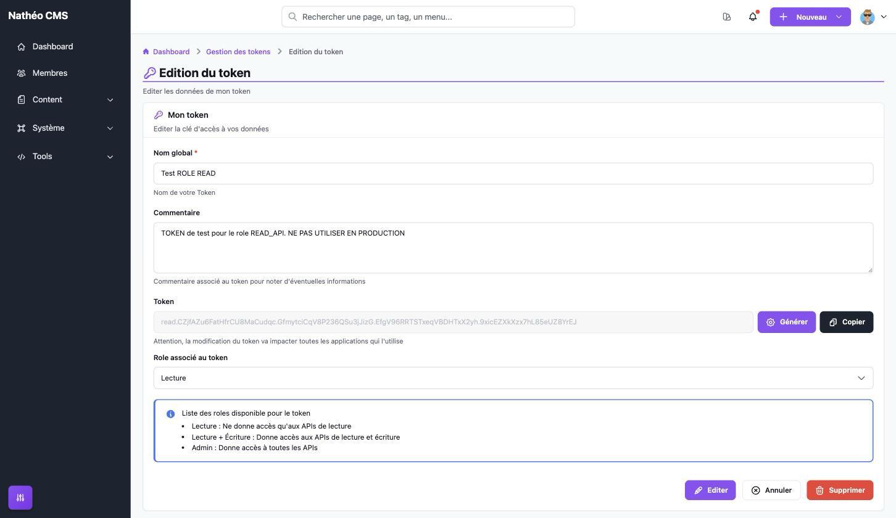
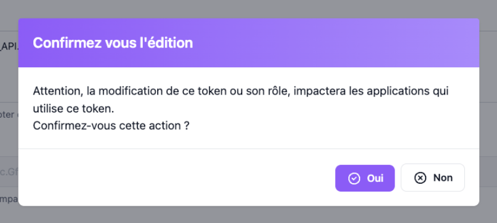

Création et modification d'un [jeton API](jetons_api.md). Comme la liste, ces pages sont réservées aux
**super-administrateurs**.

> 🔐 La valeur d'un jeton n'est affichée qu'**une seule fois**, juste après sa création ou sa régénération. Elle
> n'est stockée nulle part en clair : pensez à la copier immédiatement.

## Créer un jeton

Depuis la [liste des jetons](jetons_api.md#liste-des-jetons), bouton **Nouveau token** (URL
`/admin/{locale}/api-token/add`).

| Champ | Obligatoire | Description |
|---|---|---|
| **Nom global** | Oui | Nom du jeton, affiché dans la liste et seul critère de recherche. Donnez un nom qui identifie l'application qui l'utilise (ex. « Site vitrine Nuxt ») |
| **Commentaire** | Non | Note libre (usage, contact, date de mise en service...) |
| **Token** | — | Rien à saisir : le jeton est généré par le serveur au moment de la création |
| **Date d'expiration** | Non | Au-delà de cette date, le jeton est refusé. Il reste valide jusqu'à 23:59:59 le jour indiqué. Laisser vide pour un jeton sans expiration |
| **Role associé au token** | Oui | *Lecture* (par défaut), *Lecture + Écriture* ou *Admin*. Voir [Les rôles d'un jeton](jetons_api.md#les-rôles-dun-jeton) |

**Créer le token** enregistre le jeton (sans fenêtre de confirmation). Le jeton est **actif dès sa création**.
**Annuler** revient à la page précédente sans rien enregistrer. Si le nom est vide, un message « Vous devez saisir
un nom pour votre token » s'affiche sous le champ et le bouton reste grisé jusqu'à correction ; le serveur refuse
lui aussi un nom vide.

Une fois le jeton créé, sa valeur s'affiche **une seule et unique fois**, avec un bouton **Copier** et l'avertissement
« Copiez ce token maintenant : pour des raisons de sécurité, il ne sera plus jamais affiché. » Le bouton
d'enregistrement est alors remplacé par **Retour à la liste**.

> ⚠️ **Copiez le jeton avant de quitter la page.** Seule son empreinte est conservée en base : il est impossible de
> le réafficher ensuite. Un jeton perdu doit être [régénéré](#régénérer-un-jeton).

Un jeton généré est composé de **4 segments de 24 caractères** alphanumériques aléatoires, séparés par des points
(99 caractères au total).

## Modifier un jeton

Depuis la liste, icône ✏️ (URL `/admin/{locale}/api-token/update/{id}`).

On retrouve les mêmes champs, avec en plus :

- À la place de la valeur du jeton, un message rappelant qu'elle n'est pas affichée pour des raisons de sécurité,
  et un bouton **Régénérer** (voir ci-dessous).
- La date de **Dernière utilisation** du jeton (« Jamais utilisé » s'il n'a encore servi à aucun appel).
- Un bouton **Supprimer**, qui demande confirmation puis supprime le jeton **définitivement** et revient à la
  liste. Toute application qui l'utilisait perd son accès immédiatement.

**Editer** ouvre une fenêtre de confirmation avant d'enregistrer :

Après confirmation, le nom, le commentaire, la date d'expiration et le rôle sont enregistrés et vous restez sur la
page. L'enregistrement **ne modifie ni la valeur du jeton, ni son état** actif / désactivé.

Changer le **rôle** ou la **date d'expiration** s'applique dès l'appel suivant. Ajouter une date d'expiration déjà
passée coupe immédiatement le jeton ; la retirer (ou la repousser) le rend de nouveau utilisable.

### Régénérer un jeton

Le bouton **Régénérer** remplace la valeur du jeton par une nouvelle, après une fenêtre de confirmation
(« Régénérer le token ? »). C'est la marche à suivre si un jeton a fuité, ou si sa valeur a été perdue, et que vous
voulez garder son nom, son commentaire, son rôle et sa date d'expiration.

- La régénération est **enregistrée immédiatement**, sans passer par le bouton *Editer*.
- **L'ancienne valeur cesse de fonctionner aussitôt** : mettez à jour toutes les applications concernées, sans
  quoi elles reçoivent une erreur `401` « Token Invalide ».
- Comme à la création, la nouvelle valeur n'est affichée **qu'une seule fois**, avec un bouton **Copier**.
- La date de dernière utilisation est remise à « Jamais utilisé ».

### Points d'attention

- Le bouton **Supprimer** de la page d'édition reste affiché, et fonctionne, même quand l'option
  [Autoriser la suppression des données](../options.md) est désactivée (seule l'icône de la liste est masquée).
- Si la page reste ouverte longtemps, l'enregistrement, la régénération ou la suppression peuvent échouer avec le
  message « Jeton de sécurité invalide, veuillez recharger la page » : rechargez la page et recommencez.
- Si le jeton demandé n'existe pas (supprimé entre-temps, mauvais identifiant), la page affiche « Aucun token
  trouvé » avec un bouton **Retour** vers la liste et un bouton **Nouveau token**.

## Notes techniques

- Routes de `ApiTokenController` :
  - `add` et `update/{id}` (`GET`, affichage). Le formulaire reçoit les données via
    `ApiTokenService::getApiTokenFormData()`, qui n'expose jamais le hash du jeton.
  - `save` (`POST`, JSON `{apiToken: {...}}`) : création si `id` est vide ou `0` (`createApiToken()`, qui génère le
    jeton, en stocke le hash et renvoie la valeur en clair dans le champ `token` de la réponse), modification
    sinon (`updateApiToken()`, qui ne touche ni au jeton ni à `disabled`). Réponse `400` si le nom est vide,
    `404` si l'identifiant n'existe pas.
  - `ajax/regenerate/{id}` (`PUT`) : `ApiTokenService::regenerateToken()` génère une nouvelle valeur, en stocke le
    hash, remet `last_used_at` à `null` et renvoie la valeur en clair dans `token`.
  - `ajax/delete/{id}` (`DELETE`).
- Ces trois routes d'écriture exigent un jeton CSRF dans l'en-tête `X-CSRF-TOKEN` (ids `api_token_save`,
  `api_token_regenerate`, `api_token_delete`), sinon réponse `403`.
- Contrôles côté serveur (`hydrateApiToken()`) : nom nettoyé des espaces, rôle filtré sur la liste
  `ApiTokenConst::API_TOKEN_ROLES` (un seul rôle conservé, *Lecture* par défaut si aucun n'est valide), date
  d'expiration attendue au format `AAAA-MM-JJ` et fixée à 23:59:59 (ignorée si invalide).
- Génération : `ApiTokenService::generateToken()` via `ByteString::fromRandom()`, constantes dans
  `ApiTokenConst` (`API_TOKEN_SEGMENT = 4`, `API_TOKEN_LENGTH = 24`), hash par `TokenHasher`.

## Voir aussi
- [Jetons API](jetons_api.md)
- [API](../../../API/index.md)
- [Rôles](../roles.md)
