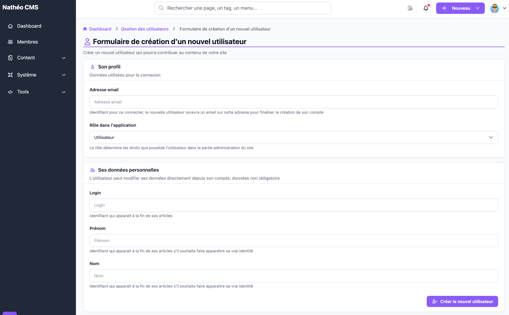
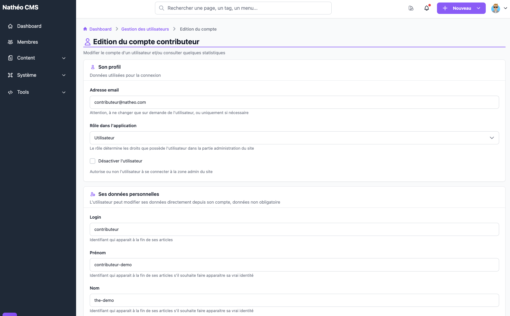
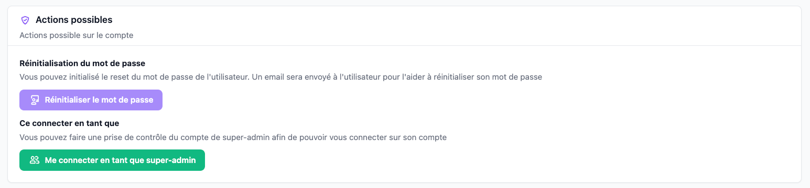

Ce formulaire permet de créer un nouvel utilisateur ou de modifier un compte existant, depuis le
[listing des utilisateurs](listing.md). Les deux écrans se ressemblent, avec quelques différences détaillées
ci-dessous.

## Accès

Réservé aux **super-administrateurs**, via le bouton **Nouvel utilisateur** du listing (création) ou l'action
✏️ **Modifier** d'une ligne (édition).

## Créer un utilisateur

| Champ | Obligatoire | Description |
|---|---|---|
| Adresse email | Oui | Sert d'identifiant de connexion |
| Rôle | Oui | Voir le détail des 4 rôles ci-dessous |
| Login | Non | Si laissé vide, dérivé automatiquement de la partie avant le `@` de l'email |
| Prénom | Non | — |
| Nom | Non | — |

Un encart rappelle les 4 rôles disponibles, listés **du moins au plus puissant**, chaque rôle héritant des
droits du rôle inférieur : **Utilisateur** (connexion seule), **Contributeur** (ajout de contenu), **Administrateur**
(administration des contenus : commentaires, membres…), **Super Administrateur** (gestion complète du CMS). Voir
la page [Les rôles](../roles.md) pour le détail de la hiérarchie technique.

À la création, aucun mot de passe n'est demandé : un mot de passe aléatoire est généré côté serveur (jamais
communiqué), et un email est envoyé au nouvel utilisateur avec un lien pour définir son propre mot de passe.

## Modifier un utilisateur

| Champ | Description |
|---|---|
| Adresse email | Modifiable |
| Rôle | Modifiable — **absent du formulaire si vous modifiez le compte fondateur** — voir l'avertissement ci-dessous |
| Désactiver l'utilisateur | Case à cocher — **absente du formulaire si vous modifiez le compte fondateur**, correctement pré-cochée selon l'état réel du compte |
| Login / Prénom / Nom | Modifiables, non obligatoires |

Un rappel de la date de dernière modification s'affiche sous ces champs.

> 🐛 **Bug réel vérifié en direct** : la liste déroulante **Rôle** de ce formulaire d'édition affiche toujours
> **« Utilisateur »** par défaut à l'ouverture de la page, **quel que soit le rôle réel du compte** (le HTML
> généré ne marque jamais l'option correspondante comme sélectionnée). La capture ci-dessus le montre sur le
> compte `contributeur`, dont le rôle réel est pourtant Contributeur (visible dans le [listing](listing.md)).
> **Conséquence concrète : si vous modifiez un autre champ de ce formulaire (prénom, nom…) et enregistrez sans
> avoir vous-même resélectionné le bon rôle dans la liste, le compte est silencieusement rétrogradé au rôle
> Utilisateur.** Pensez à toujours vérifier/resélectionner le bon rôle avant d'enregistrer une modification.

> ⚠️ Seul le **fondateur** peut ouvrir sa propre page de modification : n'importe quel autre utilisateur (même
> Super Administrateur) qui tente d'accéder à cette URL est redirigé vers le listing. Un message d'avertissement
> remplace alors la carte d'actions habituelle : *"Ce compte possède un rôle SUPER_ADMIN et est fondateur, par
> sécurité certaines données ne sont pas modifiables et certaines actions ne sont pas autorisées."*

### Carte "Action"

Absente pour le fondateur (remplacée par le message ci-dessus). Pour tout autre compte, son contenu dépend de
l'état du compte :

- **Compte désactivé** : un bandeau d'avertissement indique que certaines actions ne sont pas disponibles (pas de
  réinitialisation de mot de passe ni de prise de contrôle possible depuis cet écran).
- **Compte actif** : deux actions sont proposées —
  - **Réinitialiser le mot de passe** : envoie un email à l'utilisateur avec un lien pour définir un nouveau mot
    de passe (même mécanisme que la création de compte) ;
  - **Me connecter en tant que {login}** : prise de contrôle immédiate du compte (voir
    [listing](listing.md#se-connecter-en-tant-que-prise-de-contrôle)), sans confirmation.

### Carte "Information"

Affiche trois dates relatives : création du compte, dernière modification, et **dernière connexion** — cette
dernière peut rester vide si l'utilisateur ne s'est encore jamais connecté.

## Voir aussi
- [Listing des utilisateurs](listing.md)
- [Référence technique](technique.md)
- [Les rôles](../roles.md)
