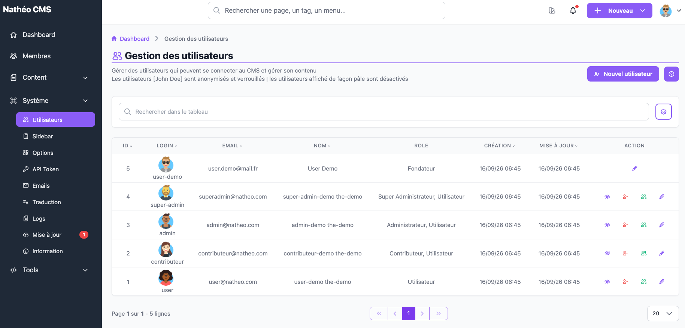

La page **Gestion des utilisateurs** liste tous les comptes pouvant se connecter à l'administration du CMS, et
permet de créer, modifier, désactiver, supprimer ou anonymiser un compte, ainsi que de s'y connecter directement
("prise de contrôle").

## Accès

Réservée aux **super-administrateurs** (`ROLE_SUPER_ADMIN`), via *Système > Gestion des utilisateurs* ou
directement à l'URL `/admin/{locale}/user/`.

## Listing

Le tableau (composant [Grid](../../../Architecture/composants/grid.md)) liste tous les comptes : id, login (avec
avatar si renseigné), email, nom, rôle(s) et dates de création/mise à jour. La recherche filtre sur l'**email, le
login, le prénom ou le nom** (pas sur le rôle) ; les colonnes id/login/email/prénom/dates sont triables.

Deux affichages particuliers dans la liste, décrits par le bandeau d'aide (icône ⓘ en haut de page) :
- un compte **anonymisé** apparaît sous le nom **John Doe** (email masqué en `--@anonyme.com`) et ne propose
  **aucune action** ;
- un compte **désactivé** est affiché en grisé/pâle, mais reste modifiable normalement.

> 📝 La colonne **Rôle** affiche toujours **« Utilisateur »** en plus du rôle réellement attribué (ex.
> « Administrateur, Utilisateur ») : `User::getRoles()` ajoute systématiquement `ROLE_USER` à la liste des rôles
> de tout compte. Seul un compte au rôle Utilisateur seul n'affiche donc qu'une seule valeur. Pour le compte
> **fondateur**, cette colonne affiche littéralement **« Fondateur »** à la place de son rôle réel (toujours
> Super Administrateur).

### Actions disponibles

| Action | Condition d'affichage | Effet |
|---|---|---|
| 👁️ **Désactiver** / **Activer** | Masquée uniquement pour le compte fondateur | Bascule `disabled` ; désactiver demande confirmation, réactiver non |
| 🗑️ **Supprimer** ou 🔁 **Anonymiser** | Visible seulement si l'option système *Autoriser la suppression de données* est active ; masquée pour le fondateur | Voir *Suppression vs anonymisation* ci-dessous |
| 👥 **Se connecter en tant que** | Masquée si le compte est désactivé ou si c'est le compte fondateur | Prise de contrôle immédiate du compte (voir ci-dessous), sans confirmation |
| ✏️ **Modifier** | Visible pour tous les comptes, **sauf** la ligne du fondateur si vous n'êtes pas vous-même le fondateur | Ouvre le [formulaire d'édition](ajouter_editer.md) |

> ⚠️ Le compte **fondateur** (celui créé lors de l'installation, toujours Super Administrateur) n'affiche **aucune
> action** dans le listing pour les autres utilisateurs — ni désactivation, ni suppression, ni prise de contrôle,
> ni même modification. Seul le fondateur, en consultant sa propre ligne, peut se modifier lui-même. En revanche,
> un compte Super Administrateur **qui n'est pas le fondateur** ne bénéficie d'aucune de ces protections : un
> autre super-administrateur peut le désactiver, le supprimer/anonymiser ou prendre son contrôle.

### Suppression vs anonymisation

Le comportement du bouton de suppression dépend de deux options système (page *Options système*, non encore
rédigée) :

| `Autoriser la suppression de données` | `Remplacer par un compte anonyme` | Résultat |
|---|---|---|
| Non | — | Action masquée, suppression refusée même par URL directe |
| Oui | Non | Suppression définitive du compte (et de son avatar sur disque) |
| Oui | Oui | Le compte est anonymisé (voir détail dans la [référence technique](technique.md)) plutôt que supprimé |

### Se connecter en tant que (prise de contrôle)

Le bouton **Se connecter en tant que** bascule votre session sur le compte ciblé (mécanisme `_switch_user` de
Symfony), sans mot de passe ni confirmation. L'action est journalisée (voir [Gestion des logs](../logs.md)) —
canal d'authentification, niveau *avertissement*, avec votre email et celui du compte ciblé.

## Voir aussi
- [Ajouter / modifier un utilisateur](ajouter_editer.md)
- [Référence technique](technique.md)
- [Les rôles](../roles.md)
- [Options système](../options.md)
- [Tableau GRID](../../../Architecture/composants/grid.md)
