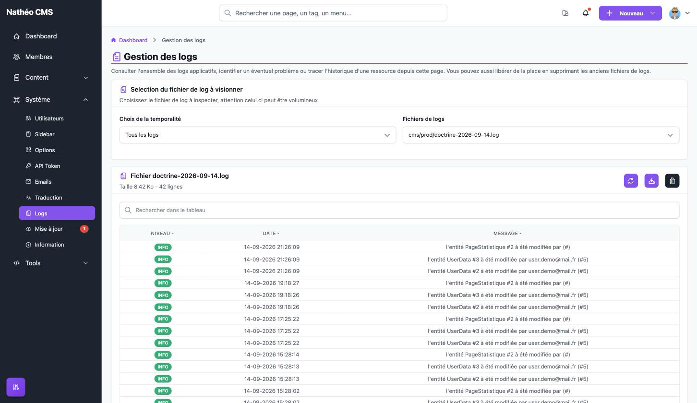

La page **Gestion des logs** permet de consulter, télécharger et supprimer les fichiers de log du CMS : journal des
connexions à l'administration, historique des modifications en base de données et journal général de l'application.

La page ne fait que **lire** les fichiers présents sur le serveur : elle ne permet pas de choisir ce qui est
journalisé. Seul l'historique des modifications en base peut être désactivé, depuis les
[options système](options.md#logs).

## Accès

Réservée aux **super-administrateurs** (`ROLE_SUPER_ADMIN`), via *Système > Logs* ou directement à l'URL
`/admin/{locale}/log/`.

## Ce qui est journalisé

| Fichier | Contenu | Niveaux |
|---|---|---|
| `cms/{env}/auth-AAAA-MM-JJ.log` | Connexions à l'administration : « Connexion de *email* - IP *ip* » en cas de succès, « Tentative de Connexion de *email* - IP *ip* » en cas d'échec (l'email est celui saisi, même s'il ne correspond à aucun compte). Prises de contrôle d'un compte via [Se connecter en tant que](Utilisateurs/listing.md#se-connecter-en-tant-que-prise-de-contrôle) | `INFO` (succès), `WARNING` (échec, prise de contrôle) |
| `cms/{env}/doctrine-AAAA-MM-JJ.log` | Chaque création, modification et suppression d'une entité en base : « l'entité *Tag* #12 à été modifiée par *email* (#*id*) ». Uniquement si l'option **Enregistrer tout changement dans la base de donnée** est activée (c'est le cas à l'installation) | `NOTICE` (création), `INFO` (modification), `WARNING` (suppression) |
| `{env}-AAAA-MM-JJ.log` | Journal général Symfony (routes appelées, requêtes, erreurs, dépréciations...), en environnements `dev` et `prod` | Tous |

`{env}` est l'environnement d'exécution (`prod`, `dev` ou `test`). Les fichiers sont créés **un par jour** et seuls
les plus récents sont conservés automatiquement : **10 fichiers** pour `auth` et `doctrine`, **5 fichiers** pour le
journal général. Les plus anciens sont supprimés par le CMS lui-même, sans action de votre part.

Précisions :

- L'historique des modifications en base est très bavard : chaque visite du site met par exemple à jour les
  statistiques de la page (`PageStatistique`), et chaque connexion met à jour les données de l'utilisateur
  (`UserData`). Un fichier `doctrine` peut donc grossir très vite sur un site fréquenté.
- L'auteur d'une modification est l'utilisateur connecté à l'administration. Quand il n'y en a pas (visiteur du
  site, API, commande...), il apparaît sous la forme « John doe (#-) », voire vide (« par  (#) »).
- Les messages sont toujours rédigés dans la **langue par défaut du site**, quelle que soit la langue de
  l'utilisateur à l'origine de l'action.

## Consulter un fichier

Le premier bloc permet de choisir le fichier :

| Champ | Effet |
|---|---|
| **Choix de la temporalité** | Filtre la liste des fichiers : *Aujourd'hui* (par défaut à l'ouverture), *Hier* ou *Tous les logs*. Changer ce choix vide la sélection du fichier |
| **Fichiers de logs** | Liste les fichiers correspondants avec leur chemin dans `var/log/` (ex. `cms/prod/doctrine-2026-09-14.log`). Choisir un fichier l'affiche immédiatement |

*Aujourd'hui* et *Hier* ne retiennent que les fichiers datés (`*-AAAA-MM-JJ.log`) : un fichier sans date dans son nom
(`test.log`...) n'apparaît que dans *Tous les logs*. Avec *Tous les logs*, la liste n'est pas triée.

Le second bloc affiche le nom du fichier, sa taille et son nombre de lignes, puis son contenu dans un tableau
(composant [Grid](../../Architecture/composants/grid.md)), **les entrées les plus récentes en premier** :

| Colonne | Contenu |
|---|---|
| **Niveau** | Gravité de l'entrée, sous forme de pastille colorée : bleue (`DEBUG`), verte (`INFO`, `NOTICE`), orange (`WARNING`), rouge (`ERROR`, `CRITICAL`, `ALERT`, `EMERGENCY`) |
| **Date** | Date et heure de l'entrée, **en UTC** (pas à l'heure locale du site) |
| **Message** | Texte de l'entrée |

Le nombre de lignes par page suit votre option *Nombre d'éléments par page* et peut être changé sous le tableau.
Le champ de recherche et le tri par colonne ne portent que sur **la page affichée**, pas sur tout le fichier : pour
chercher dans un fichier entier, téléchargez-le.

Les trois boutons en haut à droite du bloc (icônes seules, sans libellé) :

| Bouton | Effet |
|---|---|
| 🔄 **Recharger** | Relit le fichier et revient à la première page, pour voir les entrées ajoutées depuis l'ouverture |
| ⬇️ **Télécharger** | Ouvre un nouvel onglet qui télécharge le fichier brut |
| 🗑️ **Supprimer** | Demande confirmation dans une fenêtre, puis supprime le fichier du serveur. La suppression est **définitive**. La page revient ensuite sur *Aujourd'hui*, sans fichier sélectionné |

### Points d'attention

- **Fichiers de même nom dans deux dossiers** : la sélection se fait sur le seul nom du fichier, sans son dossier.
  Si deux environnements ont un fichier du même nom (ex. `cms/dev/doctrine-2026-09-29.log` et
  `cms/prod/doctrine-2026-09-29.log`), la consultation affiche un tableau **vide** (0 ligne) malgré le message
  « chargé avec succès », le téléchargement renvoie l'un des deux au hasard et la suppression **efface les deux**.
  Ce cas n'arrive que si plusieurs environnements partagent le même dossier `var/log/` (typiquement une instance de
  développement).
- **Dernière page incomplète** : quand le nombre de lignes n'est pas un multiple du nombre d'éléments par page, la
  dernière page est complétée avec des entrées déjà affichées sur l'avant-dernière (ex. fichier de 42 lignes, 20 par
  page : la page 3 affiche 20 entrées dont 18 déjà vues en page 2, au lieu des 2 plus anciennes).
- Le nombre de lignes affiché compte toutes les lignes du fichier, mais seules celles au format JSON sont affichées :
  un fichier écrit dans un autre format (comme `test.log`) apparaît vide.
- Les messages sont affichés **sans échappement HTML** : un message contenant du HTML est interprété par le
  navigateur. Or l'email saisi sur la page de connexion est journalisé tel quel en cas d'échec, par n'importe quel
  visiteur. Évitez d'ouvrir les fichiers `auth` d'un site public dans l'administration en cas de doute, et préférez
  les télécharger.

## Notes techniques

- Les canaux et fichiers sont déclarés dans `config/packages/monolog.yaml` : canaux `auth` et `doctrine_log`
  (handlers `rotating_file`, format JSON, `max_files: 10`, dans `%kernel.logs_dir%/cms/%kernel.environment%/`), et
  handler `main` (`rotating_file`, format JSON, `max_files: 5`) pour le journal général en `dev` et en `prod`. En
  `prod`, ce handler `main` est configuré avec des options de type `fingers_crossed` (`action_level: error`,
  `handler: nested`) qui ne s'appliquent pas à un `rotating_file` : il enregistre donc **tous** les niveaux, pas
  seulement les erreurs.
- Écriture : `App\Service\LoggerService` (`logAuthAdmin()` appelé par `UserAuthenticator`, `logSwitchUser()` par
  `SwitchUserSubscriber`, `logDoctrine()` par `DatabaseActivityListener` sur les événements Doctrine `postPersist`,
  `postUpdate` et `postRemove`, si `OS_LOG_DOCTRINE` vaut `1`).
- Lecture : le même service liste les fichiers de `var/log/` (`getAllFiles()`), lit une page du fichier en partant
  de la fin (`loadLogFile()`), le supprime (`deleteLog()`) ou en donne le chemin pour le téléchargement
  (`getPathFile()`). Routes de `LogController` : `ajax/data-select-log/{time}`,
  `ajax/load-log-file/{file}/{page}/{limit}`, `ajax/delete-file/{file}` (`DELETE`), `download/{file}`.
- Code concerné : `LogController`, `LoggerService`, `LogTranslate`, composant Vue
  `assets/vue/controllers/Admin/System/Log.vue`, textes dans `translations/log+intl-icu.*.yaml`.

## Voir aussi
- [Options système](options.md#logs)
- [Gestion des utilisateurs](Utilisateurs/listing.md)
- [Tableau GRID](../../Architecture/composants/grid.md)
