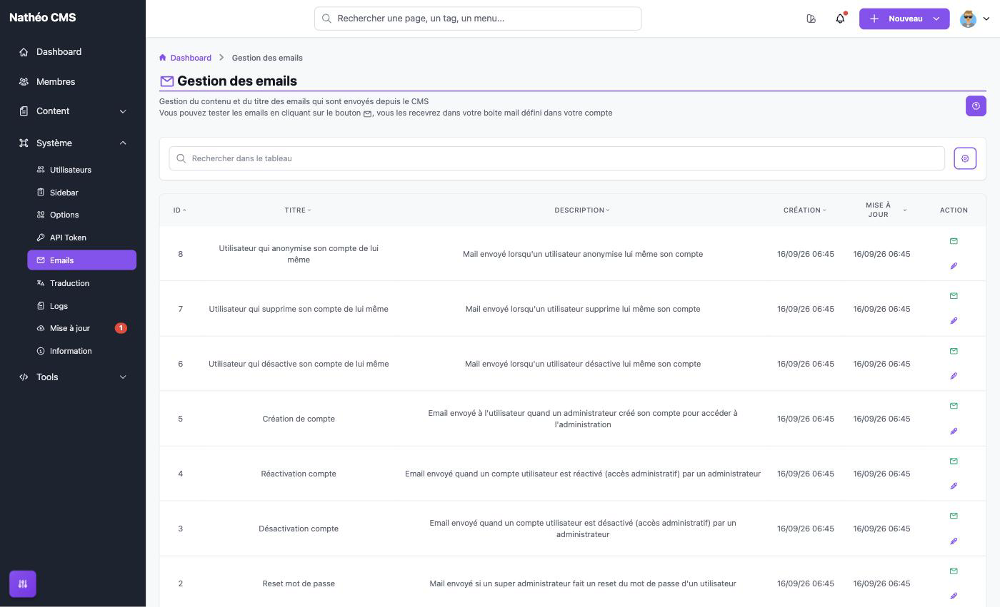
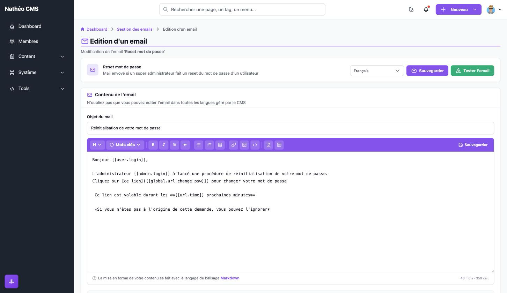
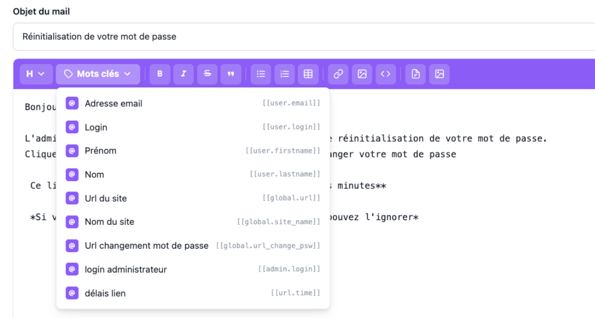

La page **Gestion des emails** permet de personnaliser l'**objet** et le **contenu** des emails envoyés
automatiquement par le CMS (création de compte, réinitialisation de mot de passe...), dans chaque langue, et de
s'envoyer un email de test.

La liste des emails est fixe : on ne peut ni en créer, ni en supprimer, ni changer le moment où ils sont envoyés.
L'expéditeur, l'adresse de réponse et la signature sont communs à tous les emails et se règlent dans les
[options système](options.md#emails).

## Accès

Réservée aux **super-administrateurs** (`ROLE_SUPER_ADMIN`), via *Système > Emails* ou directement à l'URL
`/admin/{locale}/mail/`.

## Listing

Le tableau (composant [Grid](../../Architecture/composants/grid.md)) affiche les 8 emails installés par défaut :

| Colonne | Contenu |
|---|---|
| **Id** | Identifiant de l'email |
| **Titre** | Nom de l'email dans l'administration (ce n'est pas l'objet reçu par le destinataire) |
| **Description** | Situation dans laquelle l'email est envoyé |
| **Création** / **Mise à jour** | Dates de création et de dernière sauvegarde |

Toutes les colonnes sont triables. Le tri par titre suit le nom interne de l'email (`mail.reset.password.title`...),
pas le libellé affiché : l'ordre obtenu peut donc sembler incohérent. La recherche en base de données porte sur
l'**objet et le contenu** de l'email dans la langue de l'administration, pas sur le titre ni la description.

Le bouton **?** en haut à droite ouvre une aide rappelant le rôle des deux actions.

| Action | Effet |
|---|---|
| ✉️ **Tester l'email** | Envoie immédiatement l'email de test à l'adresse de votre compte (voir [Tester un email](#tester-un-email)) |
| ✏️ **Modifier** | Ouvre l'écran d'édition de l'email |

### Les emails et leur déclenchement

| Email | Envoyé quand... | Destinataire |
|---|---|---|
| **Changement de mot de passe** | Un utilisateur utilise « mot de passe oublié » depuis l'écran de connexion | L'utilisateur |
| **Reset mot de passe** | Un super-administrateur réinitialise le mot de passe d'un utilisateur (voir [Ajouter ou modifier un utilisateur](Utilisateurs/ajouter_editer.md)) | L'utilisateur |
| **Création de compte** | Un super-administrateur crée un compte | Le nouvel utilisateur |
| **Utilisateur qui désactive son compte de lui même** | Un utilisateur désactive son propre compte (voir [Profil](../MonCompte/profil.md#zone-de-danger)) | Tous les super-administrateurs actifs |
| **Utilisateur qui supprime son compte de lui même** | Un utilisateur supprime son propre compte | Tous les super-administrateurs actifs |
| **Utilisateur qui anonymise son compte de lui même** | Un utilisateur anonymise son propre compte | Tous les super-administrateurs actifs |
| **Désactivation compte** | **Jamais envoyé** en V2 | — |
| **Réactivation compte** | **Jamais envoyé** en V2 | — |

Précisions :

- Les trois emails « de lui même » ne partent que si l'option **Recevoir un email de notification ?** est activée
  (voir [options système](options.md#emails)), et jamais quand l'utilisateur concerné est lui-même
  super-administrateur. Les emails de suppression et d'anonymisation exigent en plus que la suppression des données
  soit autorisée sur le site.
- Les emails de changement, de réinitialisation de mot de passe et de création de compte partent **toujours**,
  quelle que soit cette option.
- **Désactivation compte** et **Réactivation compte** sont modifiables, mais aucun écran ne les envoie : désactiver
  ou réactiver un utilisateur depuis la [liste des utilisateurs](Utilisateurs/listing.md) ne prévient pas l'intéressé.

## Modifier un email

Le premier bloc rappelle le titre et la description de l'email, et contient :

| Élément | Effet |
|---|---|
| **Langue** | Choisit la version à modifier (*Français*, *Anglais*, *Espagnol*) et la recharge |
| **Sauvegarder** | Enregistre l'objet et le contenu de la langue affichée. Désactivé si l'un des deux est vide |
| **Tester l'email** | Envoie l'email de test à l'adresse de votre compte (voir ci-dessous) |

Le second bloc contient les champs à modifier :

| Champ | Obligatoire | Contenu |
|---|---|---|
| **Objet du mail** | Oui | Objet reçu par le destinataire. Texte brut : les mots-clés n'y sont **pas** remplacés |
| **Contenu** | Oui | Corps de l'email, rédigé en Markdown dans l'[éditeur Markdown](../Modules/editeur_markdown.md) (aperçu, liens internes, médiathèque) |

### Mots-clés

Le menu **Mots clés** de la barre d'outils insère des variables entre doubles crochets, remplacées par la valeur
réelle au moment de l'envoi. Seuls les mots-clés proposés pour l'email en cours sont remplacés.

| Mot-clé | Remplacé par | Disponible dans |
|---|---|---|
| `[[user.email]]`, `[[user.login]]`, `[[user.firstname]]`, `[[user.lastname]]` | Email, login, prénom et nom de l'utilisateur concerné | Tous les emails |
| `[[global.url]]` | URL du site (option *URL du site*) | Tous les emails |
| `[[global.site_name]]` | Nom du site (option *Nom de votre site*) | Tous les emails |
| `[[global.url_change_psw]]` | Lien personnel pour définir un nouveau mot de passe | Changement de mot de passe, Reset mot de passe, Création de compte |
| `[[admin.login]]` | Login du super-administrateur à l'origine de l'action | Reset mot de passe, Création de compte, Désactivation et Réactivation compte |
| `[[url.time]]` | Durée de validité du lien, en minutes (option *Délais de validité du lien de changement de mot de passe*) | Reset mot de passe, Création de compte |

Dans les trois emails « de lui même », les mots-clés `[[user.*]]` désignent l'utilisateur qui a désactivé,
supprimé ou anonymisé son compte, et non le super-administrateur qui reçoit l'email.

### Points d'attention

- **Le bouton *Sauvegarder* de la barre d'outils de l'éditeur n'enregistre rien en base** : sur cet écran, le contenu
  est déjà pris en compte à chaque frappe, ce bouton n'a donc aucun effet visible. Seul le bouton **Sauvegarder** du
  bloc du haut enregistre l'email.
- **Changer de langue recharge l'email sans avertissement** : les modifications non sauvegardées de la langue
  affichée sont perdues. Sauvegardez avant de changer de langue.
- **Les emails partent toujours dans la langue par défaut du site** (option *Langue par défaut du site*), quelle que soit
  la langue de l'utilisateur. Les versions dans les autres langues ne servent que si cette option change. À
  l'installation, les versions anglaise et espagnole sont de simples copies du texte français préfixées par
  `[EN]` / `[ES]`.
- La signature définie dans les options système est ajoutée automatiquement à la fin de chaque email : inutile de
  la répéter dans le contenu.

## Tester un email

**Tester l'email** (depuis le listing ou l'écran d'édition) envoie l'email à l'adresse de **votre compte** et
affiche un message de confirmation. Pour ce test :

- c'est la **version sauvegardée dans la langue par défaut du site** qui est envoyée, pas le texte en cours de
  modification ni la langue affichée à l'écran : sauvegardez d'abord, et changez temporairement la langue par
  défaut pour tester une autre langue ;
- tous les mots-clés `[[user.*]]` et `[[admin.login]]` sont remplis avec **votre propre compte** ;
- le lien `[[global.url_change_psw]]` pointe vers l'accueil du site, et non vers un vrai lien de changement de mot
  de passe.

Le message « envoyé avec succès » signifie seulement que l'email a été **mis en file d'attente** : il n'arrive
réellement que si les deux conditions ci-dessous sont remplies (voir aussi
[Configuration de l'installation](../../Demarrage/configuration_installation.md)) :

- un serveur d'email est configuré dans la variable `MAILER_DSN` du fichier `.env`. La valeur par défaut,
  `null://null`, **jette silencieusement** tous les emails ;
- un processus traite la file d'attente des messages (`php bin/console messenger:consume async`), car tous les
  emails du CMS sont envoyés de façon asynchrone. Sans ce processus, les emails s'accumulent dans la table
  `messenger_messages` sans jamais partir.

Une erreur d'envoi (serveur injoignable, identifiants refusés...) n'apparaît donc pas à l'écran : le message est
retenté 3 fois, puis rangé dans la file des échecs (`failed`).

## Notes techniques

- Les emails sont stockés dans les tables `mail` (clé technique `MAIL_*`, titre, description, liste des mots-clés)
  et `mail_translation` (objet et contenu par langue), créés à l'installation par les fixtures
  (`src/DataFixtures/data/system/mail_fixtures_data.yaml`). La clé technique relie chaque email au code qui l'envoie
  (`App\Utils\System\Mail\MailKey`).
- La liste des mots-clés de chaque email et leurs valeurs sont définies dans `App\Utils\System\Mail\KeyWord`. Le
  remplacement est un simple rechercher/remplacer sur le contenu, avant la conversion Markdown → HTML.
- Envoi : `MailService::sendMail()` convertit le contenu en HTML, ajoute la signature (`OS_MAIL_SIGNATURE`) et
  l'intègre au gabarit `templates/emails/simple_template.html.twig`. Expéditeur et *Reply-To* par défaut :
  `OS_MAIL_FROM` et `OS_MAIL_REPLY_TO`. L'email est ensuite confié à Messenger
  (`config/packages/messenger.yaml` : `SendEmailMessage` routé vers le transport `async`, Doctrine par défaut, 3
  tentatives puis transport `failed`) : l'action qui déclenche l'email n'attend pas son envoi réel.
- Code concerné : `MailController`, `MailService`, entités `Mail`/`MailTranslation`, `MailRepository`, composant
  Vue `assets/vue/controllers/Admin/System/Mail.vue`, textes de l'écran dans `translations/mail+intl-icu.*.yaml`
  (titres, descriptions et libellés des mots-clés dans `translations/messages+intl-icu.*.yaml`).

## Voir aussi
- [Options système](options.md#emails)
- [Gestion des utilisateurs](Utilisateurs/listing.md)
- [Éditeur Markdown](../../Architecture/composants/editeur_markdown.md)
- [Tableau GRID](../../Architecture/composants/grid.md)
