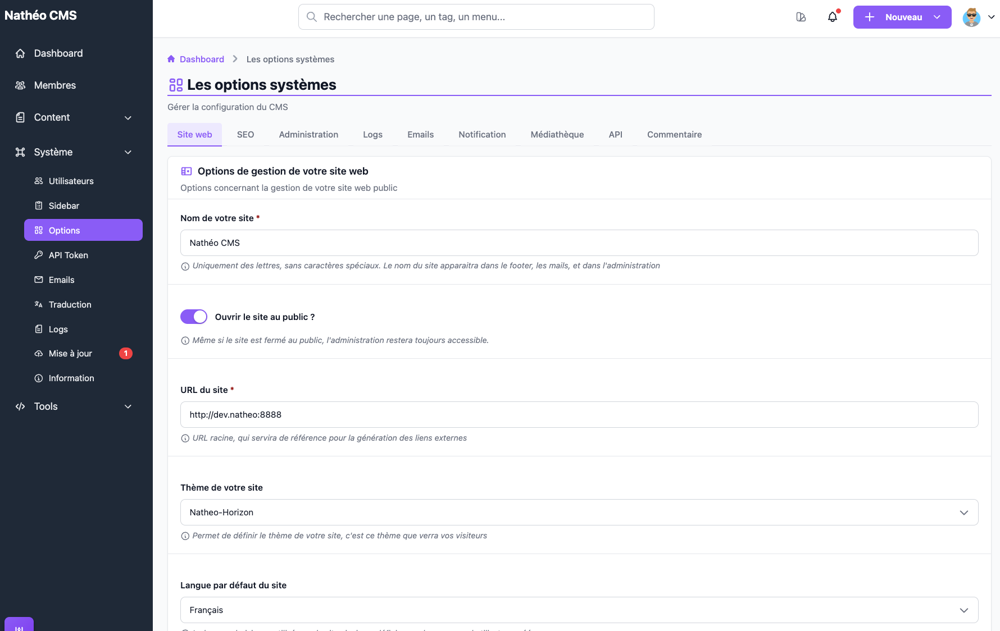
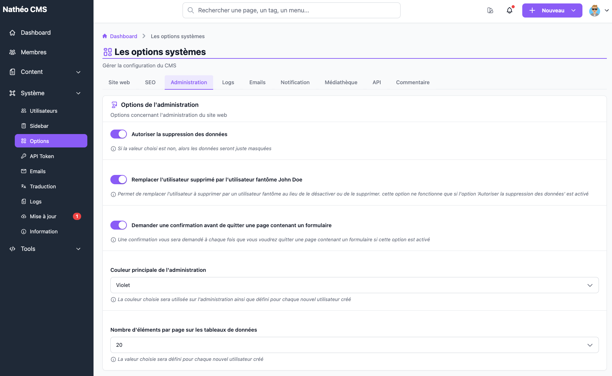

La page **Options système** regroupe la configuration globale du CMS : site public, SEO, comportement de
l'administration, logs, emails, notifications, médiathèque, API et commentaires.

## Accès

Réservée aux **super-administrateurs** (`ROLE_SUPER_ADMIN`), via *Système > Options* ou directement à l'URL
`/admin/{locale}/options-system/change`.

## Fonctionnement

Les options sont réparties en **9 onglets**. Il n'y a **pas de bouton d'enregistrement** : chaque option est
sauvegardée automatiquement dès qu'elle change (bascule d'un interrupteur, choix dans une liste, ou sortie d'un
champ texte). Un indicateur de chargement puis un message de succès s'affichent sous le champ pendant quelques
secondes.

Chaque valeur est **contrôlée côté serveur** avant d'être enregistrée. Si elle est refusée, le champ passe en
rouge avec un message d'erreur, et la valeur n'est pas sauvegardée :

- un champ obligatoire (astérisque rouge) ne peut pas être vide ;
- un interrupteur n'accepte que oui/non, une liste déroulante que l'une de ses valeurs proposées ;
- les adresses **email d'expédition et de réponse** doivent être des emails valides ;
- les **URL des réseaux sociaux** doivent être des URL valides en `http://` ou `https://` (vide autorisé) ;
- les options affichées en lecture seule (chemin et URL de la médiathèque) ne sont pas modifiables.

## Site web

| Option | À l'installation | Effet réel |
|---|---|---|
| **Nom de votre site** * | `Nathéo CMS` | Titre des onglets de l'administration, en-tête et footer du thème public, mots-clés des emails, tableau de bord |
| **Ouvrir le site au public ?** | Oui | Si non : le site public affiche une page « site fermé ». L'administration reste accessible. **Sans effet sur l'API**, qui a sa propre option (voir [API](#api)) |
| **URL du site** * | `http://dev.natheo:8888` (à adapter) | URL racine utilisée pour tous les liens vers le site public (aperçu des pages, emails, recherche globale, éditeur Markdown, API…) |
| **Thème de votre site** | Natheo-Horizon | Thème utilisé par le site public — voir l'avertissement ci-dessous |
| **Langue par défaut du site** | Français | Langue du site pour les visiteurs non connectés, et langue attribuée à chaque **nouvel** utilisateur créé |
| **Texte en bas du footer** | Présentation de Nathéo | Texte affiché dans le footer du thème public |
| **Url Github / Linkedin / Youtube / X / Facebook / Instagram / Tiktok** | Github, Linkedin et X pré-remplis (liens du projet Nathéo) | Icône de réseau social affichée dans le footer si l'URL est renseignée. URL `http(s)://` obligatoire |
| **Script dans la balise HEAD** / **juste après l'ouverture de BODY** / **juste avant la fermeture de BODY** | vide | Exposés par l'API des options — voir la note ci-dessous |

> 📝 Les trois champs de **scripts** (analytics, tag manager…) sont enregistrés et renvoyés par l'API des options
> système, mais le thème fourni **Natheo-Horizon ne les injecte pas** dans ses pages. Ils ne servent donc qu'à un
> front externe qui les récupère via l'API.

## SEO

| Option | À l'installation | Effet réel |
|---|---|---|
| **Bloquer l'indexation de votre site** | Non | Ajoute une balise `<meta name="robots" content="noindex">` à toutes les pages du site public |
| **Bloquer le suivi des liens** | Non | Ajoute une balise `<meta name="robots" content="nofollow">` à toutes les pages du site public |

## Administration

| Option | À l'installation | Effet réel |
|---|---|---|
| **Autoriser la suppression des données** | Oui | Si non, les actions de **suppression** sont masquées (et refusées) partout où elles existent : pages, menus, FAQ, tags, médiathèque, utilisateurs, jetons API, requêtes SQL sauvegardées |
| **Remplacer l'utilisateur supprimé par l'utilisateur fantôme John Doe** | Oui | Si la suppression est autorisée, un utilisateur « supprimé » est anonymisé plutôt que supprimé définitivement. Voir [Gestion des utilisateurs](Utilisateurs/listing.md#suppression-vs-anonymisation) |
| **Demander une confirmation avant de quitter une page contenant un formulaire** | Oui | Affiche une confirmation si vous quittez une page de formulaire |
| **Couleur principale de l'administration** | Violet | Copiée dans les options de chaque **nouvel** utilisateur créé, mais **sans effet visible** — voir ci-dessous |
| **Nombre d'éléments par page sur les tableaux de données** | 20 | Valeur attribuée à chaque **nouvel** utilisateur créé (chaque utilisateur peut ensuite la changer dans ses propres options) |

## Logs

| Option | À l'installation | Effet réel |
|---|---|---|
| **Enregistrer tout changement dans la base de donnée** | Oui | Journalise chaque ajout, modification et suppression d'entité en base. Peut produire des fichiers de log volumineux. Voir [Gestion des logs](logs.md) |

## Emails

| Option | À l'installation | Effet réel |
|---|---|---|
| **Recevoir un email de notification ?** | Oui | Envoie un email lorsqu'un utilisateur désactive, supprime ou anonymise son propre compte — en pratique au **compte fondateur uniquement**, et non à tous les super-administrateurs comme l'indique l'aide (voir la [référence technique des utilisateurs](Utilisateurs/technique.md#notifications-et-emails-liés)) |
| **Délais de validité du lien de changement de mot de passe** | 20 min | Durée de validité du lien envoyé à la création d'un compte ou lors d'une réinitialisation de mot de passe |
| **Email envoyé en tant que** * | `support@natheo.fr` | Adresse d'expéditeur de tous les emails du CMS. Doit être un email valide |
| **Adresse email de réponse** * | `support@natheo.fr` | Adresse *Reply-To* de tous les emails du CMS. Doit être un email valide |
| **Signature email** | « Cordialement, L'équipe de Natheo CMS » | Texte ajouté en pied de chaque email (HTML autorisé) |

## Notification

| Option | À l'installation | Effet réel |
|---|---|---|
| **Activer les notifications ?** | Oui | Si non : plus aucune notification n'est créée, la cloche du header disparaît et la page des notifications redirige vers le tableau de bord. Voir [Notifications](../MonCompte/Notifications/notifications.md) |
| **Temps en jour avant suppression des notifications** | 1 mois | Âge au-delà duquel les notifications **lues** sont supprimées lors d'une purge (1 semaine à 1 an) |

## Médiathèque

| Option | À l'installation | Effet réel |
|---|---|---|
| **Path du dossier média** | `natheotheque` | Affiché en lecture seule (non modifiable depuis l'interface) |
| **URL public pour accéder aux images stockées** | URL du site | Affiché en lecture seule (non modifiable depuis l'interface) |
| **Création de dossiers physiques** | Oui | Crée un vrai dossier sur le disque pour chaque dossier créé dans la [médiathèque](../Contenu/Mediatheque/mediatheque.md) |

## API

| Option | À l'installation | Effet réel |
|---|---|---|
| **Ouvrir l'API ?** | Oui | Si non, **toutes** les routes `/api` renvoient une erreur `403` « Ressource non accessible - API fermée », quel que soit le jeton. Indépendant de l'ouverture du site au public. Sur une installation antérieure où l'option n'existe pas encore en base, l'API est considérée comme ouverte. Voir [API](../../API/index.md) |
| **Temps de validation du token de connexion en tant que administrateur sur le front** | 1 heure | Durée de validité du jeton obtenu par un utilisateur qui se connecte via l'API : 30 min, 1 h, 2 h, 3 h, 12 h ou 24 h. **24 h est un maximum** : l'ancien choix « Sans limite » n'existe plus (une installation qui l'utilisait est passée à 24 h lors de la mise à jour) |

## Commentaire

| Option | À l'installation | Effet réel |
|---|---|---|
| **Ouvrir les commentaires ?** | Oui | Si non, les commentaires sont fermés sur **tout** le site, même sur les pages qui les autorisent (l'ajout via l'API est refusé) |
| **Forcer la validation des nouveaux commentaires** | Oui | Tout nouveau commentaire est créé *en attente de validation*. Une page peut aussi imposer la validation individuellement, même si cette option est désactivée. Voir [Commentaires](../Contenu/Commentaires/listing.md) |

## Référence technique

| Élément | Rôle |
|---|---|
| [`OptionSystemController`](https://github.com/counteraccro/natheo/blob/master/src/Controller/Admin/System/OptionSystemController.php) | Affichage de la page (`index`) et sauvegarde d'une option en AJAX (`update`), protégée par un jeton CSRF envoyé dans l'en-tête `X-CSRF-TOKEN` |
| [`OptionSystemService`](https://github.com/counteraccro/natheo/blob/master/src/Service/Admin/System/OptionSystemService.php) | Lecture/écriture par clé, `updateValueFromAdmin()` (sauvegarde validée), raccourcis `canDelete()`, `canReplace()`, `canNotification()`, `canSendMailNotification()` |
| [`OptionConfigService`](https://github.com/counteraccro/natheo/blob/master/src/Service/Admin/System/OptionConfigService.php) | Validation commune aux options système et utilisateur : clé présente dans le YAML, option non désactivée, valeur conforme au type et à la clé `validation` (`email`, `url`) |
| [`OptionSystem` (enum)](https://github.com/counteraccro/natheo/blob/master/src/Enum/Admin/System/Options/OptionSystem.php) | Liste des clés `OS_*` |
| `config/cms/options_system.yaml` | Définition du formulaire : onglets, type de champ (`text`, `boolean`, `textarea`, `select`), valeurs possibles, champs obligatoires (`required`) ou désactivés (`disabled`), format attendu (`validation`) |
| [`OptionExtension`](https://github.com/counteraccro/natheo/blob/master/src/Twig/Extension/Admin/System/OptionExtension.php) | Fonction Twig `option_system_form()` qui génère le HTML des onglets à partir du YAML |
| `assets/vue/controllers/Admin/System/Option.vue` | Écoute les changements de champ et envoie la sauvegarde AJAX |

Les valeurs sont stockées dans la table `option_system` (clé / valeur, toujours en texte ; les booléens valent
`0` ou `1`). Le formulaire est entièrement piloté par le YAML : ajouter une option consiste à ajouter sa clé à
l'enum, sa définition au YAML et sa ligne en base. Une clé absente du YAML est refusée à l'enregistrement.

> 📝 Les valeurs posées à l'installation viennent des fixtures
> (`src/DataFixtures/data/system/option_system_fixtures_data.yaml`, chargées par `natheo:install`)

Seules certaines options sont exposées publiquement par l'API (`ApiOptionSystemService::getWhiteListeOptionSystem()`) :
nom et URL du site, thème, scripts, ouverture des commentaires, footer, réseaux sociaux et options robots.

## Voir aussi
- [Gestion des utilisateurs](Utilisateurs/listing.md)
- [Gestion des logs](logs.md)
- [Notifications](../MonCompte/Notifications/notifications.md)
- [Médiathèque](../Contenu/Mediatheque/mediatheque.md)
- [Commentaires](../Contenu/Commentaires/listing.md)
