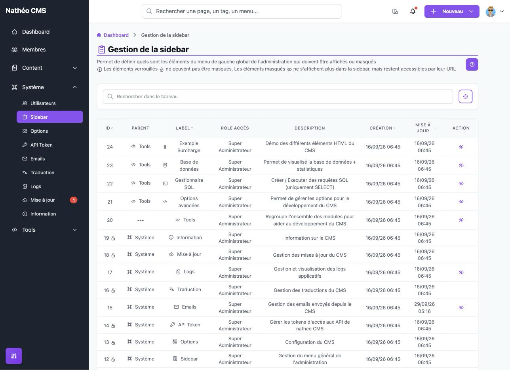
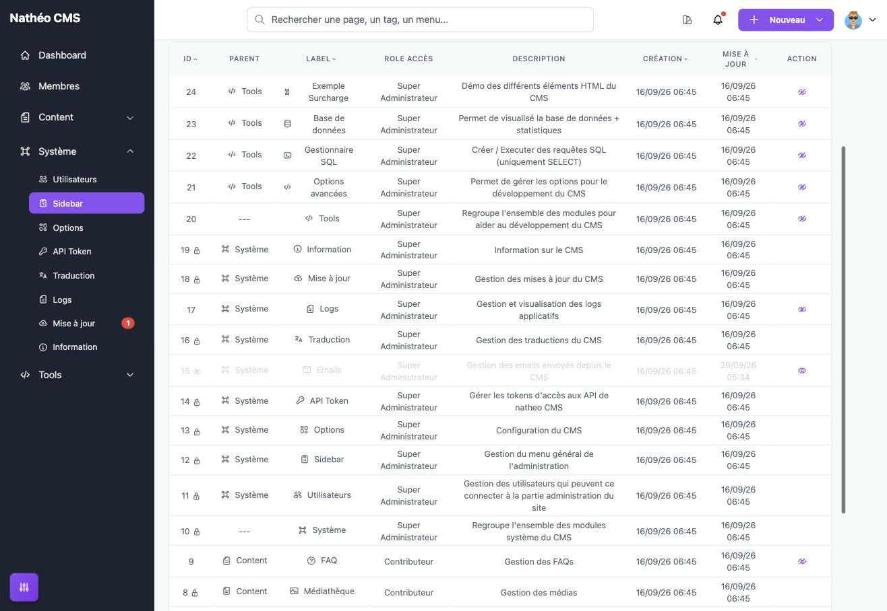
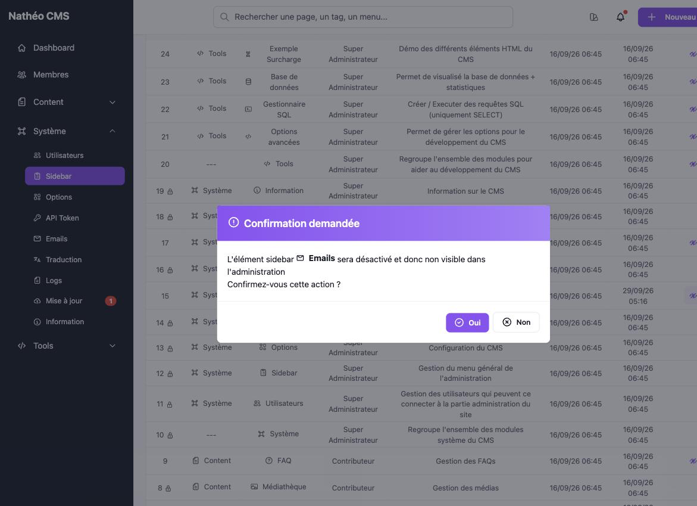

La page **Gestion de la sidebar** liste tous les éléments du menu de gauche de l'administration et permet d'en
**masquer** ou d'en **réafficher** certains, pour tous les utilisateurs à la fois. C'est la seule opération possible :
on ne peut ni ajouter, ni renommer, ni réordonner, ni changer le rôle d'un élément depuis l'interface.

## Accès

Réservée aux **super-administrateurs** (`ROLE_SUPER_ADMIN`), via *Système > Sidebar* ou directement à l'URL
`/admin/{locale}/sidebar/`.

## Listing

Le tableau (composant [Grid](../../Architecture/composants/grid.md)) affiche les 24 éléments installés par défaut,
triés par id décroissant :

| Colonne | Contenu |
|---|---|
| **Id** | Identifiant de l'élément |
| **Parent** | Groupe auquel appartient l'élément (*Content*, *Système*, *Tools*), ou `---` pour un élément de premier niveau |
| **Label** | Icône et libellé tels qu'affichés dans la sidebar |
| **Rôle accès** | Rôle minimal pour voir l'élément (voir [Les rôles](roles.md)) |
| **Description** | Description courte du module |
| **Création** / **Mise à jour** | Dates de création et de dernière modification (la mise à jour change à chaque masquage/réaffichage) |

Les colonnes id, label, création et mise à jour sont triables. La recherche ne fonctionne qu'en mode **« dans le
tableau »** (filtrage de la page affichée) : la recherche en base de données n'est pas proposée sur cet écran.

Deux icônes accompagnent l'id, comme le rappelle le bandeau d'information en haut de page : 🔒 pour un élément
**verrouillé** (voir ci-dessous) et un œil barré pour un élément **masqué**. Un élément masqué reste listé, mais sa
ligne est affichée **grisée** :

### Actions disponibles

| Action | Condition d'affichage | Effet |
|---|---|---|
| 👁️‍🗨️ **Masquer** | Élément non verrouillé et actuellement visible | Masque l'élément après confirmation |
| 👁️ **Afficher** | Élément non verrouillé et actuellement masqué | Réaffiche l'élément, sans confirmation |

Le changement est enregistré immédiatement (message de succès en bas de l'écran), mais la sidebar elle-même n'est
**pas rafraîchie** : l'élément ne disparaît (ou ne réapparaît) du menu qu'au prochain chargement de page.

### Éléments verrouillés

La plupart des éléments sont **verrouillés** (🔒 à côté de l'id) et n'affichent aucune action : il est impossible
de les masquer, ce qui évite par exemple de retirer du menu la page *Sidebar* elle-même. Seuls ces éléments peuvent
être masqués :

| Élément | Groupe |
|---|---|
| Membres | — (premier niveau) |
| FAQ | Content |
| Emails | Système |
| Logs | Système |
| Tools (le groupe entier) | — (premier niveau) |
| Options avancées, Gestionnaire SQL, Base de données, Exemple Surcharge | Tools |

## Comportement dans la sidebar

- **Masquer un groupe masque tout son contenu** : si *Tools* est masqué, ses quatre sous-éléments disparaissent
  aussi, quel que soit leur propre état. Les réafficher individuellement n'a aucun effet tant que le groupe reste
  masqué.
- **Un groupe dont aucun élément n'est visible disparaît aussi** : si tous ses sous-éléments sont masqués (ou
  réservés à un rôle que l'utilisateur n'a pas), le groupe n'est pas affiché du tout.
- **Masquer n'est pas interdire** : l'élément disparaît du menu, mais la page correspondante reste accessible par
  son URL, avec les mêmes droits qu'avant. Pour restreindre réellement l'accès, voir [Les rôles](roles.md).
- En plus du masquage, chaque élément n'est affiché que si l'utilisateur connecté possède son **rôle d'accès** (un
  contributeur ne voit ni *Système* ni *Tools*). Ce rôle est fixé à l'installation et non modifiable depuis l'écran.
- L'ordre des éléments dans le menu suit leur id (ordre d'installation) et n'est pas modifiable.
- Deux éléments pointent vers `#` et ne mènent nulle part en V2 : **Membres** et **Mise à jour**. La pastille
  rouge **« 1 »** affichée à côté de *Mise à jour* est codée en dur : elle ne correspond à aucune mise à jour
  réellement disponible.

## Notes techniques

- Les éléments sont stockés dans la table `sidebar_element` (entité `SidebarElement`) et créés à l'installation
  par les fixtures (`src/DataFixtures/data/system/sidebar_element_fixtures_data.yaml`). C'est dans ce fichier que se
  définissent libellé, icône, route, rôle, parent et verrouillage (`lock`) ; ajouter un module au menu passe donc par
  une nouvelle entrée en base, pas par l'interface.
- Le menu est généré côté serveur par la fonction Twig `getSidebar()` (`SidebarExtension`), appelée dans
  `templates/admin/includes/menu.html.twig`. Un seul niveau d'imbrication est géré (groupe > élément).
- Le masquage passe par la route `PUT /admin/{locale}/sidebar/ajax/update-disabled/{id}`, qui exige un jeton CSRF
  dans le header `X-CSRF-TOKEN` (fourni par le tableau avec chaque action). La route refuse aussi elle-même de
  modifier un élément verrouillé : un appel direct sur un tel élément renvoie une erreur 403, sans rien changer.

## Voir aussi
- [Les rôles](roles.md)
- [Options système](options.md)
- [Tableau GRID](../../Architecture/composants/grid.md)
