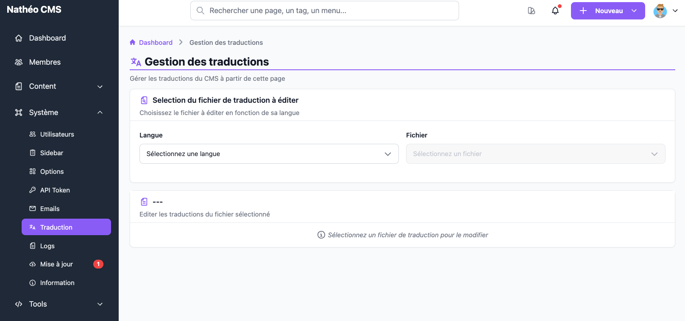
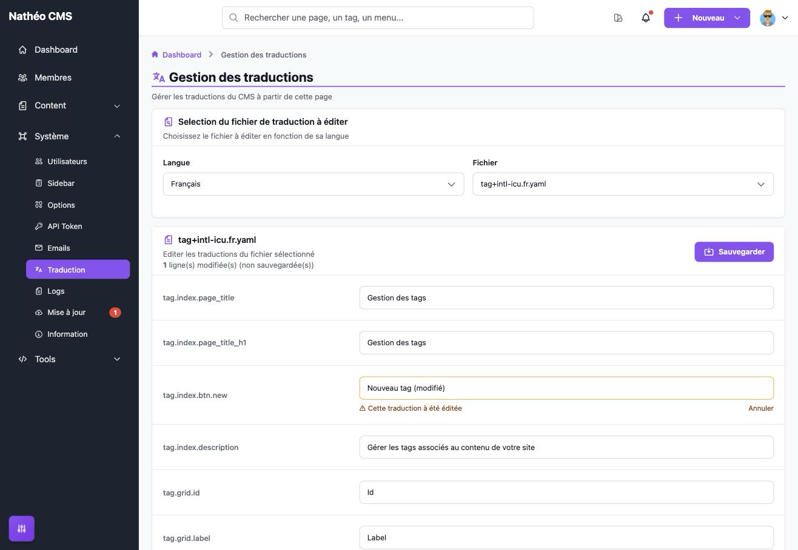
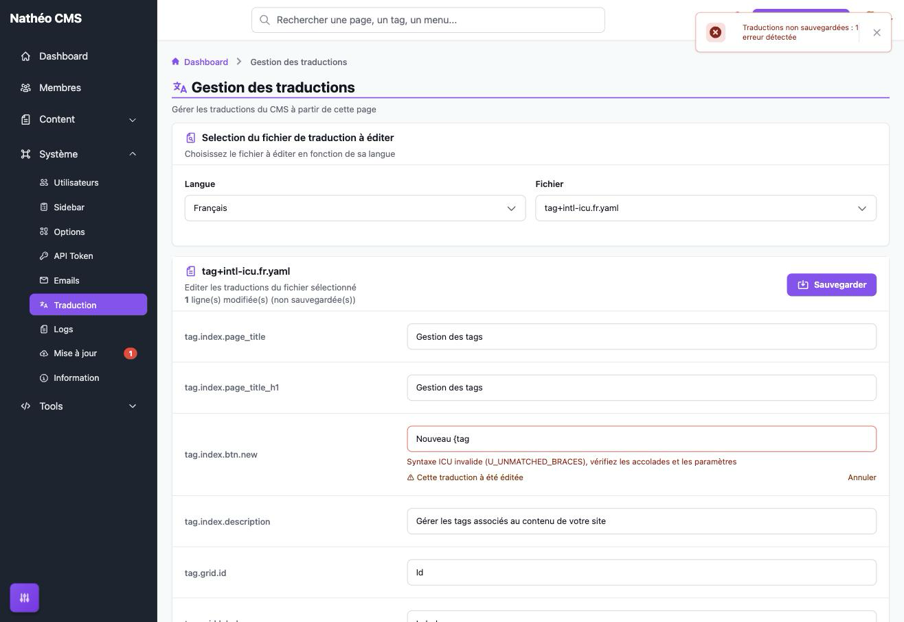

La page **Gestion des traductions** permet de modifier les **textes fixes de l'interface** (libellés de boutons,
titres, messages d'aide, messages de confirmation...) directement depuis le back-office, langue par langue et fichier
par fichier, sans toucher au code.

Elle ne concerne **pas le contenu** rédigé dans le CMS : le titre d'une page, le libellé d'un tag ou une question de
FAQ se traduisent depuis leur propre formulaire. La différence entre les deux est expliquée dans
[Traductions & multilingue](../../Architecture/traductions_i18n.md).

## Accès

Réservée aux **super-administrateurs** (`ROLE_SUPER_ADMIN`), via *Système > Traduction* ou directement à l'URL
`/admin/{locale}/translation/`.

## Choisir un fichier

Le premier bloc contient deux listes déroulantes, à renseigner dans l'ordre :

| Champ | Contenu |
|---|---|
| **Langue** | Les langues prises en charge par le site : *Français*, *Anglais*, *Espagnol* (définies par `app.supported_locales` dans `config/services.yaml`) |
| **Fichier** | Les fichiers de traduction de la langue choisie, désactivée tant qu'aucune langue n'est sélectionnée |

Il y a un fichier par zone fonctionnelle (`tag+intl-icu.fr.yaml`, `menu+intl-icu.fr.yaml`, `global+intl-icu.fr.yaml`...),
soit 33 fichiers par langue dans une installation standard. La liste contient aussi `security.fr.yaml` et
`validators.fr.yaml`, qui traduisent les messages d'authentification et de validation de formulaires de Symfony : leurs
clés sont les phrases anglaises d'origine plutôt que des identifiants.

## Modifier les traductions

Une fois le fichier choisi, le second bloc affiche une ligne par traduction : la **clé** à gauche (par exemple
`tag.index.btn.new`), la **valeur** modifiable à droite. Une valeur de moins de 120 caractères s'édite dans un champ
texte, une valeur plus longue dans une zone de texte de 3 lignes.

Une valeur modifiée est prise en compte quand on quitte le champ (ou en appuyant sur *Entrée* dans un champ texte).
Elle est alors encadrée en orange avec la mention **« ⚠ Cette traduction a été éditée »**, et le compteur
**« N ligne(s) modifiée(s) (non sauvegardée(s)) »** apparaît sous le titre du bloc. Rien n'est encore écrit à ce
stade.

| Action | Effet |
|---|---|
| **Annuler** (sous une valeur modifiée) | Retire la modification de la liste en attente et réaffiche la valeur d'origine |
| **Sauvegarder** | Vérifie puis écrit toutes les modifications en attente dans le fichier, et le recharge (message de succès) |

Le bouton **Sauvegarder** reste visible en haut de l'écran pendant le défilement, ce qui est pratique sur les
fichiers longs. Une modification sauvegardée est **visible immédiatement** dans l'interface, sans autre action : il
n'y a pas de cache à recharger à la main.

### Erreurs à la sauvegarde

Avant d'écrire quoi que ce soit, chaque valeur modifiée est vérifiée. Si au moins une valeur est refusée, **aucune
modification n'est enregistrée**, même celles qui étaient correctes : un message d'erreur indique le nombre d'erreurs
détectées, et chaque champ en cause est encadré en rouge avec la raison du refus juste en dessous.

Les modifications restent en attente : il suffit de corriger le champ (son erreur disparaît dès qu'on le modifie) ou
de cliquer sur **Annuler**, puis de sauvegarder à nouveau.

| Erreur | Cause |
|---|---|
| **Syntaxe ICU invalide (...)** | La valeur ne respecte pas le format ICU MessageFormat, par exemple une accolade `{` ouverte mais jamais fermée. Le code entre parenthèses (`U_UNMATCHED_BRACES`...) précise le problème. Contrôle fait uniquement pour les fichiers `+intl-icu` |
| **Cette clé n'existe pas dans le fichier** | La clé envoyée ne figure pas dans le fichier (ne se produit pas en usage normal de l'écran) |
| **La valeur doit être une chaîne de caractères** | Valeur envoyée non textuelle (idem) |

### Points d'attention

- **Changer de langue ou de fichier abandonne les modifications en attente, sans avertissement.** Pensez à
  sauvegarder avant de passer à un autre fichier. En revanche, quitter la page par un lien (menu, fil d'Ariane...)
  après une modification déclenche la fenêtre de confirmation habituelle du back-office.
- **Conservez les éléments techniques présents dans la valeur** : variables entre accolades (`{label}`, remplacées
  par une donnée à l'affichage) et balises HTML (`<strong>`, ` `...). Ces valeurs utilisent le format ICU
  MessageFormat. Une accolade mal fermée est refusée à la sauvegarde (voir ci-dessus), mais une variable **renommée
  ou supprimée** reste une syntaxe valide : elle est acceptée et ne sera tout simplement plus remplacée à
  l'affichage.
- On ne peut que modifier des clés existantes : l'écran ne permet ni d'ajouter, ni de supprimer, ni de renommer
  une clé.
- Seule la langue choisie est modifiée : corriger un libellé en français ne touche pas ses équivalents anglais et
  espagnol.

## Notes techniques

- Les modifications sont écrites **directement dans les fichiers YAML du dossier `translations/`** du projet, pas
  en base de données. Conséquences :
  - l'utilisateur du serveur web doit avoir les droits d'écriture sur ce dossier ;
  - ces fichiers font partie du code source de Nathéo : une mise à jour du CMS (ou un `git pull`) peut
    **écraser les traductions modifiées** depuis l'écran. Notez vos changements pour pouvoir les réappliquer.
- À la sauvegarde, le fichier entier est relu puis réécrit (`Yaml::dump()`) : la mise en forme d'origine (style de
  guillemets, commentaires éventuels) n'est pas conservée, même pour les lignes non modifiées. L'écriture est
  atomique (fichier temporaire puis renommage) et protégée par un verrou (`var/translation.lock`), ce qui évite
  qu'une sauvegarde simultanée par deux administrateurs ne corrompe le fichier.
- Après l'écriture, seul le dossier `translations/` du cache Symfony (`var/cache/{env}/translations`) est supprimé :
  les catalogues sont recompilés au chargement suivant, sans vider le reste du cache applicatif.
- Le nom de fichier reçu est vérifié côté serveur pour interdire de lire ou d'écrire en dehors du dossier
  `translations/`.
- Routes utilisées par l'écran (préfixe `/admin/{locale}/translation`) : `GET /ajax/languages`,
  `GET /ajax/files-translates/{language}`, `GET /ajax/file-translate/{file}` et `PUT /ajax/save-translate`.
  Contrairement à d'autres écrans du back-office (sidebar, options), la sauvegarde n'exige **pas de jeton CSRF**.
- Code concerné : `TranslationController`, `TranslateService`, composant Vue
  `assets/vue/controllers/Admin/System/Translate.vue`, textes de l'écran dans
  `translations/translate+intl-icu.*.yaml`.

## Voir aussi
- [Traductions & multilingue](../../Architecture/traductions_i18n.md)
- [Les rôles](roles.md)
- [Options système](options.md)
