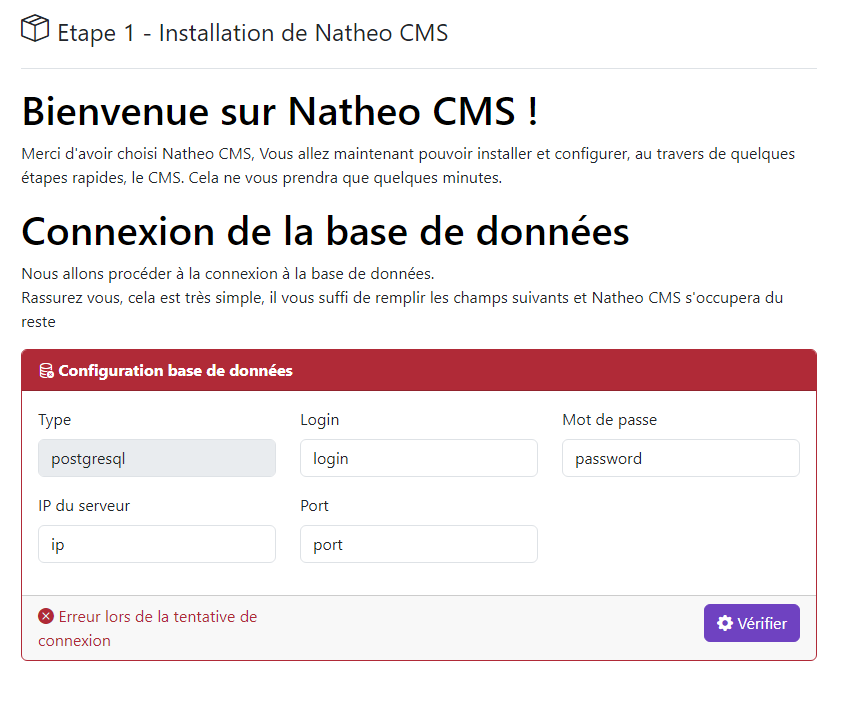

## Installation avec l'installeur

[Index](../../index.md) > Pré-requis

Voici la procédure pour installer NatheoCMS avec l'installeur

NatheoCMS propose un installeur pour aider à l'installation de celui-ci.

Cette procédure nécessite tout de même quelques manipulations en ligne de commande pour être lancé.

### Pré-requis
[Voir les pré-requis](pre-requis.md)

### Installation du code
Étape 1 : cloner le dépôt GIT

```https://github.com/counteraccro/natheo.git```

Étape 2 : Installer Symfony

```composer update```

Étape 3 : Génération des assets

```yarn encore dev -- watch```

### Accès au site
Sur votre environnement
* Créer un virtual host qui pointe vers le dossier suivant : ```[path-complet-vers-mon-dossier]\www\natheo\public```
* Cliquez sur le lien ```http://[mon-virtual-host]fr/admin/login```

### L'installeur
Une fois l'ensemble des étapes précédentes réalisé, en cliquant sur le lien défini précédemment, vous devriez arriver sur cette page

#### Connection votre SGBD



La première étape est de testé la connection avec votre SGBD, pour le moment NatheoCMS ne prend en charge que PostgreSQL

#### Création de la base de données


Une fois la connection faite avec succès, il vous faut maintenant créer votre base de données.

Pour cela, c'est très simple, saisissez le nom de votre base de données, la version du SGBD et le charset.
Cliquez ensuite sur le bouton **"+ créer la base de données"**

[!NOTE]
> Il est possible de défini un schema SQL ainsi d'un préfix pour les tables de la base de données.
> 
> Par défaut le schéma SQL est natheo et les tables n'ont pas de préfix. Pour changer ces valeurs, consulter les [options de configurations](config-install.md)
