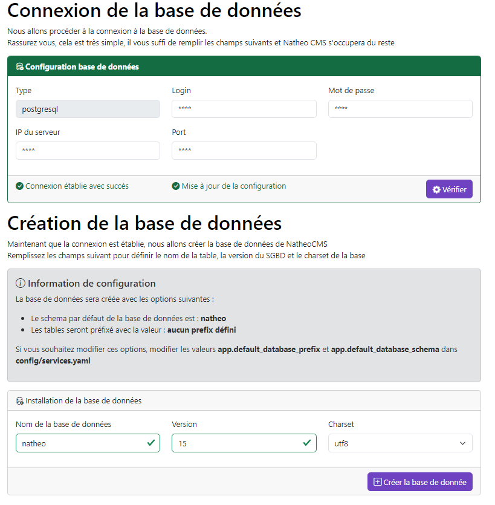

## Installation avec l'installeur

[Index](../../index.md) > Pré-requis

Voici la procédure pour installer NatheoCMS avec l'installeur

NatheoCMS propose un installeur pour aider à l'installation de celui-ci.

Cette procédure nécessite tout de même quelques manipulations en ligne de commande pour être lancé.

### Pré-requis
[Voir les pré-requis](pre-requis.md)

### Installation du code
Étape 1 : cloner le dépôt GIT

```https://github.com/counteraccro/natheo.git```

Étape 2 : Installer Symfony

```composer update```

Étape 3 : Génération des assets

```yarn encore dev -- watch```

### Accès au site
Sur votre environnement
* Créer un virtual host qui pointe vers le dossier suivant : ```[path-complet-vers-mon-dossier]\www\natheo\public```
* Cliquez sur le lien ```http://[mon-virtual-host]fr/admin/login```

### L'installeur
Une fois l'ensemble des étapes précédentes réalisé, en cliquant sur le lien défini précédemment, vous devriez arriver sur cette page

#### Connection votre SGBD


La première étape est de tester la connection avec votre SGBD, pour le moment NatheoCMS ne prend en charge que PostgreSQL

#### Création de la base de données



Une fois la connection faite avec succès, il vous faut maintenant créer votre base de données.

Pour cela, c'est très simple, saisissez le nom de votre base de données, la version du SGBD et le charset.
Cliquez ensuite sur le bouton **"+ créer la base de données"**


> Il est possible de défini un schema SQL ainsi d'un préfix pour les tables de la base de données.
> 
> Par défaut le schéma SQL est natheo et les tables n'ont pas de préfix. Pour changer ces valeurs, consulter les [options de configurations](config-install.md)

#### Création du compte fondateur


La prochaine étape est de créer le compte fondateur, ce compte va posséder les droits fondateurs, il va vous permettre de
vous connecter à l'administration du CMS une fois l'installation terminé.

> Attention, si vous être en mode débug, ce sont les comptes de tests qui seront installés
> 
> Retrouvez les données (mot de passe et login) des comptes test ici  ```src/DataFixtures/data/system/user_demo_fixtures_data.yaml```

#### Génération des données


Une fois que le compte fondateur est créé, il ne vous reste plus qu'à cliquer sur le bouton **'Finaliser l'installation'** pour terminer l'installation du CMS

Une fois l'installation terminé, vous serez automatiquement redirigé vers l'authentification de la partie administration du site.

#### Felicitation !
Le CMS est maintenant correctement installé et vous pouvez dès à présent l'utiliser.
Pour vous connecter, c'est simple, utiliser le compte fondateur que vous venez de créer.