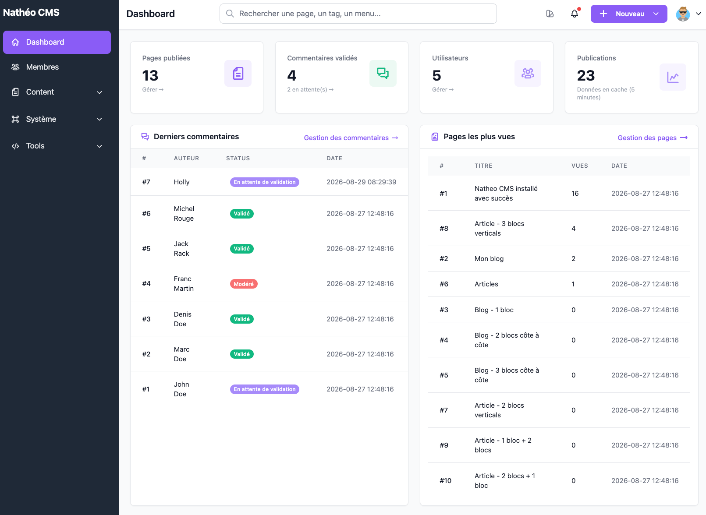
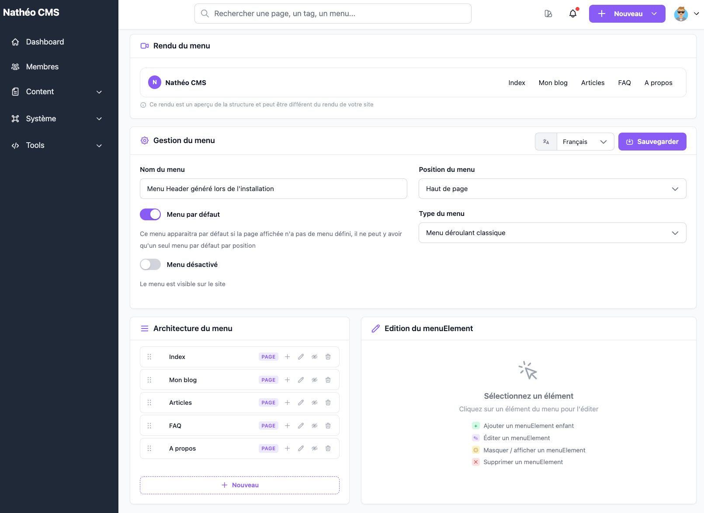
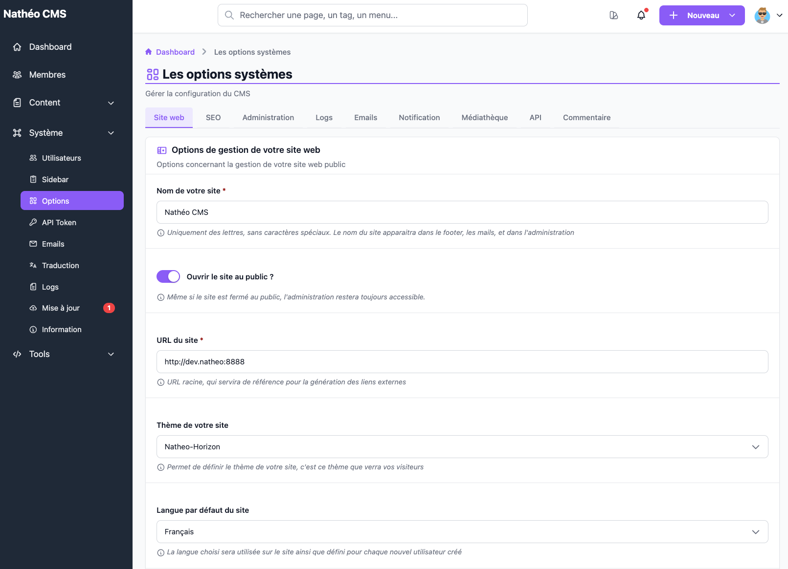

Nathéo CMS est un CMS développé avec [Symfony 8.1 (PHP 8.2+) côté back-office
et Vue 3 / TypeScript / Vite / Tailwind 4 côté interface][1].

### Un CMS headless

Nathéo CMS fonctionne en mode **headless** (« sans tête ») : l'administration
sert à gérer le contenu du site (pages, menus, tags, commentaires, FAQ...),
mais ne se charge pas elle-même de l'afficher au public. Ce contenu est
exposé via une [API REST](../API/index.md), que n'importe quel site ou
application peut venir consommer pour construire l'affichage — sans que le
CMS n'impose de technologie, de framework ou de charte graphique particulière
côté public.

Concrètement, cela découple complètement :
* **La gestion du contenu** : toujours via l'administration Nathéo CMS.
* **L'affichage du contenu** : à construire librement (site web classique,
  application mobile, autre CMS front...) en consommant l'API.

Le CMS est découpé en 2 parties distinctes :
- L'Administration
- Le Front

### Administration
Cette partie du CMS permet de gérer le paramétrage du CMS, son contenu ainsi
que les membres et administrateurs.

*Le tableau de bord : statistiques du site, derniers commentaires et pages les plus vues.*

*Gestion des menus du site, avec un aperçu du rendu et l'architecture en arborescence.*

*Options système générales : nom et URL du site, thème public, langue par défaut...*

Détail de chaque écran dans le [Guide d'administration](../GuideAdmin/index.md) :

| Domaine | Fonctionnalités |
|---|---|
| Général | [Mon compte](../GuideAdmin/MonCompte/profil.md) et [mes notifications](../GuideAdmin/MonCompte/notifications.md) |
| Content | [Tags](../GuideAdmin/Contenu/Tags/listing.md), [Médiathèque](../GuideAdmin/Contenu/Mediatheque/mediatheque.md), [Pages](../GuideAdmin/Contenu/Pages/listing.md), [Commentaires](../GuideAdmin/Contenu/Commentaires/listing.md), [Menus](../GuideAdmin/Contenu/Menus/listing.md), [FAQ](../GuideAdmin/Contenu/Faq/listing.md) |
| Système | [Utilisateurs et rôles](../GuideAdmin/Systeme/utilisateurs.md), [Options système](../GuideAdmin/Systeme/options.md), [Sidebar de l'administration](../GuideAdmin/Systeme/sidebar.md), [Traductions](../GuideAdmin/Systeme/traductions.md), [Emails](../GuideAdmin/Systeme/mail.md), [Logs](../GuideAdmin/Systeme/logs.md), [Jetons d'accès API](../GuideAdmin/Systeme/ApiToken/jetons_api.md) |
| Outils | [Options avancées](../GuideAdmin/Outils/options_avancees.md) *(réinitialisation du CMS, mode debug)*, [Gestionnaire SQL](../GuideAdmin/Outils/gestionnaire_sql.md), [Gestionnaire base de données](../GuideAdmin/Outils/gestionnaire_bdd.md) |

### Front
Le CMS embarque quelques exemples de thèmes minimals comme Natheo-Horizon, à titre de démonstration — son usage n'a
rien d'obligatoire, l'approche headless permet de construire son propre site
en consommant l'API. Voir la page [Front](../Front/index.md).

Voir aussi la [roadmap](roadmap.md), le [changelog](changelog.md) et les [versions](versions.md) du projet.

[1]: ../Architecture/stack_technique.md
