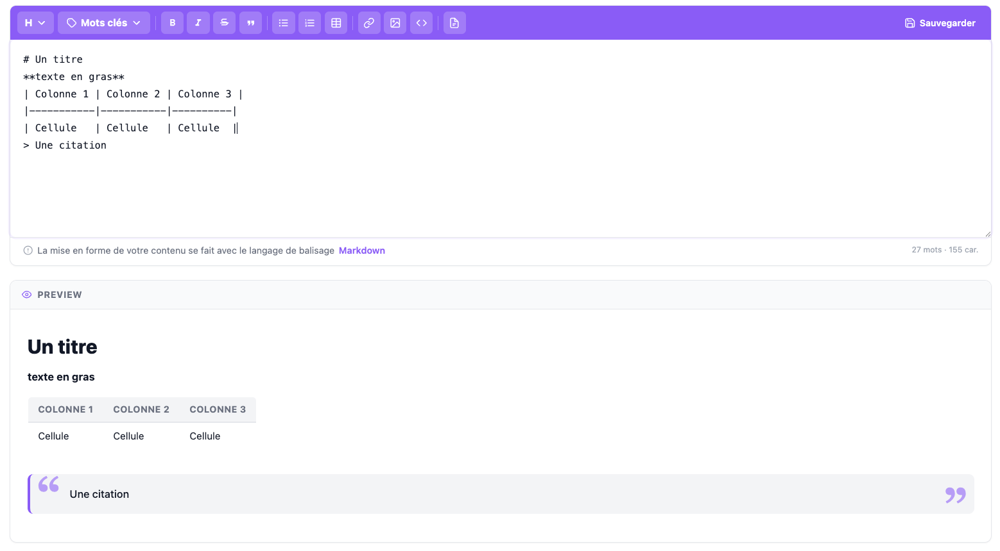

### Editeur Markdown

[Index](../../../index.md) > [Documentation technique](../index.md) > Editeur Markdown

*Cette page vous explique comment mettre en place un éditeur markdown dans le CMS*



### Mise en place
L'éditeur markdown est un composant vuejs qui s'ajoute de la façon suivante :

``` vue
<script>
import MarkdownEditor from "../../Components/MarkdownEditor.vue";

export default {
    name: "Default",
    components: {MarkdownEditor},
    props: {},
    data() {}
}
<script>

<template>
    <markdown-editor
                     :me-value="value"
                     :me-rows="10"
                     :me-translate="translate"
                     :me-key-words="keyWords"
                     :me-save="false"
                     @editor-value="methode1"
                     @editor-value-change="methode2">
    </markdown-editor>
</template>
```
Le composant prend les paramètres suivants :
* me-value : Valeur qui sera dans l'éditeur
* me-rows : Nombre de ligne vertical de l'éditeur
* me-translate : Traduction de l'éditeur 
  * Les traductions de l'éditeur sont à récupérer depuis le service ``MarkdownEditorService`` fonction ``getTranslate()``
* me-key-words : Ajoute une liste déroulante de mot clé à ajouter dans l'input sous la forme d'un tableau ``[clé => valeur]``
* me-save: Affiche ou masque le bouton sauvegarder
* @editor-value : permet de récupérer la valeur de l'éditeur via un event du bouton sauvegarder (si celui-ci est activé)
  * dans ``methods`` function ``methode1(value) { /** traitement **/}``
* @editor-value : permet de récupérer la valeur de l'éditeur via un event onChange()
  * dans ``methods`` function ``methode2(value) { /** traitement **/}``