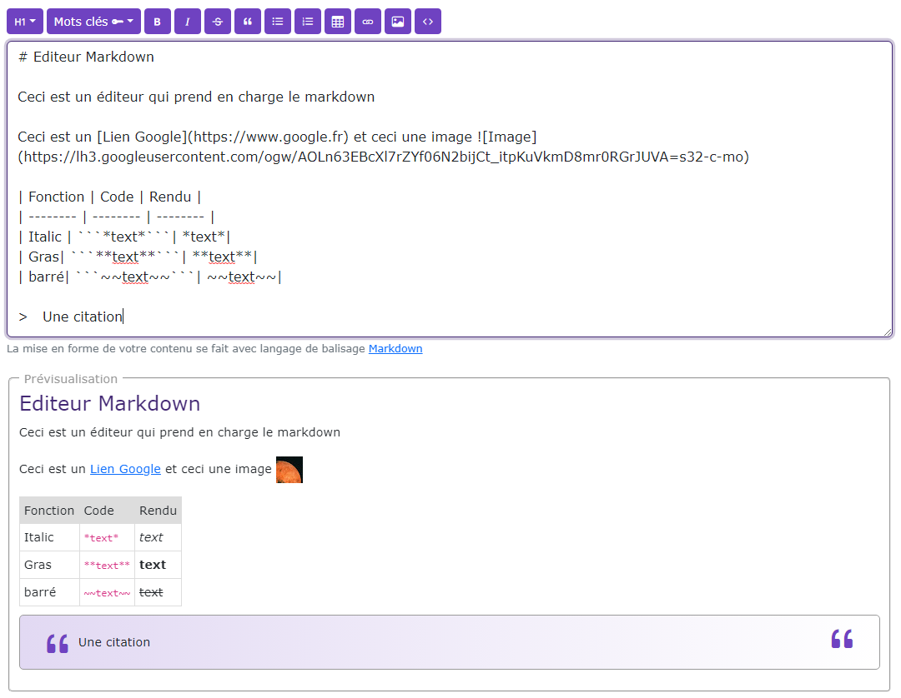

# Editeur Markdwn

[Index](../../../index.md) > [Documentation technique](../index.md) > Editeur Markdown

Éditeur Markdown riche pour Nathéo CMS, construit avec Vue 3 (Composition API). Il offre une toolbar configurable, une prévisualisation en direct, un système de mots-clés, et un système de modules custom extensible.



---

## Sommaire

- [Installation](#installation)
- [Utilisation de base](#utilisation-de-base)
- [Référence des props](#référence-des-props)
- [Événements](#événements)
- [Toolbar — configuration avancée](#toolbar--configuration-avancée)
- [Mots-clés](#mots-clés)
- [Traductions](#traductions)
- [Modules custom](#modules-custom)
- [Ajouter un nouveau module](#ajouter-un-nouveau-module)

---

## Installation

Le composant charge automatiquement ses dépendances internes via `axios` au montage. Assurez-vous que la route Symfony `/admin/{locale}/markdown/ajax/load-datas` est accessible et retourne les URLs nécessaires.

```typescript
// Dans votre composant parent
import MarkdownEditor from '@/vue/Components/Global/MarkdownEditor.vue'
```

---

## Utilisation de base

```vue
<template>
  <MarkdownEditor
    me-id="my-editor"
    :me-value="content"
    @editor-value-change="onValueChange"
  />
</template>

<script lang="ts">
import { defineComponent, ref } from 'vue'
import MarkdownEditor from '@/vue/Components/Global/MarkdownEditor.vue'

export default defineComponent({
  components: { MarkdownEditor },
  setup() {
    const content = ref('')

    function onValueChange(id: string, value: string): void {
      content.value = value
    }

    return { content, onValueChange }
  }
})
</script>
```

---

## Référence des props

| Prop | Type | Défaut | Description |
|------|------|--------|-------------|
| `me-id` | `String` | `'mdInput'` | Identifiant HTML du textarea |
| `me-value` | `String` | `''` | Contenu initial de l'éditeur |
| `me-rows` | `Number` | `12` | Hauteur minimale (en lignes) |
| `me-save` | `Boolean` | `false` | Affiche le bouton Sauvegarder |
| `me-preview` | `Boolean` | `true` | Affiche la prévisualisation live |
| `me-translate` | `Object` | `{}` | Traductions de l'interface |
| `me-key-words` | `Array` | `[]` | Liste de mots-clés injectables |
| `me-modules` | `Array` | `[]` | Modules custom de la toolbar |
| `me-toolbar` | `Array` | voir ci-dessous | Configuration des groupes de boutons |

### Valeur par défaut de `me-toolbar`

```typescript
[
  ['heading', 'keywords'],
  ['bold', 'italic', 'strikethrough', 'blockquote'],
  ['bulletList', 'orderedList', 'table'],
  ['link', 'image', 'code'],
  ['save'],
]
```

### Boutons disponibles

| Nom | Description | Condition d'affichage |
|-----|-------------|-----------------------|
| `heading` | Titres H1–H6 (dropdown) | — |
| `keywords` | Mots-clés (dropdown) | `me-key-words` non vide |
| `bold` | Gras — `Ctrl+B` | — |
| `italic` | Italique — `Ctrl+I` | — |
| `strikethrough` | Barré | — |
| `blockquote` | Citation | — |
| `bulletList` | Liste à puces | — |
| `orderedList` | Liste numérotée | — |
| `table` | Tableau | — |
| `link` | Lien — `Ctrl+K` | — |
| `image` | Image | — |
| `code` | Code inline | — |
| `save` | Sauvegarder | `me-save` à `true` |

---

## Événements

### `editor-value-change`

Déclenché à chaque frappe. Reçoit l'`id` de l'éditeur et la valeur courante.

```vue
<MarkdownEditor @editor-value-change="(id, value) => content = value" />
```

### `editor-value`

Déclenché à la perte de focus (`blur`) ou au clic sur Sauvegarder. Même signature.

```vue
<MarkdownEditor
  :me-save="true"
  @editor-value="(id, value) => saveToServer(id, value)"
/>
```

---

## Toolbar — configuration avancée

Vous pouvez réorganiser, réduire ou étendre la toolbar en passant votre propre configuration.

### Toolbar minimale

```vue
<MarkdownEditor
  :me-toolbar="[
    ['bold', 'italic'],
    ['link'],
  ]"
/>
```

### Toolbar sans prévisualisation ni titres

```vue
<MarkdownEditor
  :me-preview="false"
  :me-toolbar="[
    ['bold', 'italic', 'strikethrough'],
    ['bulletList', 'orderedList'],
    ['save'],
  ]"
  :me-save="true"
/>
```

### Toolbar complète avec sauvegarde

```vue
<MarkdownEditor
  :me-save="true"
  :me-toolbar="[
    ['heading', 'keywords'],
    ['bold', 'italic', 'strikethrough', 'blockquote'],
    ['bulletList', 'orderedList', 'table'],
    ['link', 'image', 'code'],
    ['save'],
  ]"
/>
```

> **Note** : Le bouton `save` est toujours rendu en dernier dans la toolbar (tout à droite), quelle que soit sa position dans la configuration.

---

## Mots-clés

Les mots-clés sont des variables injectables dans le contenu (ex : `{{site_name}}`, `{{date}}`). Ils apparaissent dans un dropdown dédié si `me-key-words` est non vide.

### Structure

```typescript
interface KeyWord {
  label: string    // texte affiché dans le dropdown
  keyword: string  // valeur insérée dans l'éditeur
}
```

### Exemple

```vue
<template>
  <MarkdownEditor
    :me-key-words="keywords"
    :me-toolbar="[['keywords'], ['bold', 'italic'], ['save']]"
    :me-save="true"
  />
</template>

<script lang="ts">
export default defineComponent({
  setup() {
    const keywords = [
      { label: 'Nom du site',    keyword: '{{site_name}}' },
      { label: 'Date du jour',   keyword: '{{date}}' },
      { label: 'Nom du contact', keyword: '{{contact_name}}' },
    ]
    return { keywords }
  }
})
</script>
```

---

## Traductions

Toutes les chaînes de l'interface sont surchargeables via `me-translate`.

### Clés disponibles

| Clé | Valeur par défaut |
|-----|-------------------|
| `placeholder` | `Rédigez votre contenu en Markdown…` |
| `hint` | `La mise en forme de votre contenu se fait avec le langage de balisage` |
| `preview` | `Prévisualisation` |
| `previewEmpty` | `Commencez à écrire…` |
| `save` | `Sauvegarder` |
| `keywords` | `Mots clés` |
| `words` | `mots` |
| `chars` | `car.` |
| `heading1` … `heading6` | `Titre 1` … `Titre 6` |

### Exemple

```vue
<MarkdownEditor
  :me-translate="{
    placeholder: 'Write your content here…',
    preview: 'Preview',
    previewEmpty: 'Start writing…',
    save: 'Save',
    words: 'words',
    chars: 'ch.',
  }"
/>
```

---

## Modules custom

Les modules permettent d'ajouter des boutons dans la toolbar et d'interagir avec l'éditeur via une API dédiée. Ils sont affichés **avant** le bouton Sauvegarder, séparés des groupes natifs.

### Interface `EditorModule`

```typescript
interface EditorApi {
  insertText(text: string): void
  wrapSelection(before: string, after: string, placeholder?: string): void
  insertLinePrefix(prefix: string): void
  insertBlock(text: string): void
  getSelection(): { text: string; start: number; end: number }
  focus(): void
  getMarkdown(): string
  setMarkdown(value: string): void
}

interface EditorModule {
  name: string                    // identifiant unique
  label: string                   // tooltip du bouton
  icon: string                    // SVG inline (string HTML)
  action(api: EditorApi): void    // action déclenchée au clic
}
```

### Utilisation

```vue
<template>
  <MarkdownEditor
    :me-modules="editorModules"
    :me-save="true"
  />
</template>

<script lang="ts">
import { defineComponent } from 'vue'
import MarkdownEditor from '@/vue/Components/Global/MarkdownEditor.vue'
import { InternalLinkModule } from '@/ts/MarkdownEditor/internalLinkModule'

export default defineComponent({
  components: { MarkdownEditor },
  setup() {
    const editorModules = [InternalLinkModule]
    return { editorModules }
  }
})
</script>
```

---

## Ajouter un nouveau module

Un module est composé de deux parties : la **définition** (bouton + action) et le **composant modal** (interface utilisateur optionnelle).

La communication entre les deux se fait via un `CustomEvent` sur `window`, ce qui découple complètement le module de son interface.

### 1. Créer la définition du module

```typescript
// src/ts/MarkdownEditor/myModule.ts
import type { EditorModule } from '@/ts/MarkdownEditor/MarkdownEditor.types'

// Typage de l'événement custom (optionnel mais recommandé)
export interface MyModuleEvent extends CustomEvent {
  detail: {
    onSelect: (value: string) => void
  }
}

export const MyModule: EditorModule = {
  name: 'my-module',
  label: 'Mon module',

  // Icône SVG inline
  icon: `<svg viewBox="0 0 24 24" fill="none" stroke="currentColor"
    stroke-width="2" stroke-linecap="round" stroke-linejoin="round">
    <circle cx="12" cy="12" r="10"/>
    <line x1="12" y1="8" x2="12" y2="16"/>
    <line x1="8" y1="12" x2="16" y2="12"/>
  </svg>`,

  action(api) {
    // Option A — action directe sans modal
    api.insertText('Mon texte inséré')

    // Option B — ouvrir une modal via CustomEvent
    const event: MyModuleEvent = new CustomEvent('natheo:my-module-open', {
      detail: {
        onSelect: (value: string) => {
          api.wrapSelection('[', `](${value})`, 'texte du lien')
        }
      }
    })
    window.dispatchEvent(event)
  }
}
```

### 2. Créer le composant modal

```vue
<!-- src/vue/Components/Global/MarkdownEditor/MyModal.vue -->
<template>
  <modal
    :id="'modal-my-module'"
    :show="isOpen"
    @close-modal="close"
    :option-show-close-btn="true"
  >
    <template #icon><!-- votre icône --></template>
    <template #title>{{ translate.title ?? 'Mon module' }}</template>

    <template #body>
      <!-- Votre interface -->
      <input v-model="inputValue" class="form-input" placeholder="Saisir une valeur…" />
    </template>

    <template #footer>
      <button class="btn btn-primary btn-sm me-2" @click="confirm">
        Insérer
      </button>
      <button class="btn btn-outline-dark btn-sm" @click="close">
        Annuler
      </button>
    </template>
  </modal>
</template>

<script lang="ts">
import { defineComponent, ref, onMounted, onUnmounted, type PropType } from 'vue'
import type { MyModuleEvent } from '@/ts/MarkdownEditor/myModule'
import Modal from '@/vue/Components/Global/Modal.vue'

export default defineComponent({
  name: 'MyModal',
  components: { Modal },

  props: {
    translate: {
      type: Object as PropType<Record<string, string>>,
      default: () => ({}),
    },
  },

  setup() {
    const isOpen     = ref(false)
    const inputValue = ref('')

    // Callback fourni par l'action du module
    let onSelectCallback: ((value: string) => void) | null = null

    function handleOpen(e: MyModuleEvent): void {
      onSelectCallback = e.detail.onSelect
      inputValue.value = ''
      isOpen.value = true
    }

    onMounted(() => {
      window.addEventListener('natheo:my-module-open', handleOpen)
    })

    onUnmounted(() => {
      window.removeEventListener('natheo:my-module-open', handleOpen)
    })

    function confirm(): void {
      onSelectCallback?.(inputValue.value)
      close()
    }

    function close(): void {
      isOpen.value = false
      onSelectCallback = null
    }

    return { isOpen, inputValue, confirm, close }
  }
})
</script>
```

### 3. Enregistrer le module et la modal dans le parent

```vue
<template>
  <MarkdownEditor
    :me-modules="editorModules"
    :me-save="true"
  />

  <!-- La modal écoute l'événement window indépendamment de l'éditeur -->
  <MyModal :translate="myModuleTranslate" />
</template>

<script lang="ts">
import { defineComponent } from 'vue'
import MarkdownEditor from '@/vue/Components/Global/MarkdownEditor.vue'
import MyModal from '@/vue/Components/Global/MarkdownEditor/MyModal.vue'
import { MyModule } from '@/ts/MarkdownEditor/myModule'
import type { EditorModule } from '@/ts/MarkdownEditor/MarkdownEditor.types'

export default defineComponent({
  components: { MarkdownEditor, MyModal },

  setup() {
    const editorModules: EditorModule[] = [MyModule]

    const myModuleTranslate = {
      title: 'Insérer depuis mon module',
    }

    return { editorModules, myModuleTranslate }
  }
})
</script>
```

### Flux complet

```
Clic sur le bouton toolbar
  → MyModule.action(api)
    → window.dispatchEvent('natheo:my-module-open', { onSelect })
      → MyModal reçoit l'événement → s'ouvre
        → L'utilisateur saisit/sélectionne une valeur
          → confirm() appelle onSelect(value)
            → api.wrapSelection(…) insère dans l'éditeur
              → MyModal se ferme
```

### Exemple concret — module d'insertion de shortcode

```typescript
// src/ts/MarkdownEditor/shortcodeModule.ts
import type { EditorModule } from '@/ts/MarkdownEditor/MarkdownEditor.types'

export interface ShortcodeEvent extends CustomEvent {
  detail: { onSelect: (shortcode: string) => void }
}

export const ShortcodeModule: EditorModule = {
  name: 'shortcode',
  label: 'Insérer un shortcode',
  icon: `<svg viewBox="0 0 24 24" fill="none" stroke="currentColor"
    stroke-width="2" stroke-linecap="round" stroke-linejoin="round">
    <polyline points="16 18 22 12 16 6"/>
    <polyline points="8 6 2 12 8 18"/>
    <line x1="12" y1="2" x2="12" y2="22"/>
  </svg>`,

  action(api) {
    window.dispatchEvent(
      new CustomEvent('natheo:shortcode-open', {
        detail: {
          onSelect: (shortcode: string) => {
            api.insertBlock(`[${shortcode}]`)
          }
        }
      })
    )
  }
}
```

---

> **Conventions** :
> - Préfixer tous les événements `CustomEvent` avec `natheo:` pour éviter les collisions.
> - Toujours nettoyer les listeners dans `onUnmounted`.
> - Un module n'a pas besoin de modal — il peut agir directement sur l'éditeur via `api`.