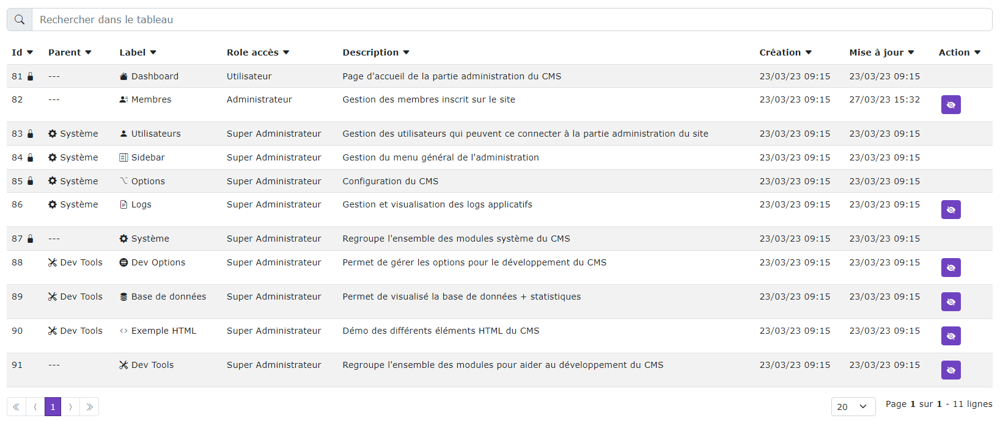

### Mise en place d'un tableau GRID

[Index](../../../index.md) > [Documentation technique](../index.md) > Tableau GRID

*Cette page vous explique comment mettre en place rapidement un tableau GRID générique*


*Exemple de grid simple*

### Tiwg
Dans votre fichier twig, ajouter le composant VueJs
```html
<div  vue_component('Admin/GenericGrid', {'url' : path('route'), 'page' : page, 'limit' : limit}) ></div>
```
Le composant GénericGrid prend 3 paramètres qui sont :
* url : La route qui va récupérer les données à afficher dans le grid
* page: La page courante
* limit: Le nombre maximum d'éléments par page

### Controller

Dans votre controller, créer la route pour récupérer les données
``` php
/**
     * Charge le tableau grid de sidebar en ajax
     * @param Request $request
     * @param MyService $myService
     * @return JsonResponse
     */
    #[Route('/ajax/load-grid-data', name: 'load_grid_data' , methods: ['POST'])]
    public function loadGridData(Request $request, MyService $myService): JsonResponse
    {
        $data = json_decode($request->getContent(), true);
        $grid = $myService->getAllFormatToGrid($data['page'], $data['limit']);
        return $this->json($grid);
    }
```
*On part du principe que toute la logic du code est présent dans votre service*

Affichage d'un message de réalisation et/ou d'erreur après une action
``` php
 /**
     * Disabled ou non un element
     * @param MyService $myService
     * @return JsonResponse
     */
    #[Route('/ajax/update-disabled/{id}', name: 'update_disabled')]
    public function updateDisabled(Entity $element, MyService $myService, TranslatorInterface $translator): JsonResponse
    {
        $element->setDisabled(!$element->isDisabled());
        $myService->save($element);

        $msg = $translator->trans('translate.success.no.disabled', ['label' => '<i class="bi ' . $element->getIcon() . '"></i> ' . $translator->trans($element->getLabel())]);
        if($element->isDisabled())
        {
            $msg = $translator->trans('translate.success.disabled', ['label' => '<i class="bi ' . $element->getIcon() . '"></i> ' . $translator->trans($element->getLabel())]);
        }

        // Format de retour obligatoire
        return $this->json(['type' => 'success', 'msg' => $msg]);
    }

```

### Service

La méthode getAllFormatToGrid présent dans votre service
``` php
/**
     * Construit le tableau de donnée à envoyé au tableau GRID
     * @param int $page
     * @param int $limit
     * @return array
     */
    public function getAllFormatToGrid(int $page, int $limit)
    {
        // Définition des entêtes du grid
        $column = [
            $this->translator->trans('translate.grid.id'),
            $this->translator->trans('translate.grid.parent'),
            $this->translator->trans('translate.grid.label'),
            $this->translator->trans('translate.grid.role'),
            $this->translator->trans('translate.grid.description'),
            $this->translator->trans('translate.grid.created_at'),
            $this->translator->trans('translate.grid.update_at'),
            GridService::KEY_ACTION,
        ];

        // Récupération des données
        $dataPaginate = $this->getAllPaginate($page, $limit);

        $nb = $dataPaginate->count();
        $data = [];
        // Construction du tableau de données
        foreach ($dataPaginate as $element) {
        
            // Construction des actions (lien edit / delete etc...)
            $action = $this->generateTabAction($element);
           
           // Chaque ligne du $data doit avoir les même clés que les entêtes pour que grid puisse correctement les afficher
            $data[] = [
                $this->translator->trans('translate.grid.id') => $element->getId(),
                $this->translator->trans('translate.grid.parent') => $element->getParent(),
                $this->translator->trans('translate.grid.label') => $this->translator->trans($element->getLabel(),
                $this->translator->trans('translate.grid.role') => $this->gridService->renderRole($element->getRole()),
                $this->translator->trans('translate.grid.description') => $this->translator->trans($element->getDescription()),
                $this->translator->trans('translate.grid.created_at') => $element->getCreatedAt()->format('d/m/y H:i'),
                $this->translator->trans('translate.grid.update_at') => $element->getUpdateAt()->format('d/m/y H:i'),
                GridService::KEY_ACTION => json_encode($action),
            ];
        }

        // Construction du tableau de retour, la structure est obligatoire
        $tabReturn = [
            GridService::KEY_NB => $nb,
            GridService::KEY_DATA => $data,
            GridService::KEY_COLUMN => $column,
        ];
        
        // Récupération des données obligatoires depuis le gridService
        return $this->gridService->addAllDataRequiredGrid($tabReturn);
    }
```
Pour la construction des liens d'actions
``` php
/**
     * Génère le tableau d'action pour le Grid des sidebarElement
     * @param SidebarElement $element
     * @return array[]
     */
    private function generateTabAction(Entity $element): array
    {
            $action_disabled = [
                'label' => '<i class="bi bi-eye-slash-fill"></i>',
                'url' => $this->router->generate('route', ['id' => $element->getId()]),
                'ajax' => true,
                'confirm' => true,
                'msgConfirm' => $this->translator->trans('translate.confirm.disabled.msg', ['{label}' => '<i class="bi ' . $element->getIcon() . '"></i> ' . $this->translator->trans($element->getLabel())])];
            if ($element->isDisabled()) {
                $action_disabled = [
                    'label' => '<i class="bi bi-eye-fill"></i>', 
                    'url' => $this->router->generate('route', ['id' => $element->getId()]), 
                    'ajax' => true
                ];
            }
        }
        return $action;
    }
```
Chaque bouton doit posséder les paramètres suivants :
* Label : le texte et/ou l'icône présent dans le bouton
* url : la route de l'action
* ajax : défini si l'action est un appel ajax ou direct
  * valeur : true ou false
* confirm : Défini si un message de confirmation doit être affiché ou non
  * valeur : true ou false
* msgConfirm : Pris en compte uniquement si confirm est à true, défini le message de confirmation
