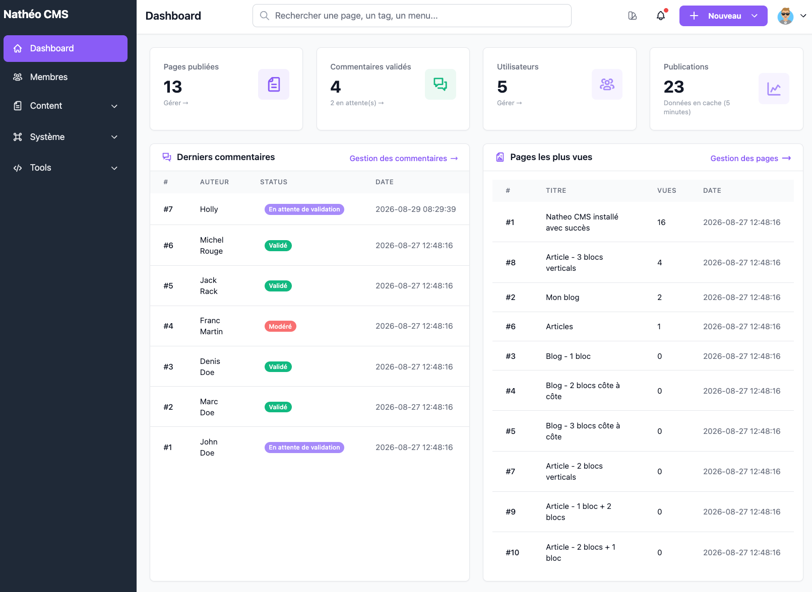
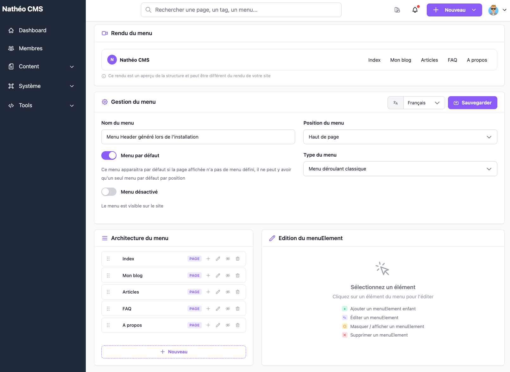
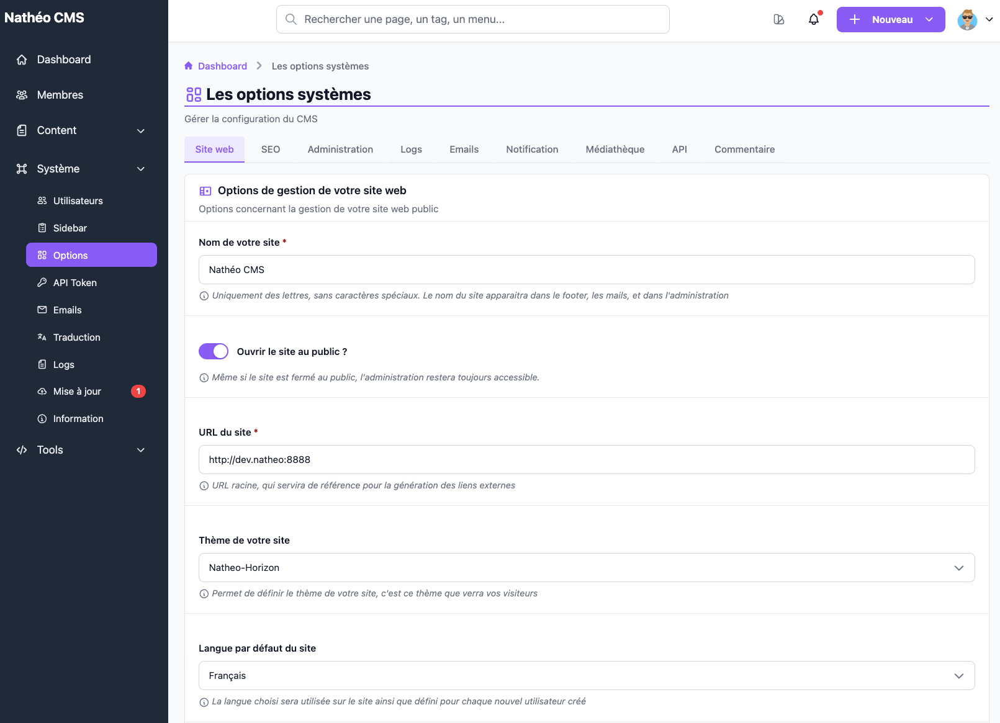

  <h1 class="home-hero-title">Documentation de Nathéo CMS</h1>
  

    Nathéo est un CMS <strong>headless</strong> open source : un back-office complet pour gérer pages, menus,
    médias, commentaires et utilisateurs, et une API JSON pour afficher ce contenu sur le front de votre choix.
  

  
Version actuellev2.0.0-beta.1Bêta<a href="Docs/Projet/versions.html">Voir toutes les versions →</a>

  <ul class="home-stack">
    <li>Symfony 8.1</li>
    <li>PHP 8.2+</li>
    <li>Vue 3 + TypeScript</li>
    <li>Vite</li>
    <li>Tailwind 4</li>
    <li>MySQL / PostgreSQL</li>
  </ul>

## Par où commencer ?

  

    🚀
    J'installe le CMS
    
Vérifier l'environnement, puis installer via l'installeur graphique ou en ligne de commande.

    <ul>
      <li><a href="Docs/Demarrage/pre_requis.html">Pré-requis</a></li>
      <li><a href="Docs/Demarrage/installation_prod.html">Installation via l'installeur</a></li>
      <li><a href="Docs/Demarrage/installation_dev.html">Installation développeur</a></li>
      <li><a href="Docs/Demarrage/configuration_installation.html">Options de configuration</a></li>
    </ul>
  

  

    🛠️
    J'administre le contenu
    
Prendre en main le back-office, écran par écran, avec captures et rôles requis.

    <ul>
      <li><a href="Docs/GuideAdmin/Contenu/Pages/listing.html">Gérer les pages</a></li>
      <li><a href="Docs/GuideAdmin/Contenu/Menus/listing.html">Construire les menus</a></li>
      <li><a href="Docs/GuideAdmin/Contenu/Mediatheque/mediatheque.html">Utiliser la médiathèque</a></li>
      <li><a href="Docs/GuideAdmin/Systeme/Utilisateurs/listing.html">Gérer les utilisateurs</a></li>
    </ul>
  

  

    🔌
    Je développe un front
    
Consommer le contenu du CMS depuis un site ou une application via l'API JSON.

    <ul>
      <li><a href="Docs/API/index.html">Règles communes de l'API</a></li>
      <li><a href="Docs/GuideAdmin/Systeme/ApiToken/jetons_api.html">Créer un jeton d'accès</a></li>
      <li><a href="Docs/API/References/find_page.html">Récupérer une page</a></li>
      <li><a href="Docs/API/References/find_menu.html">Récupérer un menu</a></li>
    </ul>
  

  

    🧩
    Je contribue au code
    
Comprendre l'architecture interne, les composants Vue réutilisables et les outils de dev.

    <ul>
      <li><a href="Docs/Architecture/stack_technique.html">Stack technique</a></li>
      <li><a href="Docs/Architecture/backend.html">Architecture backend</a></li>
      <li><a href="Docs/Architecture/frontend.html">Architecture frontend</a></li>
      <li><a href="Docs/Architecture/composants/index.html">Composants</a></li>
    </ul>
  

## Toute la documentation

  <a class="doc-card" href="Docs/Projet/index.html">
    Nathéo CMS
    
Présentation du projet et de l'approche headless, roadmap, changelog et historique des versions

  </a>
  <a class="doc-card" href="Docs/Demarrage/index.html">
    Démarrage
    
Pré-requis, installation (installeur graphique ou CLI), configuration et choix du SGBD

  </a>
  <a class="doc-card" href="Docs/Architecture/index.html">
    Architecture
    
Stack, backend Symfony, frontend Vue/Vite, traductions, modèle de données, commandes et tests

  </a>
  <a class="doc-card" href="Docs/GuideAdmin/index.html">
    Guide d'administration
    
Chaque écran du back-office : contenu, système, outils, modules, compte et recherche globale

  </a>
  <a class="doc-card" href="Docs/Front/index.html">
    Front
    
Le thème de démonstration Natheo-Horizon et le rendu public du site

  </a>
  <a class="doc-card" href="Docs/API/index.html">
    API
    
Authentification, format des réponses, pagination et référence de chaque endpoint

  </a>

## Un aperçu du back-office

  <figure>
    
    <figcaption>Le tableau de bord : statistiques, derniers commentaires et pages les plus vues.</figcaption>
  </figure>
  <figure>
    
    <figcaption>La gestion des menus, avec aperçu du rendu et arborescence.</figcaption>
  </figure>
  <figure>
    
    <figcaption>Les options système : nom du site, thème public, langue par défaut…</figcaption>
  </figure>

## Liens utiles

- **Code source** : [counteraccro/natheo sur GitHub](https://github.com/counteraccro/natheo)
- **Suivi du projet** : [roadmap](Docs/Projet/roadmap.md), [changelog](Docs/Projet/changelog.md) et [notes de version](https://github.com/counteraccro/natheo/releases)
- **Une question, un bug ?** Ouvrir une [issue sur GitHub](https://github.com/counteraccro/natheo/issues)

Utilisez la barre de recherche en haut de page pour retrouver rapidement un écran, un endpoint ou une commande.
